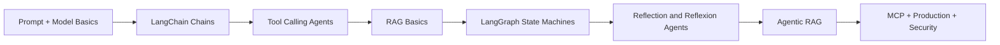
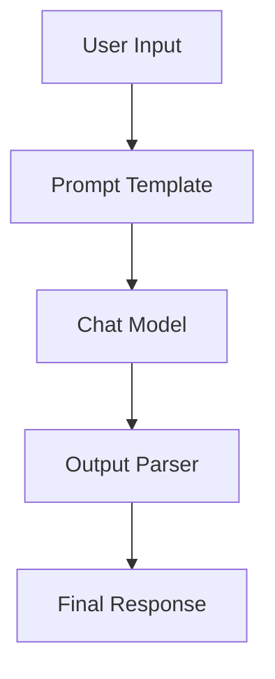
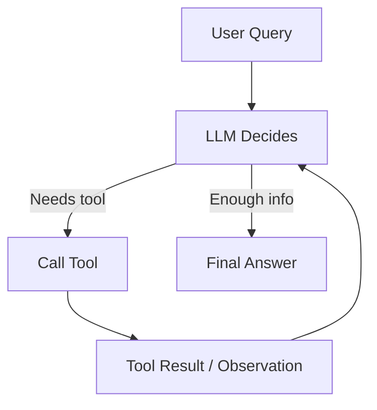
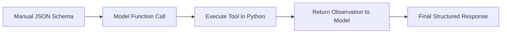
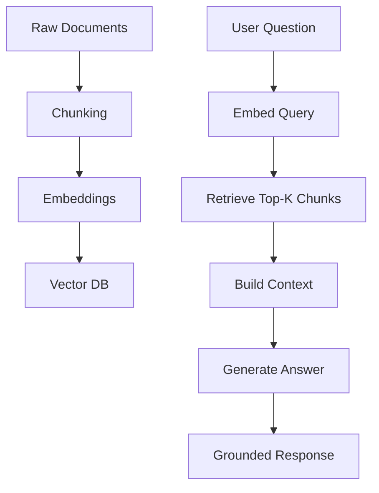
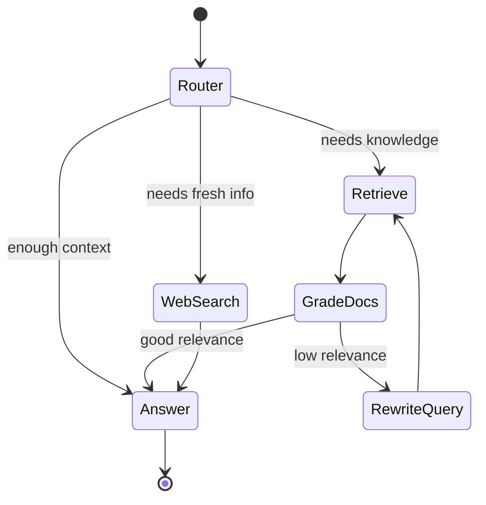
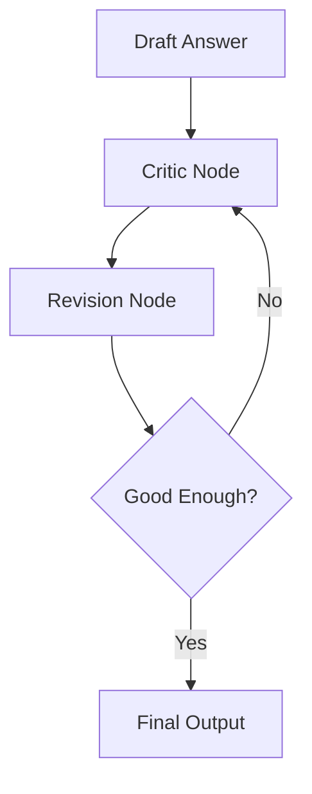
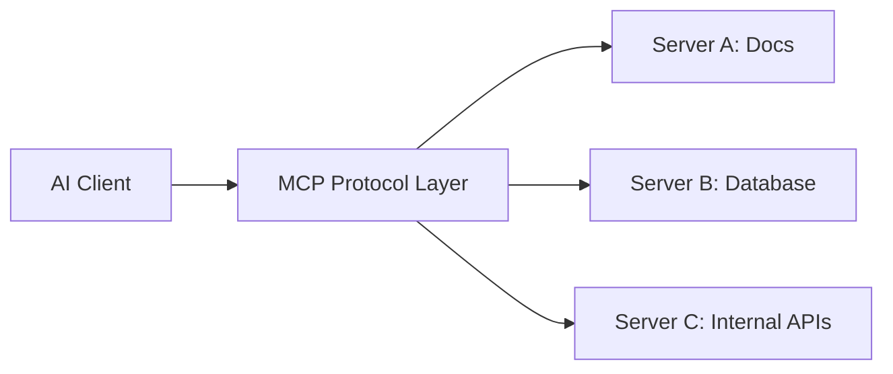

# LangChain + LangGraph Study Guide

This file teaches you the core ideas in a simple, practical order.
Use it like a revision sheet while watching your Udemy course.

---

## 1) Big Picture

### What is LangChain?

LangChain helps you build LLM apps using reusable blocks:

- Prompt templates
- Chat models
- Tools
- Output parsers
- Retrieval pipelines

### What is LangGraph?

LangGraph is for workflow orchestration of agent systems:

- Graph nodes = steps
- Edges = transitions
- Shared state = memory between steps
- Loops/branching/retries = reliable agent behavior

### Simple rule

- Use **LangChain** for linear pipelines.
- Use **LangGraph** for multi-step, stateful, branching agents.

---

## 2) Learning Flow

---

## 3) LangChain Core Architecture

### Minimal mental model

1. Format prompt.
2. Call model.
3. Parse output.
4. Return answer.

---

## 4) Agent Loop (ReAct idea)

ReAct means: **Reason -> Act -> Observe -> Repeat**.

### Why this matters

Agents become useful when the model can:

- Search web/docs
- Query databases
- Run custom functions
- Decide when to stop

---

## 5) Function Calling Layers

### Three styles

- Raw SDK function calling (more control)
- LangChain tools abstraction (faster development)
- ReAct prompt only (manual, educational)

---

## 6) RAG Basics

RAG = Retrieval Augmented Generation.

### Important quality controls

- Better chunk size/overlap
- Metadata filters
- Reranking
- Relevance grading

---

## 7) LangGraph Agent Architecture

### Why LangGraph here

This graph has branching and loops. A plain linear chain is not enough.

---

## 8) Reflection vs Reflexion

### Reflection Agent

- Generates answer
- Critiques answer
- Revises answer

### Reflexion Agent

- Maintains memory of failures/success
- Improves next attempts using feedback history
- Better for iterative tasks

---

## 9) MCP in One View

MCP (Model Context Protocol) standardizes how AI clients use tools/resources.

### Why useful

- One standard interface
- Reusable tool servers
- Easier integration with multiple clients

---

## 10) Production Checklist

- Add tracing (LangSmith)
- Add guardrails (input/output validation)
- Add retries/timeouts/fallback model
- Add security (authz, rate limits, SSRF controls, prompt-injection defenses)
- Add evaluation datasets and regression tests

---

## 11) 14-Day Study Plan (from your course outline)

1. Day 1-2: LangChain fundamentals and simple chain.
2. Day 3-4: ReAct agent loop and tool calling.
3. Day 5-6: Raw function calling and structured output.
4. Day 7-8: RAG ingestion + retrieval.
5. Day 9-10: LangGraph basics and graph nodes/edges.
6. Day 11: Reflection/Reflexion patterns.
7. Day 12: Agentic RAG flows.
8. Day 13: MCP basics and pre-built server usage.
9. Day 14: Production concerns + security review.

---

## 12) Quick Interview Answers

### Difference between LangChain and LangGraph?

LangChain gives modular LLM components; LangGraph orchestrates complex, stateful, branching agent workflows.

### When should I use LangGraph?

Use it when you need loops, retries, branching, or multi-agent coordination.

### Why not only prompts?

Prompt-only systems are brittle. Tool calling + state + evaluation improves reliability.

### What is Agentic RAG?

RAG where an agent decides retrieval strategy, verifies relevance, and can rewrite/query/search iteratively.

---

## 13) Next Hands-On Steps

1. Build a tiny summarizer chain.
2. Convert it into a tool-calling ReAct agent.
3. Add a vector store and retrieval.
4. Move control flow into LangGraph with a relevance-check loop.
5. Add LangSmith tracing and basic evaluation.

If you want, I can create the next file: a **step-by-step coding lab** with folder structure and starter code (LangChain + LangGraph + Streamlit).
