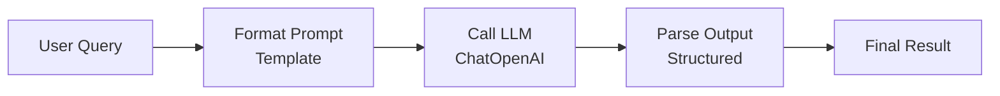

# LangChain + LangGraph: 14-Day Detailed Study Plan

Complete guide with learning objectives, concepts, code examples, and diagrams for each day.

---

# DAYS 1-2: LangChain Fundamentals and Simple Chain

## Learning Objectives

- [ ] Understand LLMs and how to call them
- [ ] Learn Prompt Templates and their power
- [ ] Build your first LangChain chain
- [ ] Use output parsers for structured responses
- [ ] Install and configure LangChain

## Key Concepts

### 1. What is an LLM?

An LLM (Large Language Model) is a trained neural network that predicts text. It takes a prompt and generates a response.

```
User: "Write a poem about cats"
→ [LLM Magic] →
Output: "Whiskers soft and silent paws..."
```

### 2. Prompt Templates

Instead of manually building prompts, use templates:

```python
from langchain.prompts import PromptTemplate

template = """
Translate the following text to {language}:
Text: {text}
Translation:
"""

prompt = PromptTemplate(
    input_variables=["language", "text"],
    template=template
)

# Generate dynamic prompts
prompt.format(language="Spanish", text="Hello")
# Output: "Translate the following text to Spanish:\nText: Hello\nTranslation:"
```

### 3. Chat Models vs LLMs

- **LLMs**: Text-in, text-out. (e.g., GPT-3)
- **Chat Models**: Message-based conversation. (e.g., GPT-4, Claude)

```python
from langchain.chat_models import ChatOpenAI
from langchain.schema import HumanMessage, AIMessage, SystemMessage

model = ChatOpenAI(model="gpt-4", temperature=0.7)

messages = [
    SystemMessage(content="You are a helpful assistant."),
    HumanMessage(content="What is Python?")
]

response = model.invoke(messages)
print(response.content)
```

### 4. The First Chain

A chain links prompt → model → output parser into one pipeline.

```python
from langchain.chat_models import ChatOpenAI
from langchain.prompts import PromptTemplate
from langchain.schema.output_parser import StrOutputParser

# Step 1: Define prompt
prompt = PromptTemplate(
    template="Summarize this text in one sentence: {text}",
    input_variables=["text"]
)

# Step 2: Define model
model = ChatOpenAI(model="gpt-4")

# Step 3: Define parser
parser = StrOutputParser()

# Step 4: Link together (chain)
chain = prompt | model | parser

# Step 5: Run
result = chain.invoke({"text": "LangChain is a framework for LLM apps."})
print(result)
```

### 5. Output Parsers

Parsers convert model output into structured data.

```python
from langchain.output_parsers import CommaSeparatedListOutputParser

parser = CommaSeparatedListOutputParser()

prompt_template = PromptTemplate(
    template="Give 5 benefits of {topic}.\n{format_instructions}",
    input_variables=["topic"],
    partial_variables={"format_instructions": parser.get_format_instructions()}
)

chain = prompt_template | model | parser
result = chain.invoke({"topic": "Python"})
print(result)  # ['Benefit1', 'Benefit2', ...]
```

## Flow Diagram



## Code Lab: Your First Chain

**Goal**: Build a chain that takes any topic and generates a 3-line haiku.

```python
from langchain.chat_models import ChatOpenAI
from langchain.prompts import PromptTemplate
from langchain.schema.output_parser import StrOutputParser

# Your code here
# 1. Create PromptTemplate with input_variable "topic"
# 2. Create ChatOpenAI model
# 3. Create StrOutputParser
# 4. Chain them: prompt | model | parser
# 5. Test with .invoke({"topic": "AI"})

# Expected output: A 3-line haiku about AI
```

## Resources from Course

- Section 2: The GIST of LangChain (11 lectures)
- Focus: Lectures 1-5 (fundamentals through chains)

## Checklist

- [ ] Installed langchain and openai packages
- [ ] Can call OpenAI API via LangChain
- [ ] Built a simple prompt template
- [ ] Created first chain with | operator
- [ ] Understand the flow: template → model → parser

---
