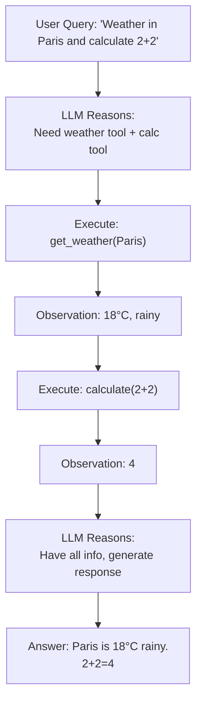

# DAYS 3-4: ReAct Agent Loop and Tool Calling

## Learning Objectives

- [ ] Understand the ReAct (Reason-Act-Observe) cycle
- [ ] Learn what tools are and why agents need them
- [ ] Implement tool binding with LangChain
- [ ] Build your first ReAct agent
- [ ] Understand defensive prompting

## Key Concepts

### 1. Why Agents?

Chains are one-shot pipelines. **Agents** can think, decide, and loop.

```
Simple Chain:    Input → Prompt → Model → Output (done)

Agent Loop:      Input → Think → Decide → Act → Observe → Think Again → ...
```

### 2. The ReAct Framework

**ReAct** = Reason → Act → Observe

```
Step 1 [Reason]: "I need to search for weather in London"
Step 2 [Act]:    Execute search_weather(location="London")
Step 3 [Observe]: "Temperature: 15°C, cloudy"
Step 4 [Reason]:  "Enough info. Answer the user."
Step 5 [Act]:     Generate response
```

### 3. What is a Tool?

A tool is a Python function the agent can call.

```python
from langchain.tools import tool

@tool
def get_weather(location: str) -> str:
    """Get current weather for a location.

    Args:
        location: City name

    Returns:
        Weather description
    """
    # Fake API call
    return f"Weather in {location}: 20°C, sunny"

@tool
def calculate(expression: str) -> str:
    """Evaluate a math expression.

    Args:
        expression: Math expression like '2+2'

    Returns:
        Result of calculation
    """
    return str(eval(expression))

# Bind tools to agent
tools = [get_weather, calculate]
```

### 4. Tool Descriptions

The agent reads tool descriptions to decide which tool to use.

```
Tool: get_weather
Description: "Get current weather for a location.
Args: location (str)"

Tool: calculate
Description: "Evaluate a math expression.
Args: expression (str)"
```

The model learns to parse these and call the right tool.

### 5. Function Calling (Model's Perspective)

Modern LLMs can output structured function calls:

```
User: "What's the weather in Paris? Then calculate 10 + 5"

Model Output:
[
  {"tool": "get_weather", "args": {"location": "Paris"}},
  {"tool": "calculate", "args": {"expression": "10+5"}}
]
```

### 6. Defensive Prompting

Always tell the agent:

- What tools are available
- When to use each tool
- When to STOP and give final answer

```
System prompt example:
"You are a helpful assistant.
You have access to these tools: [list].
Use tools to gather information.
Once you have enough info, respond directly.
Never use a tool if you can answer from your knowledge."
```

## ReAct Agent Flow



## Code Lab: Build Your First ReAct Agent

**Goal**: Create an agent with 2 tools (weather + calculator) and test it.

```python
from langchain.tools import tool
from langchain.chat_models import ChatOpenAI
from langchain.agents import create_react_agent, AgentExecutor
from langchain.prompts import PromptTemplate

# Step 1: Define tools
@tool
def get_weather(location: str) -> str:
    """Get weather for a location."""
    return f"Weather in {location}: 18°C, cloudy"

@tool
def calculate(expression: str) -> str:
    """Evaluate math expression."""
    return str(eval(expression))

tools = [get_weather, calculate]

# Step 2: Initialize model
model = ChatOpenAI(model="gpt-4")

# Step 3: Create agent
agent = create_react_agent(model, tools)

# Step 4: Create executor
executor = AgentExecutor(agent=agent, tools=tools, verbose=True)

# Step 5: Test
result = executor.invoke({
    "input": "What's the weather in Tokyo? Then add 5 + 3"
})
print(result["output"])
```

## Prompting Techniques for Agents

### Few-Shot Prompting

Show agent examples of good tool usage:

```
Example 1:
Query: "What's the weather?"
Agent: Uses get_weather tool
Good: ✓

Example 2:
Query: "What's 2+2?"
Agent: Uses calculate tool OR answers directly
Good: ✓
```

### Chain of Thought

Encourage agent to explain reasoning:

```
System: "Think step-by-step.
1. Understand the user's request
2. Decide which tools are needed
3. Call tools with correct arguments
4. Observe results
5. Generate final answer"
```

## Resources from Course

- Section 3: THE GIST of AI Agents (9 lectures)
- Section 4: Agents Under The Hood (4 lectures)
- Section 5: The ReAct Loop (5 lectures)

## Checklist

- [ ] Understand ReAct (Reason-Act-Observe) cycle
- [ ] Can define @tool functions
- [ ] Can create agent with create_react_agent
- [ ] Can bind multiple tools to an agent
- [ ] Built an agent that loops 2-3 times before stopping
- [ ] Understand defensive prompting concepts

---
