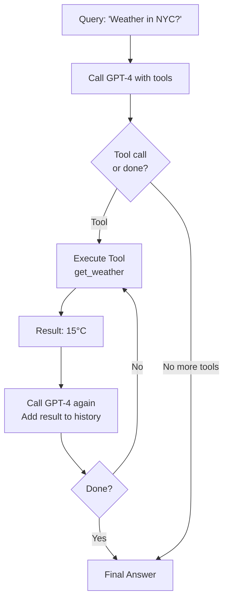

# DAYS 5-6: Raw Function Calling and Structured Output

## Learning Objectives

- [ ] Understand function calling without LangChain abstraction
- [ ] Learn to manually create JSON schemas
- [ ] Call raw Ollama/OpenAI function APIs
- [ ] Implement manual agent loops from scratch
- [ ] Compare LangChain vs raw approach

## Key Concepts

### 1. Why Learn Raw Function Calling?

- Understand how LLMs really work under the hood
- More control in production systems
- Helps debug issues
- Educational

### 2. Function Calling JSON Schema

Models don't call functions magically—they output JSON describing what to call.

```json
{
  "tools": [
    {
      "type": "function",
      "function": {
        "name": "get_weather",
        "description": "Get the weather for a location",
        "parameters": {
          "type": "object",
          "properties": {
            "location": {
              "type": "string",
              "description": "City name"
            }
          },
          "required": ["location"]
        }
      }
    }
  ]
}
```

### 3. Raw OpenAI Function Calling

Without LangChain:

```python
import json
from openai import OpenAI

client = OpenAI(api_key="your-key")

# Define tools as JSON
tools = [
    {
        "type": "function",
        "function": {
            "name": "get_weather",
            "description": "Get weather for a location",
            "parameters": {
                "type": "object",
                "properties": {
                    "location": {"type": "string"}
                },
                "required": ["location"]
            }
        }
    }
]

# Step 1: Call model with tools
response = client.chat.completions.create(
    model="gpt-4",
    messages=[
        {"role": "user", "content": "What's the weather in Paris?"}
    ],
    tools=tools,
    tool_choice="auto"
)

# Step 2: Parse response
tool_call = response.choices[0].message.tool_calls[0]
print(tool_call.function.name)  # "get_weather"
print(json.loads(tool_call.function.arguments))  # {"location": "Paris"}

# Step 3: Execute tool in your code
if tool_call.function.name == "get_weather":
    result = get_weather(location="Paris")
    print(result)

# Step 4: Send result back to model
response2 = client.chat.completions.create(
    model="gpt-4",
    messages=[
        {"role": "user", "content": "What's the weather in Paris?"},
        {"role": "assistant", "content": tool_call.message},
        {"role": "user", "content": f"Tool result: {result}"}
    ]
)

print(response2.choices[0].message.content)
```

### 4. Pydantic for Structured Output

Use Pydantic to define output schemas:

```python
from pydantic import BaseModel, Field
from typing import List

class ActionStep(BaseModel):
    """An action the agent takes."""
    tool_name: str = Field(description="Name of tool to call")
    arguments: dict = Field(description="Arguments for the tool")
    reasoning: str = Field(description="Why we use this tool")

class AgentThought(BaseModel):
    """Agent's thought process."""
    observation: str = Field(description="What we learned")
    next_action: ActionStep
    confidence: float = Field(ge=0, le=1)

# Use with LangChain
from langchain.output_parsers import PydanticOutputParser

parser = PydanticOutputParser(pydantic_object=AgentThought)
format_instructions = parser.get_format_instructions()

prompt = PromptTemplate(
    template="... {format_instructions}",
    input_variables=[],
    partial_variables={"format_instructions": format_instructions}
)
```

### 5. Manual Agent Loop

Here's how to implement a ReAct agent loop from scratch:

```python
import json
from openai import OpenAI

client = OpenAI()
MAX_ITERATIONS = 5

def run_agent_loop(user_query):
    messages = [
        {"role": "user", "content": user_query}
    ]
    tools = [get_weather_schema, calculate_schema]

    for iteration in range(MAX_ITERATIONS):
        print(f"\n=== Iteration {iteration + 1} ===")

        # Call model
        response = client.chat.completions.create(
            model="gpt-4",
            messages=messages,
            tools=tools,
            tool_choice="auto"
        )

        # Check if done
        if response.choices[0].finish_reason == "end_turn":
            return response.choices[0].message.content

        # Parse tool call
        tool_call = response.choices[0].message.tool_calls[0]
        tool_name = tool_call.function.name
        tool_args = json.loads(tool_call.function.arguments)

        print(f"Tool: {tool_name}")
        print(f"Args: {tool_args}")

        # Execute tool
        if tool_name == "get_weather":
            result = get_weather(tool_args["location"])
        elif tool_name == "calculate":
            result = calculate(tool_args["expression"])

        print(f"Result: {result}")

        # Add to message history
        messages.append({"role": "assistant", "content": tool_call.message})
        messages.append({
            "role": "user",
            "content": f"Tool {tool_name} returned: {result}"
        })

    return "Max iterations reached"

# Test
response = run_agent_loop("What's the weather in NYC? Add 5+5")
print(f"\nFinal Answer: {response}")
```

## Comparison: LangChain vs Raw

| Aspect           | LangChain     | Raw API       |
| ---------------- | ------------- | ------------- |
| Setup            | 2-3 lines     | 10-15 lines   |
| Abstraction      | High (simple) | Low (verbose) |
| Control          | Medium        | Full          |
| Error handling   | Built-in      | Manual        |
| Production ready | Yes           | Needs extras  |
| Learning value   | Good          | Excellent     |

## Flow Diagram: Manual Loop



## Code Lab: Implement Manual Loop

**Goal**: Rewrite ReAct agent using raw OpenAI API (no LangChain Agent classes).

```python
# Use raw openai client
# Define JSON schemas manually
# Implement 5-iteration loop
# Handle tool execution yourself
# Add observation to message history
# Stop when model says "done"
```

## Resources from Course

- Section 6: Raw Function Calling (4 lectures)
- Section 7: The ReAct Prompt (6 lectures)

## Checklist

- [ ] Understand JSON function schemas
- [ ] Can call OpenAI raw function calling API
- [ ] Implemented manual agent loop (5+ iterations)
- [ ] Used Pydantic for output parsing
- [ ] Compared LangChain abstraction vs raw approach
- [ ] Understand tool observation feedback loop

---
