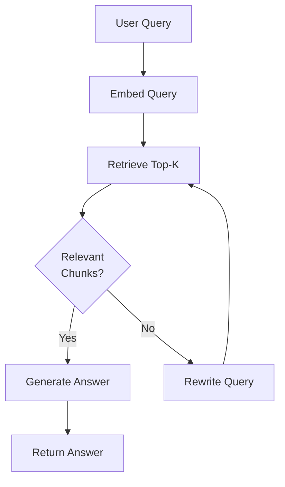
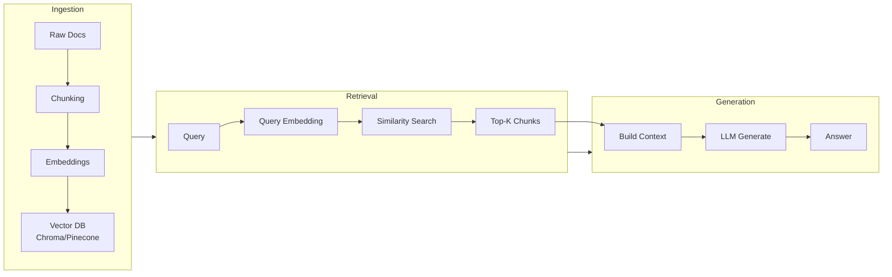

# DAYS 7-8: RAG Ingestion + Retrieval

## Learning Objectives

- [ ] Understand RAG (Retrieval Augmented Generation)
- [ ] Learn text splitting and chunking strategies
- [ ] Understand embeddings and vector databases
- [ ] Implement document ingestion pipeline
- [ ] Build retrieval augmented chains

## Key Concepts

### 1. Problem: LLM Knowledge Cutoff

LLMs are trained on fixed data. They don't know:

- Your proprietary docs
- Real-time information
- Recent news

**Solution**: Feed them context before generation.

### 2. RAG Pipeline Overview

```
Stage 1 [Offline - Ingestion]:
  Raw Docs → Chunking → Embeddings → Vector DB

Stage 2 [Runtime - Retrieval]:
  User Query → Embed Query → Search Vector DB → Top-K Chunks

Stage 3 [Generation]:
  Chunks + Query → Prompt → LLM → Answer
```

### 3. Text Splitting (Chunking)

Documents are too long. Split into manageable pieces.

```python
from langchain.text_splitter import RecursiveCharacterTextSplitter

text = """
LangChain is a framework...
[Long document with many sections]
"""

splitter = RecursiveCharacterTextSplitter(
    chunk_size=500,      # Size of each chunk
    chunk_overlap=50     # Overlap between chunks
)

chunks = splitter.split_text(text)
print(len(chunks))  # e.g., 15 chunks
print(chunks[0][:100])  # First 100 chars of chunk 0
```

**Why overlap?**

- Prevents losing context at chunk boundaries
- Helps retrieval find relevant chunks

### 4. Embeddings

Convert text to vectors that capture meaning.

```python
from langchain.embeddings import OpenAIEmbeddings

embeddings = OpenAIEmbeddings(model="text-embedding-3-small")

# Embed a single text
embedding = embeddings.embed_query("What is Python?")
print(len(embedding))  # e.g., 1536 dimensions

# Embed multiple texts
docs = [
    "Python is a programming language",
    "JavaScript runs in browsers"
]
doc_embeddings = embeddings.embed_documents(docs)
```

**Key idea**: Similar texts have similar embeddings.

```
Embedding similarity:
"cat" ≈ "kitten"      (high similarity)
"cat" ≈ "programming" (low similarity)
```

### 5. Vector Database

Store embeddings and retrieve by similarity.

```python
from langchain.vectorstores import Chroma
from langchain.document_loaders import TextLoader

# Load documents
loader = TextLoader("my_document.txt")
documents = loader.load()

# Split documents
chunks = splitter.split_documents(documents)

# Create vector store
vectorstore = Chroma.from_documents(
    documents=chunks,
    embedding=embeddings,
    persist_directory="./chroma_db"
)

# Retrieve similar chunks
query = "What is RAG?"
results = vectorstore.similarity_search(query, k=3)

for result in results:
    print(result.page_content[:100])
    print(f"Relevance score: {result.metadata.get('score', 'N/A')}")
```

### 6. RAG Chain

Link retrieval + generation:

```python
from langchain.chains import RetrievalQA
from langchain.chat_models import ChatOpenAI

vectorstore = Chroma.from_documents(...)

# Create chain
qa_chain = RetrievalQA.from_chain_type(
    llm=ChatOpenAI(model="gpt-4"),
    chain_type="stuff",  # Combine all chunks
    retriever=vectorstore.as_retriever(search_kwargs={"k": 3})
)

# Query
response = qa_chain.invoke({"query": "What is RAG?"})
print(response["result"])
```

### 7. Quality Checks in RAG



### 8. Different Chain Types

- **stuff**: Combine all chunks into one prompt (good for small docs)
- **map_reduce**: Process each chunk separately, then combine
- **refine**: Iteratively build answer with each chunk

## Complete RAG Implementation

```python
from langchain.text_splitter import RecursiveCharacterTextSplitter
from langchain.embeddings import OpenAIEmbeddings
from langchain.vectorstores import Chroma
from langchain.document_loaders import TextLoader
from langchain.chains import RetrievalQA
from langchain.chat_models import ChatOpenAI

# 1. Load documents
loader = TextLoader("tech_docs.txt")
docs = loader.load()

# 2. Split documents
splitter = RecursiveCharacterTextSplitter(
    chunk_size=1000,
    chunk_overlap=100
)
chunks = splitter.split_documents(docs)

# 3. Create embeddings and vector store
embeddings = OpenAIEmbeddings()
vectorstore = Chroma.from_documents(chunks, embeddings)

# 4. Create QA chain
qa = RetrievalQA.from_chain_type(
    llm=ChatOpenAI(model="gpt-4"),
    chain_type="stuff",
    retriever=vectorstore.as_retriever(search_kwargs={"k": 5})
)

# 5. Ask questions
result = qa.invoke({"query": "How does RAG work?"})
print(result["result"])
```

## RAG Flow Diagram



## Code Lab: Build Your First RAG System

**Goal**: Create a RAG system over a sample document.

```python
# 1. Create sample.txt with technical content
# 2. Use TextLoader to load it
# 3. Split with RecursiveCharacterTextSplitter (chunk_size=500)
# 4. Create Chroma vector store
# 5. Build RetrievalQA chain
# 6. Ask 3 different questions
# 7. Test with search_kwargs={"k": 3}, then {"k": 5}
# 8. Compare quality

# Expected: Answers grounded in document content
```

## Resources from Course

- Section 9: The GIST of RAG (10 lectures)
- Section 10: Building a Documentation Assistant (16 lectures)

## Checklist

- [ ] Understand RAG problem and solution
- [ ] Can split documents with TextSplitter
- [ ] Understand embeddings and similarity search
- [ ] Created Chroma vector store
- [ ] Built RetrievalQA chain
- [ ] Tested different retrieval parameters (k value)
- [ ] Know difference between chain types (stuff, map_reduce, refine)

---
