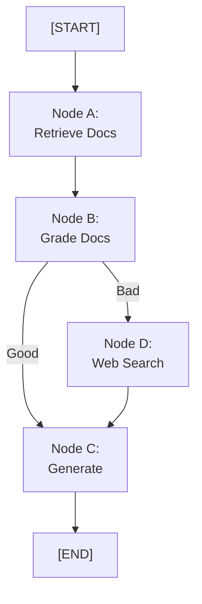
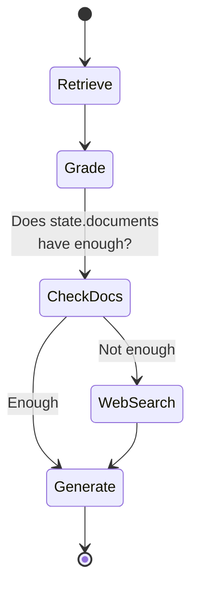

# DAYS 9-10: LangGraph Basics and Graph Nodes/Edges

## Learning Objectives

- [ ] Understand graphs as state machines
- [ ] Learn nodes (steps) and edges (transitions)
- [ ] Implement a simple LangGraph workflow
- [ ] Use GraphState to share data
- [ ] Build branching and looping logic

## Key Concepts

### 1. Why LangGraph? When ReAct Isn't Enough

ReAct (from LangChain) is great for linear loops, but breaks down with:

- Complex branching (if/else)
- Retry logic
- Parallel execution
- Multi-agent coordination
- Sub-workflows

**LangGraph = State Machine for LLM Workflows**

### 2. Graph Components

A LangGraph has:

- **Nodes**: Functions that do work
- **Edges**: Connections between nodes
- **State**: Shared dictionary passed between nodes
- **Reducer**: Merges state updates (e.g., append to list)



### 3. GraphState

Shared state passed to all nodes:

```python
from typing import TypedDict, Annotated
from langchain_core.messages import BaseMessage
import operator

class GraphState(TypedDict):
    """State passed between nodes."""
    query: str
    documents: list  # List of retrieved docs
    web_results: list  # List of web search results
    answer: str
    messages: Annotated[list[BaseMessage], operator.add]  # Appends messages
```

The `Annotated[..., operator.add]` means messages will accumulate (append), not replace.

### 4. Nodes (Functions)

Each node receives state, processes, returns updated state:

```python
def retrieve_docs(state: GraphState) -> GraphState:
    """Retrieve documents from vector store."""
    query = state["query"]
    docs = vectorstore.similarity_search(query, k=5)
    return {
        "documents": docs,
        "messages": [f"Retrieved {len(docs)} documents"]
    }

def grade_docs(state: GraphState) -> GraphState:
    """Grade if docs are relevant."""
    docs = state["documents"]
    graded = []
    for doc in docs:
        # Use LLM to grade relevance
        is_relevant = llm_grade(state["query"], doc)
        if is_relevant:
            graded.append(doc)
    return {"documents": graded}

def generate_answer(state: GraphState) -> GraphState:
    """Generate answer from docs."""
    query = state["query"]
    docs = state["documents"]
    context = "\n".join([doc.page_content for doc in docs])

    prompt = f"Answer based on:\n{context}\n\nQuestion: {query}"
    answer = llm.invoke(prompt)

    return {
        "answer": answer.content,
        "messages": [answer]
    }
```

### 5. Edges and Routing

**Conditional edges** route based on state:

```python
def should_search_web(state: GraphState) -> str:
    """Decide: use retrieved docs or search web?"""
    docs = state["documents"]
    if len(docs) < 3:
        return "web_search"
    else:
        return "generate"

# In graph builder:
graph.add_conditional_edges(
    "grade_docs",
    should_search_web,
    {
        "web_search": "web_search_node",
        "generate": "generate_node"
    }
)
```

### 6. Building a LangGraph

```python
from langgraph.graph import StateGraph, START, END

# Create graph
graph_builder = StateGraph(GraphState)

# Add nodes
graph_builder.add_node("retrieve", retrieve_docs)
graph_builder.add_node("grade", grade_docs)
graph_builder.add_node("web_search", web_search_node)
graph_builder.add_node("generate", generate_answer)

# Add edges
graph_builder.add_edge(START, "retrieve")
graph_builder.add_edge("retrieve", "grade")

# Conditional edge
graph_builder.add_conditional_edges(
    "grade",
    should_search_web,
    {
        "web_search": "web_search",
        "generate": "generate"
    }
)

graph_builder.add_edge("web_search", "generate")
graph_builder.add_edge("generate", END)

# Compile
graph = graph_builder.compile()

# Run
result = graph.invoke({
    "query": "What is LangChain?",
    "documents": [],
    "web_results": [],
    "answer": "",
    "messages": []
})

print(result["answer"])
```

### 7. Difference: LangChain Agent vs LangGraph

| Aspect      | LangChain Agent  | LangGraph           |
| ----------- | ---------------- | ------------------- |
| Paradigm    | Loop + tools     | Graph state machine |
| Flexibility | Tool-based       | Arbitrary nodes     |
| Visibility  | Less transparent | Clear state flow    |
| Debugging   | Harder           | Easier              |
| Branching   | Limited          | Full support        |
| Retries     | Needs extras     | Built-in            |
| Production  | Good             | Excellent           |

### 8. Advanced: Cycles and Retries

Graphs can loop:

```python
def decide_retry(state: GraphState) -> str:
    """Should we retry or give up?"""
    if state.get("retry_count", 0) < 3:
        return "retry"
    else:
        return "fail"

graph_builder.add_edge("process", "validate")
graph_builder.add_conditional_edges(
    "validate",
    decide_retry,
    {
        "retry": "process",    # Loop back!
        "fail": END
    }
)
```

## Complete LangGraph Example

```python
from langgraph.graph import StateGraph, START, END
from typing import TypedDict, Annotated
import operator

class State(TypedDict):
    query: str
    docs: list
    answer: str

def retrieve(state: State):
    """Step 1: Get docs."""
    docs = vectorstore.similarity_search(state["query"], k=3)
    return {"docs": docs}

def generate(state: State):
    """Step 2: Generate answer."""
    context = "\n".join([d.page_content for d in state["docs"]])
    answer = llm.invoke(f"Answer: {state['query']}\nContext: {context}")
    return {"answer": answer.content}

# Build graph
builder = StateGraph(State)
builder.add_node("retrieve", retrieve)
builder.add_node("generate", generate)
builder.add_edge(START, "retrieve")
builder.add_edge("retrieve", "generate")
builder.add_edge("generate", END)

# Compile and run
graph = builder.compile()
result = graph.invoke({"query": "What is RAG?", "docs": [], "answer": ""})
print(result["answer"])
```

## LangGraph Flow Diagram



## Code Lab: Build Your First LangGraph

**Goal**: Create a 3-node graph (retrieve → grade → generate).

```python
# 1. Define GraphState with query, documents, answer
# 2. Create retrieve_node function
# 3. Create grade_node function (filter irrelevant docs)
# 4. Create generate_node function
# 5. Build StateGraph and add nodes/edges
# 6. Test with queries
```

## Resources from Course

- Section 13: Introduction To LangGraph (13 lectures)
- Focus on: Nodes, Edges, GraphState, Compiling

## Checklist

- [ ] Understand graph as state machine
- [ ] Can define GraphState with TypedDict
- [ ] Can write node functions
- [ ] Can add nodes and edges
- [ ] Understand conditional edges
- [ ] Built a 3+ node graph
- [ ] Can invoke and trace graph execution

---
