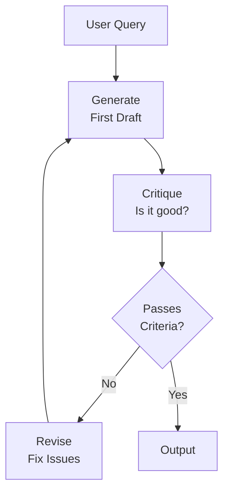
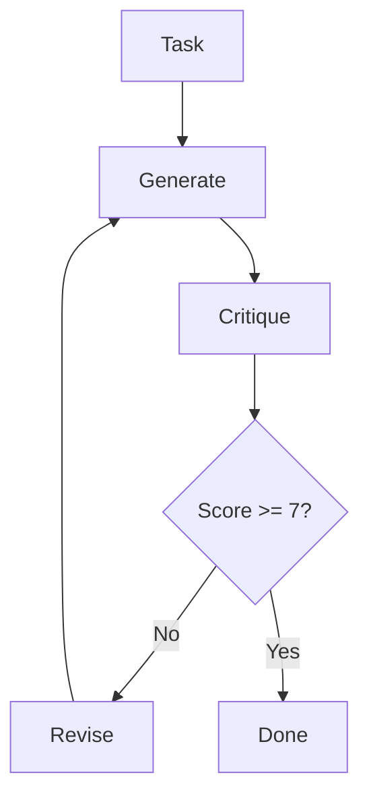
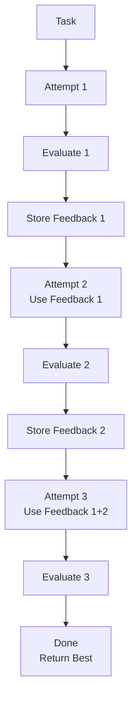

# DAY 11: Reflection and Reflexion Patterns

## Learning Objectives

- [ ] Understand Reflection (generate → critique → revise)
- [ ] Understand Reflexion (memory + feedback loops)
- [ ] Implement both patterns in LangGraph
- [ ] Know when to use each pattern
- [ ] Add evaluation logic

## Key Concepts

### 1. Reflection Pattern

**Reflection** = Generate → Critique → Revise cycle.

Useful for:

- Content generation (writing, coding)
- Query answering with high stakes
- Any task where a second pass improves quality



### 2. Reflection Components

```python
def generate_node(state: State):
    """Generate first draft."""
    prompt = f"Write a poem about {state['topic']}"
    draft = llm.invoke(prompt)
    return {"draft": draft.content, "iteration": 1}

def critique_node(state: State):
    """Evaluate quality."""
    criteria = """
    - Is the poem at least 4 lines?
    - Does it have rhyme or rhythm?
    - Is it creative?
    """
    prompt = f"Review:\n{state['draft']}\n\nCriteria:\n{criteria}\nScore 1-10 and explain."
    critique = llm.invoke(prompt)

    # Extract score (simple: parse number from output)
    import re
    score = int(re.search(r'\d+', critique.content).group())

    return {
        "critique": critique.content,
        "score": score
    }

def revise_node(state: State):
    """Fix issues."""
    prompt = f"""
    Original: {state['draft']}
    Critique: {state['critique']}

    Create a revised version addressing the feedback.
    """
    revised = llm.invoke(prompt)
    return {
        "draft": revised.content,
        "iteration": state["iteration"] + 1
    }

def should_continue(state: State) -> str:
    """Route: revise again or done?"""
    if state["score"] >= 7 or state["iteration"] >= 3:
        return "end"
    return "revise"

# Build graph
builder = StateGraph(State)
builder.add_node("generate", generate_node)
builder.add_node("critique", critique_node)
builder.add_node("revise", revise_node)

builder.add_edge(START, "generate")
builder.add_edge("generate", "critique")
builder.add_conditional_edges(
    "critique",
    should_continue,
    {"revise": "revise", "end": END}
)
builder.add_edge("revise", "generate")
```

### 3. Reflexion Pattern

**Reflexion** = Learn from past failures → Improve future attempts.

Uses:

- Experience memory (what worked/failed)
- Self-feedback loop
- Reasoning improvements over iterations

```
Attempt 1: Answer → Evaluate → Feedback
Attempt 2: Answer (using Attempt 1 feedback) → Evaluate → Feedback
Attempt 3: Answer (using all past feedback) → Done
```

### 4. Reflexion Implementation

```python
class State(TypedDict):
    task: str
    attempts: list  # [{answer, feedback}, ...]
    current_attempt: int
    final_answer: str

def actor_node(state: State):
    """Attempt to solve task."""
    # Build prompt with past feedback
    past_feedback = ""
    if state["attempts"]:
        feedback_list = "\n".join([
            f"- {a['feedback']}"
            for a in state["attempts"]
        ])
        past_feedback = f"\nPast feedback:\n{feedback_list}\nUse this to improve."

    prompt = f"""
    Task: {state['task']}
    {past_feedback}

    Provide your best answer.
    """

    answer = llm.invoke(prompt)
    return {
        "current_attempt": state["current_attempt"] + 1,
        "answer": answer.content
    }

def evaluator_node(state: State):
    """Evaluate quality and provide feedback."""
    prompt = f"""
    Task: {state['task']}
    Answer: {state['answer']}

    Is this correct? Provide feedback for improvement.
    """

    evaluation = llm.invoke(prompt)

    # Extract pass/fail
    is_good = "correct" in evaluation.content.lower() or "good" in evaluation.content.lower()

    # Store attempt
    new_attempt = {
        "answer": state["answer"],
        "feedback": evaluation.content
    }

    return {
        "attempts": state["attempts"] + [new_attempt],
        "is_good": is_good
    }

def should_retry(state: State) -> str:
    """Decide: try again or done?"""
    if state["is_good"] or state["current_attempt"] >= 3:
        return "done"
    return "retry"

# Build
builder = StateGraph(State)
builder.add_node("actor", actor_node)
builder.add_node("evaluator", evaluator_node)

builder.add_edge(START, "actor")
builder.add_edge("actor", "evaluator")
builder.add_conditional_edges(
    "evaluator",
    should_retry,
    {"retry": "actor", "done": END}
)
```

### 5. Comparison

| Aspect       | Reflection                   | Reflexion                  |
| ------------ | ---------------------------- | -------------------------- |
| Loop         | Generate → Critique → Revise | Attempt → Evaluate → Learn |
| Memory       | Explicit (score/critique)    | Persistent (attempts log)  |
| Best for     | Content quality              | Reasoning improvement      |
| Iterations   | 2-3                          | Multiple (memory helps)    |
| LLM overhead | Medium                       | Higher (stores feedback)   |

### 6. When to Use Each?

**Use Reflection when:**

- You have explicit quality metrics
- Task output is "good" or "bad"
- Few iterations needed (2-3)
- Examples: Writing, coding, translation

**Use Reflexion when:**

- Task requires reasoning
- Feedback helps improve strategy
- Multiple attempts expected
- Examples: Math problems, planning, research

## Reflection Flow Diagram



## Reflexion Flow Diagram



## Code Lab: Build Reflection Agent

**Goal**: Create a reflection graph for code generation.

```python
# Task: Generate Python function to reverse a string
# 1. Generate: Write function
# 2. Critique: Check correctness, style, docs
# 3. Score: Extract score from critique
# 4. Revise: Fix issues
# 5. Loop until score >= 8 or iterations >= 3
```

## Resources from Course

- Section 14: Reflection Agent (5 lectures)
- Section 15: Reflexion Agent (8 lectures)

## Checklist

- [ ] Understand Reflection (generate → critique → revise)
- [ ] Understand Reflexion (memory + feedback)
- [ ] Implemented Reflection graph
- [ ] Implemented Reflexion graph
- [ ] Know when to use each pattern
- [ ] Can add evaluation/scoring logic

---
