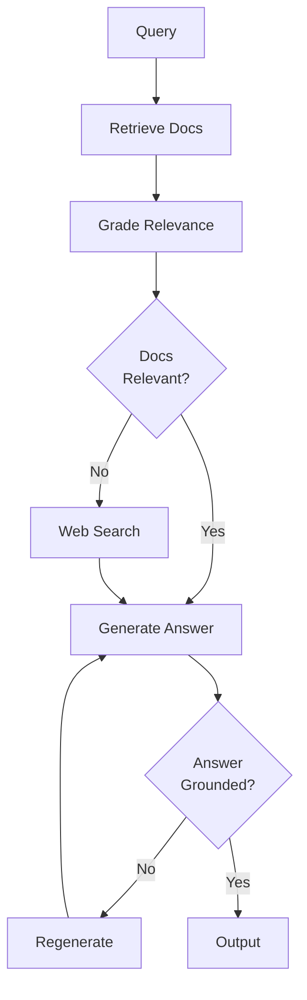
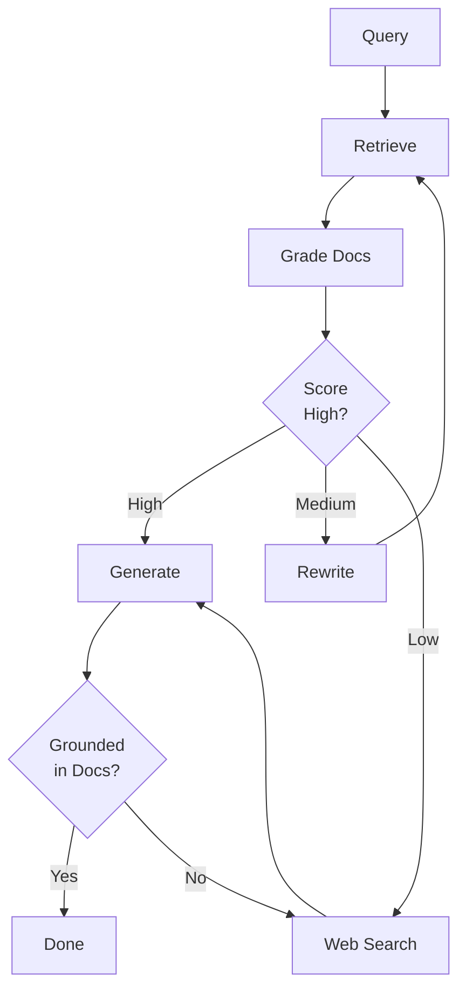

# DAY 12: Agentic RAG Flows

## Learning Objectives

- [ ] Understand Agentic RAG architecture
- [ ] Implement corrective RAG flow
- [ ] Learn relevance grading
- [ ] Build adaptive RAG (rewrite + search)
- [ ] Combine RAG + agents + LangGraph

## Key Concepts

### 1. Problem: Static RAG

Simple RAG (retrieve → generate) has issues:

- Retrieved chunks might be irrelevant
- Query might be ambiguous
- No recovery mechanism

**Solution**: Agentic RAG adds decision-making.

### 2. Corrective RAG Flow



### 3. Relevance Grading

Use LLM to judge if retrieved docs match query:

```python
def grade_documents(state: GraphState) -> GraphState:
    """Use LLM to grade relevance."""
    llm_grader = ChatOpenAI(model="gpt-4", temperature=0)

    docs = state["documents"]
    query = state["query"]

    prompt = f"""
    You are a grader assessing relevance of a retrieved document to a user query.

    Query: {query}

    Document: {{doc}}

    Grade (1-5 scale):
    - 5: Highly relevant
    - 1: Not relevant

    Respond only with the number.
    """

    graded_docs = []
    for doc in docs:
        score = int(llm_grader.invoke(
            prompt.format(doc=doc.page_content[:500])
        ).content.strip())

        if score >= 3:
            graded_docs.append(doc)

    return {"documents": graded_docs}
```

### 4. Query Rewriting

If relevance is low, rewrite the query:

```python
def rewrite_query(state: GraphState) -> GraphState:
    """Rewrite ambiguous query."""
    original_query = state["query"]

    prompt = f"""
    You are an expert at reformulating queries.
    Original query: {original_query}

    Generate an improved version that is:
    - More specific
    - Clearer intent
    - Likely to retrieve better docs
    """

    rewritten = llm.invoke(prompt)
    return {"query": rewritten.content}
```

### 5. Web Search Fallback

When retrieval fails, search web:

```python
from langchain.tools import tool
from tavily import TavilyClient

@tool
def web_search(query: str) -> str:
    """Search web for current information."""
    client = TavilyClient()
    response = client.search(query)
    return str(response)

def web_search_node(state: GraphState) -> GraphState:
    """Search web and get results."""
    results = web_search.invoke(state["query"])
    return {"web_results": results}
```

### 6. Self-RAG (Self-Reflective RAG)

Add another layer: grade generated answer.

```python
def grade_generation(state: GraphState) -> str:
    """Is generated answer grounded in docs?"""
    answer = state["answer"]
    docs = state["documents"]

    prompt = f"""
    Is the answer grounded in the provided context?

    Context: {docs[0].page_content if docs else 'N/A'}
    Answer: {answer}

    Respond: yes or no
    """

    response = llm.invoke(prompt).content.lower()
    return "end" if "yes" in response else "regen"
```

### 7. Adaptive RAG

Choose retrieval strategy based on query:

```python
def route_query(state: GraphState) -> str:
    """Route: vector search, keyword search, or web?"""
    query = state["query"]

    if "current" in query or "today" in query or "2024" in query:
        return "web_search"  # Current events need web
    elif "how to" in query or "tutorial" in query:
        return "vector_search"  # How-tos in docs
    else:
        return "hybrid"  # Both
```

## Complete Agentic RAG Graph

```python
from langgraph.graph import StateGraph, START, END
from typing import TypedDict, Annotated, Literal
import operator

class RAGState(TypedDict):
    query: str
    documents: list
    web_results: str
    answer: str
    retrieval_score: float
    grounding_score: float

def retrieve_docs(state: RAGState):
    docs = vectorstore.similarity_search(state["query"], k=5)
    return {"documents": docs}

def grade_relevance(state: RAGState):
    # ... grade logic from above ...
    graded = [doc for doc in state["documents"] if score >= 3]
    score = len(graded) / len(state["documents"]) if state["documents"] else 0
    return {"documents": graded, "retrieval_score": score}

def decide_retrieval(state: RAGState) -> Literal["generate", "web_search", "rewrite"]:
    if state["retrieval_score"] >= 0.5:
        return "generate"
    elif state["retrieval_score"] < 0.2:
        return "web_search"
    else:
        return "rewrite"

def rewrite(state: RAGState):
    # ... rewrite query ...
    return {"query": rewritten_query}

def web_search(state: RAGState):
    results = tavily_search(state["query"])
    return {"web_results": results}

def generate_answer(state: RAGState):
    context = "\n".join([d.page_content for d in state["documents"]])
    answer = llm.invoke(f"Answer: {state['query']}\nContext: {context}")
    return {"answer": answer.content}

def grade_grounding(state: RAGState) -> Literal["end", "generate_web"]:
    # Check if answer is grounded in docs
    prompt = f"Is this answer grounded in docs? {state['answer']}"
    response = llm.invoke(prompt).content.lower()
    return "end" if "yes" in response else "generate_web"

# Build graph
builder = StateGraph(RAGState)

builder.add_node("retrieve", retrieve_docs)
builder.add_node("grade_relevance", grade_relevance)
builder.add_node("rewrite", rewrite)
builder.add_node("web_search", web_search)
builder.add_node("generate", generate_answer)

builder.add_edge(START, "retrieve")
builder.add_edge("retrieve", "grade_relevance")
builder.add_conditional_edges(
    "grade_relevance",
    decide_retrieval,
    {
        "generate": "generate",
        "web_search": "web_search",
        "rewrite": "rewrite"
    }
)
builder.add_edge("rewrite", "retrieve")
builder.add_edge("web_search", "generate")
builder.add_conditional_edges(
    "generate",
    grade_grounding,
    {"end": END, "generate_web": "web_search"}
)

# Compile and run
graph = builder.compile()
result = graph.invoke({
    "query": "What are the latest AI trends?",
    "documents": [],
    "web_results": "",
    "answer": "",
    "retrieval_score": 0,
    "grounding_score": 0
})
```

## Agentic RAG Flow Diagram



## Code Lab: Build Agentic RAG

**Goal**: Implement corrective RAG with relevance grading.

```python
# 1. Create RAGState TypedDict
# 2. Implement retrieve_docs node
# 3. Implement grade_relevance node
# 4. Implement decide_retrieval conditional
# 5. Implement web_search node
# 6. Implement generate_answer node
# 7. Build StateGraph with all nodes/edges
# 8. Test with queries
```

## Resources from Course

- Section 16: Agentic RAG (14 lectures)
- Covers: Corrective RAG, Self-RAG, Adaptive RAG

## Checklist

- [ ] Understand Agentic RAG benefits
- [ ] Implemented relevance grading
- [ ] Built query rewriting
- [ ] Integrated web search
- [ ] Graded answer grounding
- [ ] Built complete agentic RAG graph
- [ ] Can debug with LangSmith

---
