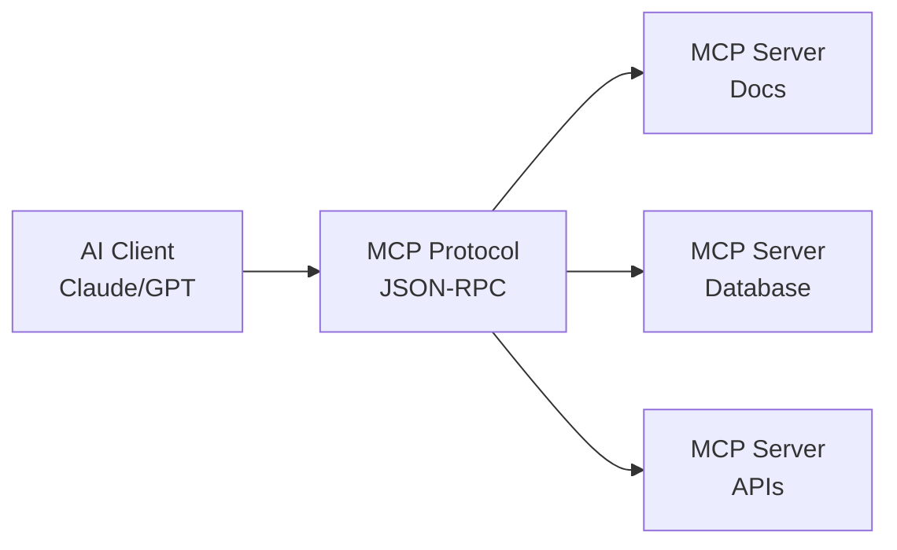
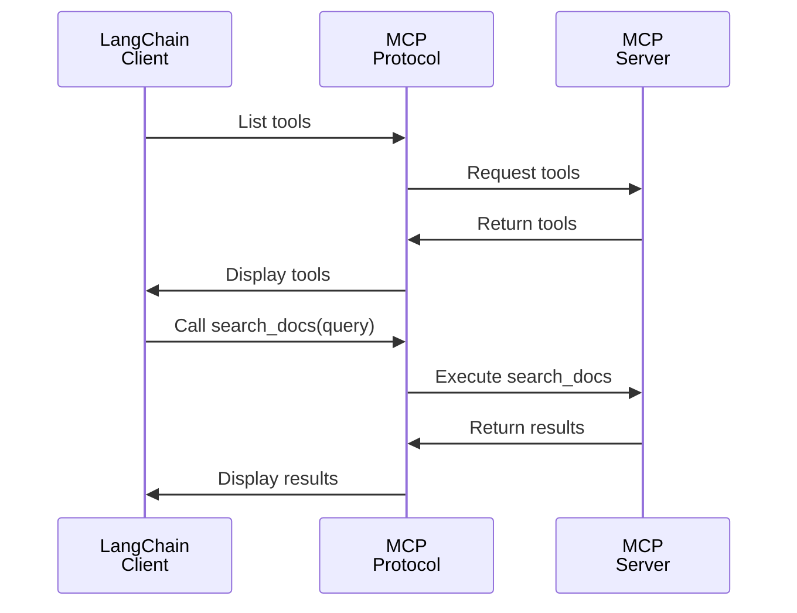

# DAY 13: MCP Basics and Pre-built Servers

## Learning Objectives

- [ ] Understand Model Context Protocol (MCP)
- [ ] Learn MCP architecture (client-server)
- [ ] Use pre-built MCP servers
- [ ] Integrate MCP with LangChain
- [ ] Build a simple MCP server

## Key Concepts

### 1. Problem: LLM Tool Integration is Messy

Currently:

- Each app defines tools differently
- Hard to reuse tool definitions
- No standard protocol
- Brittle integrations

**Solution**: MCP (Model Context Protocol) standardizes tool/resource sharing.

### 2. MCP Architecture



### 3. MCP Concepts

- **Resources**: Read-only data (docs, configs)
- **Tools**: Callable functions
- **Prompts**: Reusable prompt templates
- **Sampling**: LLM calls within server

### 4. Pre-built MCP Servers

Common pre-built servers:

- `mcpdoc`: Browse documentation
- `filesystem`: Read/write files
- `github`: Interact with GitHub
- `slack`: Send Slack messages
- etc.

### 5. Using mcpdoc Server

```bash
# Install
pip install mcp-server-mcpdoc

# Start server
python -m mcp_server_mcpdoc
```

Client usage:

```python
from mcp.client import ClientSession
from mcp.tools import Tool

async def use_mcpdoc():
    async with ClientSession() as session:
        # List available resources
        resources = await session.list_resources()

        for resource in resources:
            print(f"- {resource.name}: {resource.uri}")

        # Read a resource
        content = await session.read_resource("langchain-docs")
        print(content)
```

### 6. MCP Tools

Tools are functions the server exposes:

```python
from mcp.server import Server
from pydantic import BaseModel

class SearchQuery(BaseModel):
    query: str
    max_results: int = 5

server = Server("my-server")

@server.tool()
def search_docs(query: SearchQuery) -> str:
    """Search documentation."""
    results = vectorstore.similarity_search(query.query, k=query.max_results)
    return "\n".join([r.page_content for r in results])
```

### 7. Building a Simple MCP Server

```python
from mcp.server import Server
from mcp.server.stdio import stdio_server

server = Server("langchain-helper")

@server.resource()
def get_langchain_intro() -> str:
    """Return LangChain introduction."""
    return """
    LangChain is a framework for developing applications powered by language models.
    Key components:
    - Prompts
    - Models
    - Chains
    - Agents
    - RAG
    """

@server.tool()
def explain_concept(concept: str) -> str:
    """Explain a LangChain concept."""
    concepts = {
        "chain": "A sequence of calls to LLMs and other tools",
        "agent": "An LLM that can reason and use tools",
        "rag": "Retrieval Augmented Generation for grounded answers"
    }
    return concepts.get(concept, "Unknown concept")

if __name__ == "__main__":
    # Run server via stdio
    stdio_server(server)
```

### 8. MCP with LangChain

```python
from langchain.tools import Tool
from mcp.client import ClientSession

async def setup_mcp_tools():
    """Load MCP server tools into LangChain."""
    async with ClientSession() as session:
        # List MCP tools
        tools_list = await session.list_tools()

        # Convert to LangChain tools
        langchain_tools = []
        for mcp_tool in tools_list:
            def mcp_callable(input: str, tool_name=mcp_tool.name):
                result = await session.call_tool(tool_name, input)
                return result

            tool = Tool(
                name=mcp_tool.name,
                description=mcp_tool.description,
                func=mcp_callable
            )
            langchain_tools.append(tool)

        return langchain_tools

# Use with agent
tools = await setup_mcp_tools()
agent = create_react_agent(llm, tools)
```

## MCP Flow Diagram



## Code Lab: Use Pre-built MCP Server

**Goal**: Use mcpdoc server to answer questions about LangChain docs.

```python
# 1. Install mcp-server-mcpdoc
# 2. Start server
# 3. Create LangChain agent
# 4. Add MCP tools to agent
# 5. Test with queries like "Explain RAG from LangChain docs"
# 6. Compare with vector search RAG
```

## Resources from Course

- Section 17: Introduction to Model Context Protocol (6 lectures)
- Section 18: Using a Pre-built Server (4 lectures)
- Section 19: Building MCP Servers (9 lectures)

## Checklist

- [ ] Understand MCP architecture
- [ ] Know difference between resources, tools, prompts
- [ ] Used pre-built MCP server
- [ ] Converted MCP tools to LangChain
- [ ] Built simple MCP server
- [ ] Can debug MCP communication

---
