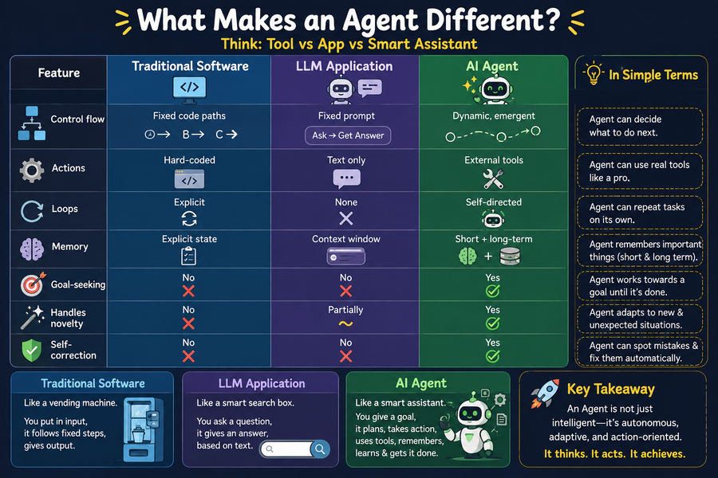
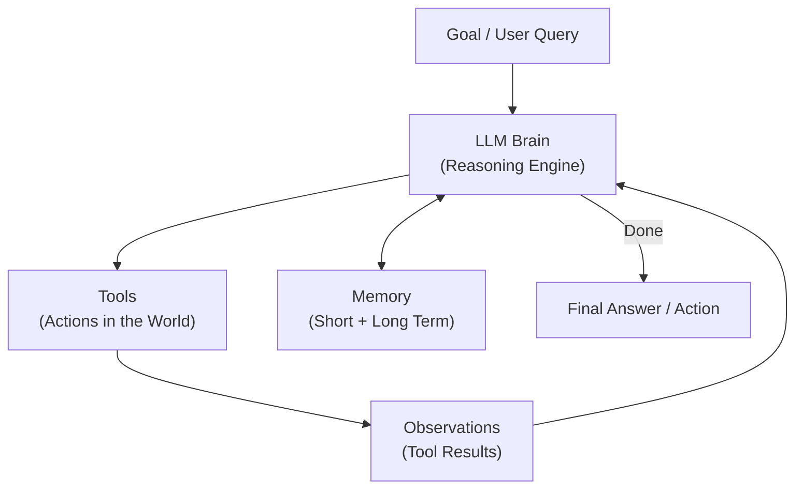
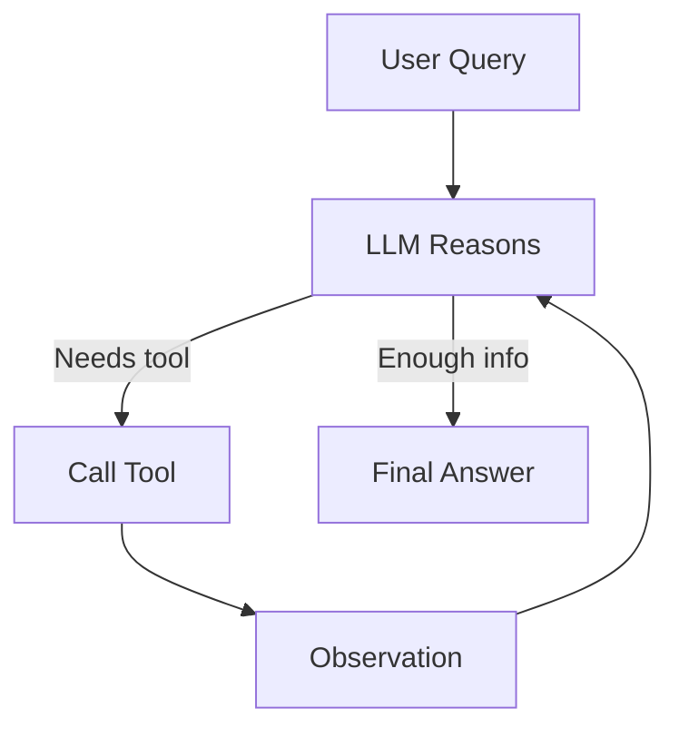

# Chapter 01 — What Is an AI Agent?

> **Previous**: [README](README.md) | **Next**: [Chapter 02 — Learning Roadmap](Chapter-02-Learning-Roadmap.md)

---

## 1.1 The Core Idea

An **AI Agent** is software that uses a large language model (LLM) as its reasoning engine, combined with the ability to take actions in the world — searching the web, running code, reading files, calling APIs — and to loop until a goal is accomplished.

```
Traditional Software:     Input → Hard-coded Logic → Output

LLM Application:          Input → LLM → Output  (one-shot)

AI Agent:                 Goal → [Think → Act → Observe] × N → Done
```

---

## 1.2 What Makes an Agent Different

| Property | Traditional Software | LLM Application | AI Agent |
|---|---|---|---|
| Control flow | Fixed code paths | Fixed prompt | Dynamic, emergent |
| Actions | Hard-coded | Text only | External tools |
| Loops | Explicit | None | Self-directed |
| Memory | Explicit state | Context window | Short + long-term |
| Goal-seeking | No | No | Yes |
| Handles novelty | No | Partially | Yes |
| Self-correction | No | No | Yes |

---



## 1.3 Anatomy of an Agent

Every agent — regardless of framework — has these five building blocks:



**The five components:**

1. **LLM** — the reasoning engine; decides what to do next
2. **Tools** — functions the agent can call (web search, code execution, database queries)
3. **Memory** — stores conversation history, facts, past actions
4. **Orchestration** — the loop that drives the agent forward
5. **Output** — the final result or action

---

## 1.4 Agents vs. Workflows vs. Automation

These terms are often confused. Here is the clear distinction:

| Term | Who decides control flow? | Example |
|---|---|---|
| Script / Automation | Developer (100%) | Cron job, Zapier |
| Workflow | Developer + LLM | LangChain chain |
| Agent | LLM (mostly) | ReAct agent with tools |
| Autonomous Agent | LLM (fully) | AutoGPT-style systems |

**Key rule**: In a workflow, *you* write the control flow. In an agent, the *LLM* decides the control flow at runtime.

---

## 1.5 ReAct: The Foundation of Modern Agents

**ReAct** (Reason + Act) is the fundamental pattern behind almost all modern agents. It was introduced in the paper *"ReAct: Synergizing Reasoning and Acting in Language Models"* (Yao et al., 2022).

```
Thought:      I need to find the weather in Paris.
Action:       get_weather(location="Paris")
Observation:  18°C, cloudy
Thought:      I have the weather. I can answer now.
Final Answer: The weather in Paris is 18°C and cloudy.
```



The loop continues until the LLM decides it has enough information to answer.

---

## 1.6 Why Now? What Changed?

Before 2022, building agents was academic. Three things changed:

1. **Function calling** (2023) — Models can now output structured tool calls, not just text
2. **Long context windows** — 128k–1M tokens let agents hold more state
3. **Better instruction following** — GPT-4+ reliably follows complex system prompts

---

## Summary

- An AI agent uses an LLM as a reasoning engine in a loop
- The loop is: Think → Act → Observe → repeat
- Agents differ from scripts because the LLM controls the flow at runtime
- ReAct is the foundational pattern behind nearly all agent frameworks
- Five components: LLM, Tools, Memory, Orchestration, Output

## Common Mistakes

- Calling every LLM application an "agent" — a single API call is not an agent
- Building an agent when a simple chain would do the job
- Not defining a stopping condition → infinite loops in production

## Interview Questions

1. What distinguishes an AI agent from a regular LLM application?
2. Explain the ReAct loop in two sentences.
3. When would you use a chain vs. an agent?
4. What are the five components of every agent?

## Exercises

1. Write a pseudocode ReAct loop (no framework) that calls `search()` and `calculate()`.
2. Find a product you use daily — identify whether it uses a chain or an agent.
3. Draw the anatomy diagram for a customer support chatbot.

---

> **Next**: [Chapter 02 — Learning Roadmap](Chapter-02-Learning-Roadmap.md)
