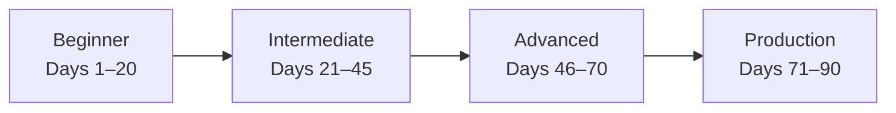
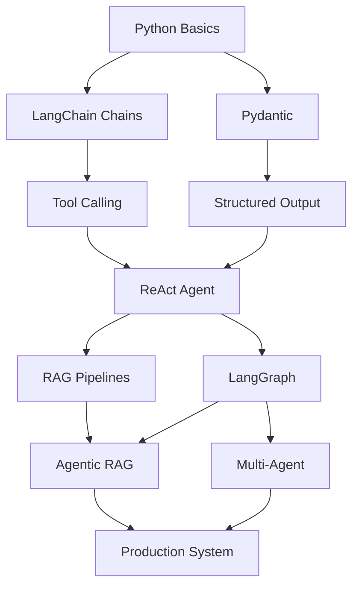

# Chapter 02 — Learning Roadmap

> **Previous**: [Chapter 01 — What Is an AI Agent?](Chapter-01-What-Is-An-AI-Agent.md) | **Next**: [Chapter 03 — Python Fundamentals](Chapter-03-Python-Fundamentals.md)

---

## Overview

---

## Beginner Milestones (Days 1–20)

> Goal: Call LLMs, build chains, understand tools, build first RAG.

- [ ] Call an LLM via API (OpenAI, Anthropic, Ollama)
- [ ] Write and use prompt templates
- [ ] Build a simple chain: prompt → model → parser
- [ ] Define and call a tool
- [ ] Build your first ReAct agent
- [ ] Understand function calling / tool calling
- [ ] Use Pydantic for structured output
- [ ] Build a basic RAG pipeline
- [ ] Understand embeddings and vector databases

**Chapters to read**: 01, 03, 04, 05

---

## Intermediate Milestones (Days 21–45)

> Goal: Build stateful graphs, reflection loops, memory systems.

- [ ] Build a LangGraph state machine
- [ ] Implement reflection (generate → critique → revise)
- [ ] Build an Agentic RAG system with fallback
- [ ] Add short-term and long-term memory
- [ ] Implement human-in-the-loop checkpoints
- [ ] Compare and use at least 2 agent frameworks
- [ ] Build a multi-tool agent from scratch (no framework)
- [ ] Understand MCP architecture

**Chapters to read**: 06, 07, 09, Frameworks 01–02

---

## Advanced Milestones (Days 46–70)

> Goal: Multi-agent coordination, production-grade patterns.

- [ ] Implement multi-agent supervisor pattern
- [ ] Build custom agent architectures in LangGraph
- [ ] Agent-to-Agent (A2A) communication
- [ ] Event-driven agents
- [ ] Advanced RAG (corrective, self-reflective, adaptive)
- [ ] Build a production FastAPI agent endpoint
- [ ] Implement observability with LangSmith

**Chapters to read**: 10, 11, 12, Frameworks 03–08

---

## Production Milestones (Days 71–90)

> Goal: Security, evaluation, deployment, capstone project.

- [ ] Security hardening (prompt injection, SSRF, rate limits)
- [ ] Full evaluation pipeline with LLM-as-judge
- [ ] CI/CD for agent systems
- [ ] Deploy with Docker and docker-compose
- [ ] Cost and token optimization
- [ ] Monitoring and alerting setup
- [ ] Complete capstone project

**Chapters to read**: 12, 13, 15, 16

---

## Skill Prerequisite Map

---

## What to Build at Each Stage

| Stage | Mini-Project |
|---|---|
| Beginner | Translation chain, haiku generator, CSV summarizer |
| Intermediate | Customer support agent, research assistant, RAG Q&A |
| Advanced | Multi-agent writing team, self-correcting code generator |
| Production | Full-stack agent API with auth, logging, and evaluation |

---

## Summary

- Follow the chapters in order for the smoothest learning curve
- Build something after each chapter — don't just read
- The 90-day plan in [Chapter 16](Chapter-16-90-Day-Plan.md) gives a day-by-day breakdown

---

> **Next**: [Chapter 03 — Python Fundamentals](Chapter-03-Python-Fundamentals.md)
