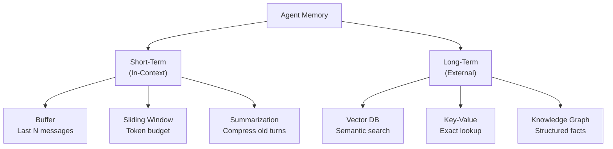

# Chapter 06 — Memory, Context, and State Management

> **Previous**: [Chapter 05 — Prompting & Tool Calling](Chapter-05-Prompting-Structured-Output.md) | **Next**: [Chapter 07 — Agent Architecture Patterns](Chapter-07-Agent-Architecture-Patterns.md)

---

## 6.1 Types of Memory



**Short-term memory** lives in the context window (fast, cheap, limited).
**Long-term memory** lives in external storage (persistent, scalable, requires retrieval).

---

## 6.2 Short-Term: Message Buffer

The simplest approach — keep the last N messages:

```python
from collections import deque
from langchain_openai import ChatOpenAI
from langchain_core.messages import HumanMessage, AIMessage, SystemMessage

class BufferedAgent:
    """Agent that remembers the last N conversation turns."""

    def __init__(self, model: str = "gpt-4o", max_messages: int = 20):
        self.llm = ChatOpenAI(model=model)
        self.history: deque = deque(maxlen=max_messages)
        self.system = SystemMessage(content="You are a helpful assistant.")

    def chat(self, user_input: str) -> str:
        self.history.append(HumanMessage(content=user_input))
        messages = [self.system] + list(self.history)
        response = self.llm.invoke(messages)
        self.history.append(response)
        return response.content

    def clear(self):
        self.history.clear()

agent = BufferedAgent(max_messages=10)
print(agent.chat("My name is Alice"))
print(agent.chat("What is my name?"))  # Remembers "Alice"
```

---

## 6.3 Short-Term: Sliding Window with Token Budget

More precise than message count — trim by tokens:

```python
import tiktoken
from langchain_core.messages import BaseMessage

def trim_history(
    messages: list[BaseMessage],
    max_tokens: int = 8000,
    model: str = "gpt-4o"
) -> list[BaseMessage]:
    """Keep most recent messages within a token budget."""
    enc = tiktoken.encoding_for_model(model)

    def tokens(m: BaseMessage) -> int:
        return len(enc.encode(str(m.content)))

    system_msgs = [m for m in messages if m.type == "system"]
    other_msgs  = [m for m in messages if m.type != "system"]

    budget = max_tokens - sum(tokens(m) for m in system_msgs)
    kept = []

    for m in reversed(other_msgs):     # most recent first
        cost = tokens(m)
        if budget - cost >= 0:
            budget -= cost
            kept.insert(0, m)
        else:
            break

    return system_msgs + kept
```

---

## 6.4 Short-Term: Conversation Summarization

For very long sessions, compress old turns into a summary:

```python
from langchain_openai import ChatOpenAI
from langchain_core.messages import SystemMessage, HumanMessage, AIMessage

llm = ChatOpenAI(model="gpt-4o-mini", temperature=0)

def summarize_history(messages: list) -> str:
    """Compress message history into a single summary."""
    history_text = "\n".join([
        f"{m.type.upper()}: {m.content}"
        for m in messages
        if m.type in ("human", "ai")
    ])
    summary = llm.invoke(
        f"Summarize this conversation concisely (2–3 sentences):\n{history_text}"
    )
    return summary.content

class SummarizingAgent:
    def __init__(self, summary_threshold: int = 10):
        self.llm = ChatOpenAI(model="gpt-4o")
        self.messages: list = []
        self.summary: str = ""
        self.threshold = summary_threshold

    def chat(self, user_input: str) -> str:
        # Summarize if history is getting long
        if len(self.messages) > self.threshold:
            self.summary = summarize_history(self.messages)
            self.messages = []  # clear detailed history

        self.messages.append(HumanMessage(content=user_input))

        system_content = "You are a helpful assistant."
        if self.summary:
            system_content += f"\n\nConversation so far:\n{self.summary}"

        response = self.llm.invoke(
            [SystemMessage(content=system_content)] + self.messages
        )
        self.messages.append(response)
        return response.content
```

---

## 6.5 Long-Term: Vector Store Memory

Semantic memory — recall past interactions by meaning, not exact key:

```python
from langchain_openai import OpenAIEmbeddings
from langchain_chroma import Chroma
from datetime import datetime

class LongTermMemory:
    """Semantic long-term memory backed by a vector store."""

    def __init__(self, collection: str = "agent_memory"):
        self.embeddings = OpenAIEmbeddings(model="text-embedding-3-small")
        self.store = Chroma(
            collection_name=collection,
            embedding_function=self.embeddings,
            persist_directory="./memory_db"
        )

    def remember(self, content: str, metadata: dict | None = None):
        """Store a memory with optional metadata."""
        meta = {"timestamp": datetime.now().isoformat(), **(metadata or {})}
        self.store.add_texts([content], metadatas=[meta])

    def recall(self, query: str, k: int = 5) -> list[str]:
        """Retrieve semantically similar memories."""
        results = self.store.similarity_search(query, k=k)
        return [doc.page_content for doc in results]

    def recall_with_scores(self, query: str, k: int = 5) -> list[tuple[str, float]]:
        """Retrieve memories with relevance scores."""
        results = self.store.similarity_search_with_score(query, k=k)
        return [(doc.page_content, score) for doc, score in results]

# Usage
memory = LongTermMemory()
memory.remember("User prefers Python over JavaScript", {"user": "alice"})
memory.remember("User is building a finance app", {"user": "alice"})

relevant = memory.recall("what language does this user prefer?")
print(relevant)
```

---

## 6.6 LangGraph State — The Production Standard

In LangGraph, state is a `TypedDict` that flows through all graph nodes. This is the preferred approach for production agents.

```python
from typing import TypedDict, Annotated
from langchain_core.messages import BaseMessage, HumanMessage
import operator
from langgraph.graph import StateGraph, START, END
from langchain_openai import ChatOpenAI

class ConversationState(TypedDict):
    messages: Annotated[list[BaseMessage], operator.add]  # append-only
    user_name: str
    turn_count: int

llm = ChatOpenAI(model="gpt-4o")

def respond(state: ConversationState) -> ConversationState:
    response = llm.invoke(state["messages"])
    return {
        "messages": [response],
        "turn_count": state.get("turn_count", 0) + 1
    }

def should_continue(state: ConversationState) -> str:
    return "end" if state.get("turn_count", 0) >= 5 else "respond"

builder = StateGraph(ConversationState)
builder.add_node("respond", respond)
builder.add_edge(START, "respond")
builder.add_conditional_edges("respond", should_continue,
                              {"respond": "respond", "end": END})

graph = builder.compile()
```

### Using MemorySaver for Multi-Turn Conversations

`MemorySaver` persists state between invocations — enabling stateful conversations across calls.

```python
from langgraph.checkpoint.memory import MemorySaver

memory = MemorySaver()
graph = builder.compile(checkpointer=memory)

# Thread ID ties invocations to the same conversation
config = {"configurable": {"thread_id": "user-alice-session-1"}}

result1 = graph.invoke(
    {"messages": [HumanMessage(content="My name is Alice")], "turn_count": 0, "user_name": ""},
    config
)

result2 = graph.invoke(
    {"messages": [HumanMessage(content="What is my name?")]},
    config  # same thread_id — agent remembers previous turns
)

print(result2["messages"][-1].content)  # Should mention Alice
```

---

## 6.7 State vs. Memory — What to Use When

| Need | Solution |
|---|---|
| Remember last few turns of current chat | Message buffer (`deque`) |
| Handle very long chats without overflow | Sliding window or summarization |
| Recall user facts across sessions | Vector store long-term memory |
| Share state between LangGraph nodes | `TypedDict` + `operator.add` |
| Resume interrupted multi-step agent | `MemorySaver` checkpointing |
| Store exact key-value facts | Redis or Python dict |

---

## Summary

- Short-term memory lives in the context window; limit by count or tokens
- Summarization compresses old history when it grows too large
- Vector store memory enables semantic recall across sessions
- LangGraph state (`TypedDict`) is the standard for multi-node agents
- `MemorySaver` lets agents resume across invocations

## Exercises

1. Build a `BufferedAgent` and show that it remembers a name after 5 turns.
2. Write `trim_history()` and verify it never exceeds 4000 tokens.
3. Create a `LongTermMemory` instance, store 5 facts, then query with a related phrase.
4. Build a LangGraph that uses `MemorySaver` — run it twice with the same thread ID.

---

> **Next**: [Chapter 07 — Agent Architecture Patterns](Chapter-07-Agent-Architecture-Patterns.md)
