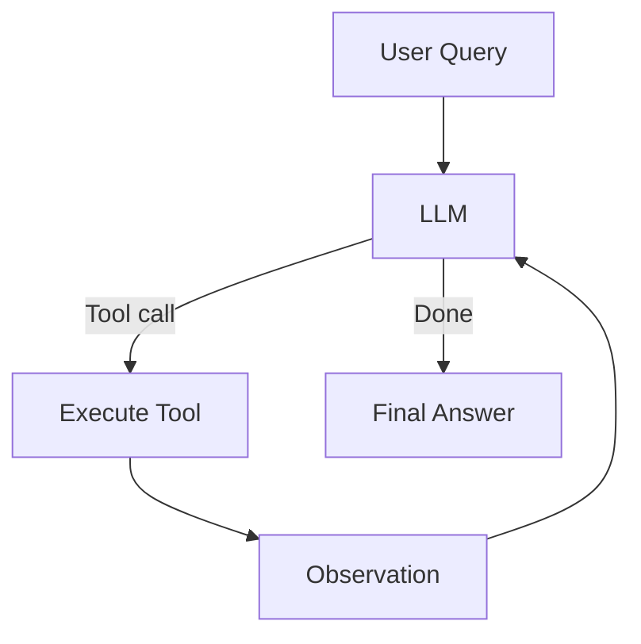
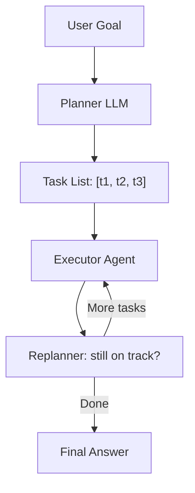
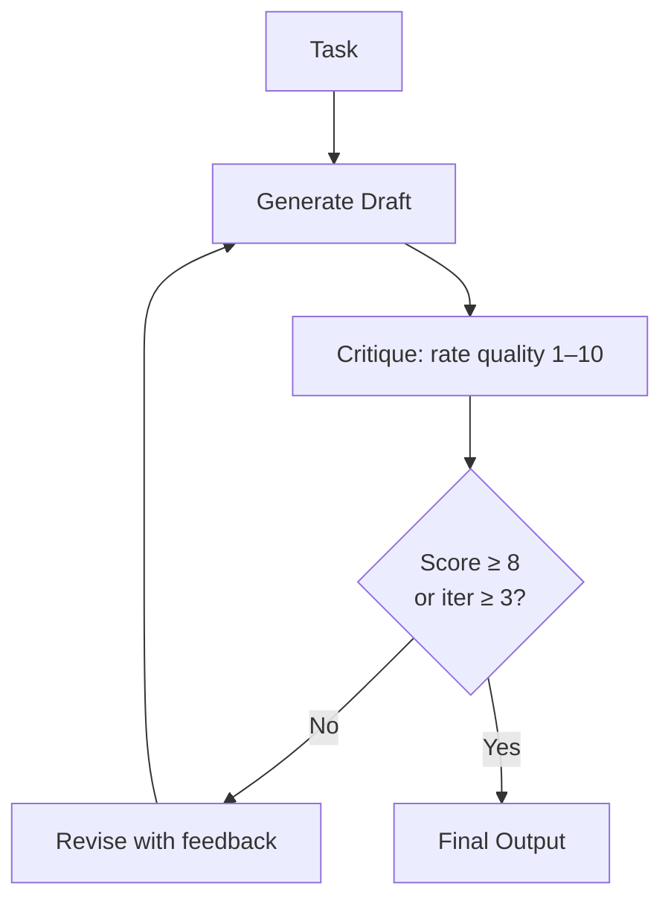
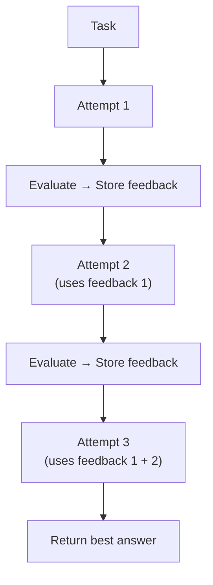
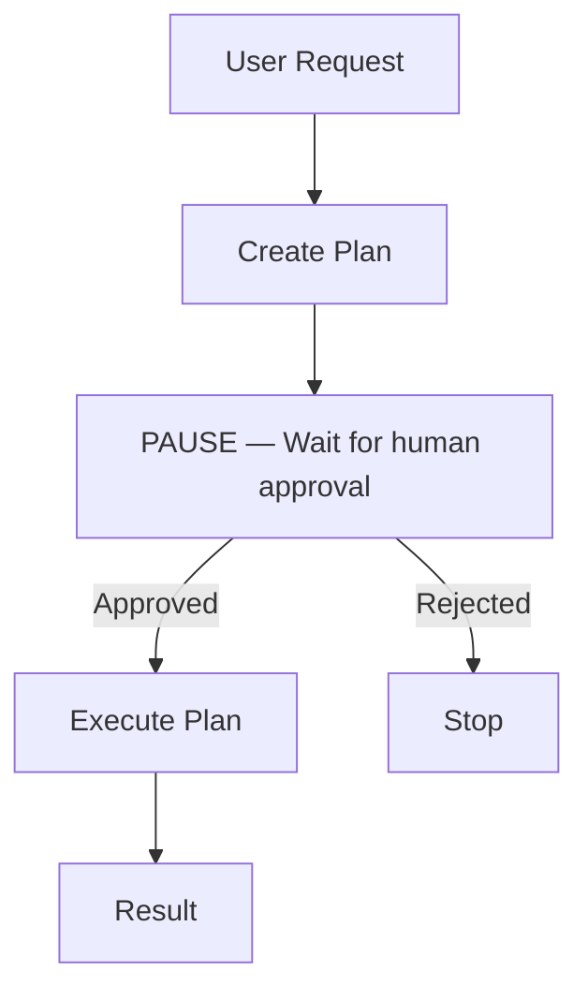

# Chapter 07 — Agent Architecture Patterns

> **Previous**: [Chapter 06 — Memory](Chapter-06-Memory-Context-State.md) | **Next**: [Frameworks Overview](frameworks/00-Framework-Overview.md)

---

## 7.1 Pattern 1: ReAct (Single-Agent Loop)

The simplest pattern. One LLM, many tools, one loop. Best for tasks that fit in a single reasoning thread.



```python
from langchain_openai import ChatOpenAI
from langchain_core.tools import tool
from langgraph.prebuilt import create_react_agent

llm = ChatOpenAI(model="gpt-4o")

@tool
def search(query: str) -> str:
    """Search the web for current information."""
    return f"Results for '{query}': ..."

@tool
def calculator(expression: str) -> str:
    """Evaluate a math expression like '5 * (3 + 2)'."""
    try:
        allowed = set("0123456789+-*/().** ")
        if not all(c in allowed for c in expression):
            return "Error: unsafe expression"
        return str(eval(expression))  # noqa: S307
    except Exception as e:
        return f"Error: {e}"

# create_react_agent is LangGraph's built-in ReAct
agent = create_react_agent(llm, tools=[search, calculator])

result = agent.invoke({
    "messages": [("user", "What's 15% of 847? Then search for today's top AI news.")]
})
print(result["messages"][-1].content)
```

**When to use**: Most tasks. Start here before reaching for more complex patterns.

---

## 7.2 Pattern 2: Plan-and-Execute

Separate planning from execution. The planner generates a task list; the executor completes each task. A replanner adjusts if the plan becomes invalid.



**When to use**: Complex multi-step tasks where the full plan cannot be known upfront, such as writing a research paper or building a feature.

```python
from pydantic import BaseModel
from typing import List, Optional
from langchain_openai import ChatOpenAI

llm = ChatOpenAI(model="gpt-4o", temperature=0)

class Plan(BaseModel):
    steps: List[str]

class Replan(BaseModel):
    action: str                            # "continue", "replan", or "done"
    updated_steps: Optional[List[str]] = None
    final_answer: Optional[str] = None

planner  = llm.with_structured_output(Plan)
replanner = llm.with_structured_output(Replan)

def plan_and_execute(goal: str) -> str:
    plan = planner.invoke(f"Create a step-by-step plan: {goal}")
    remaining = list(plan.steps)
    completed = []

    while remaining:
        step = remaining.pop(0)
        step_result = agent.invoke({"messages": [("user", step)]})
        result_text = step_result["messages"][-1].content
        completed.append({"step": step, "result": result_text})

        context = f"Goal: {goal}\nDone: {completed}\nRemaining: {remaining}"
        decision = replanner.invoke(f"Evaluate progress:\n{context}")

        if decision.action == "done":
            return decision.final_answer or result_text
        if decision.action == "replan":
            remaining = decision.updated_steps or remaining

    return completed[-1]["result"]
```

---

## 7.3 Pattern 3: Reflection

Generate → Critique → Revise until a quality threshold is met.



```python
from langgraph.graph import StateGraph, START, END
from typing import TypedDict
import re

class ReflectionState(TypedDict):
    task: str
    draft: str
    critique: str
    score: int
    iteration: int
    final: str

llm = ChatOpenAI(model="gpt-4o")

def generate(state: ReflectionState) -> ReflectionState:
    prompt = f"Complete this task:\n{state['task']}"
    if state.get("critique"):
        prompt += f"\n\nPrevious critique:\n{state['critique']}\nAddress this feedback."
    result = llm.invoke(prompt)
    return {"draft": result.content, "iteration": state.get("iteration", 0) + 1}

def critique(state: ReflectionState) -> ReflectionState:
    result = llm.invoke(f"""
    Task: {state['task']}
    Draft: {state['draft']}

    Rate quality 1–10 and explain what to improve.
    Format: "SCORE: N\\nFEEDBACK: ..."
    """)
    content = result.content
    match = re.search(r"SCORE:\s*(\d+)", content)
    score = int(match.group(1)) if match else 5
    return {"critique": content, "score": score}

def should_revise(state: ReflectionState) -> str:
    if state["score"] >= 8 or state["iteration"] >= 3:
        return "done"
    return "revise"

builder = StateGraph(ReflectionState)
builder.add_node("generate", generate)
builder.add_node("critique", critique)
builder.add_node("finalize", lambda s: {"final": s["draft"]})

builder.add_edge(START, "generate")
builder.add_edge("generate", "critique")
builder.add_conditional_edges("critique", should_revise,
                              {"revise": "generate", "done": "finalize"})
builder.add_edge("finalize", END)

reflection_agent = builder.compile()
```

**When to use**: Writing, code generation, translation — any task with a measurable quality bar.

---

## 7.4 Pattern 4: Reflexion (Learning from Failure)

Reflexion extends reflection by accumulating feedback across attempts. Each attempt uses all previous feedback to improve.



| | Reflection | Reflexion |
|---|---|---|
| Loop | Generate → Critique → Revise | Attempt → Evaluate → Learn |
| Memory | Current critique only | All past feedback |
| Best for | Content quality | Reasoning improvement |

```python
from typing import TypedDict, Annotated
import operator

class ReflexionState(TypedDict):
    task: str
    current_answer: str
    attempts: Annotated[list, operator.add]   # [{answer, feedback}]
    attempt_count: int
    is_solved: bool

def actor(state: ReflexionState) -> ReflexionState:
    """Solve the task using all past feedback."""
    past = "\n".join([
        f"Attempt {i+1} feedback: {a['feedback']}"
        for i, a in enumerate(state.get("attempts", []))
    ])
    prompt = f"Task: {state['task']}"
    if past:
        prompt += f"\n\nLearn from past attempts:\n{past}"

    answer = llm.invoke(prompt)
    return {
        "current_answer": answer.content,
        "attempt_count": state.get("attempt_count", 0) + 1
    }

def evaluator(state: ReflexionState) -> ReflexionState:
    """Evaluate and store feedback."""
    result = llm.invoke(f"""
    Task: {state['task']}
    Answer: {state['current_answer']}

    Is this correct? Reply with JSON:
    {{"is_correct": true/false, "feedback": "specific improvement"}}
    """)
    import json
    data = json.loads(result.content)
    return {
        "attempts": [{"answer": state["current_answer"], "feedback": data["feedback"]}],
        "is_solved": data["is_correct"]
    }

def should_retry(state: ReflexionState) -> str:
    if state["is_solved"] or state["attempt_count"] >= 4:
        return "done"
    return "retry"
```

---

## 7.5 Pattern 5: Human-in-the-Loop

Pause execution at critical points and wait for human approval before continuing.



```python
from langgraph.graph import StateGraph, START, END
from langgraph.checkpoint.memory import MemorySaver
from langgraph.types import interrupt
from typing import TypedDict

class ApprovalState(TypedDict):
    task: str
    plan: str
    approved: bool
    result: str

def create_plan(state: ApprovalState) -> ApprovalState:
    plan = llm.invoke(f"Create a detailed execution plan for: {state['task']}")
    return {"plan": plan.content}

def await_approval(state: ApprovalState) -> ApprovalState:
    """Graph pauses here until the caller resumes with a decision."""
    decision = interrupt({"message": "Approve this plan?", "plan": state["plan"]})
    return {"approved": decision.get("approved", False)}

def execute(state: ApprovalState) -> ApprovalState:
    if not state["approved"]:
        return {"result": "Plan rejected — task cancelled"}
    result = llm.invoke(f"Execute: {state['plan']}")
    return {"result": result.content}

memory = MemorySaver()
builder = StateGraph(ApprovalState)
builder.add_node("plan", create_plan)
builder.add_node("approval", await_approval)
builder.add_node("execute", execute)
builder.add_edge(START, "plan")
builder.add_edge("plan", "approval")
builder.add_edge("approval", "execute")
builder.add_edge("execute", END)

# interrupt_before="approval" pauses the graph before that node
hitl_graph = builder.compile(checkpointer=memory, interrupt_before=["approval"])

config = {"configurable": {"thread_id": "deploy-001"}}
result = hitl_graph.invoke({"task": "Deploy to production"}, config)
print("Plan:", result["plan"])

# Human reviews, then resumes
final = hitl_graph.invoke({"approved": True}, config)
print("Result:", final["result"])
```

---

## 7.6 Pattern 6: Event-Driven Agent

React to external events rather than explicit calls. Useful for monitoring, alerts, and automation pipelines.

```python
import asyncio
from dataclasses import dataclass

@dataclass
class AgentEvent:
    event_type: str
    payload: dict

class EventDrivenAgent:
    def __init__(self):
        self.handlers: dict[str, list] = {}
        self.queue: asyncio.Queue = asyncio.Queue()

    def on(self, event_type: str):
        """Register a handler for an event type."""
        def decorator(func):
            self.handlers.setdefault(event_type, []).append(func)
            return func
        return decorator

    async def emit(self, event: AgentEvent):
        await self.queue.put(event)

    async def run(self):
        while True:
            event = await self.queue.get()
            for handler in self.handlers.get(event.event_type, []):
                await handler(event)
            self.queue.task_done()

agent = EventDrivenAgent()

@agent.on("new_customer_message")
async def handle_message(event: AgentEvent):
    reply = await llm.ainvoke(event.payload["message"])
    await send_reply(event.payload["customer_id"], reply.content)

@agent.on("anomaly_detected")
async def handle_anomaly(event: AgentEvent):
    summary = await llm.ainvoke(f"Summarize this anomaly: {event.payload}")
    await alert_team(summary.content)
```

---

## Pattern Selection Guide

| Pattern | Use when |
|---|---|
| ReAct | Most tasks; start here |
| Plan-and-Execute | Long multi-step tasks where full plan isn't known upfront |
| Reflection | Output quality needs iterative improvement |
| Reflexion | Reasoning needs to improve across attempts |
| Human-in-the-Loop | High-stakes actions needing approval |
| Event-Driven | Reactive systems, monitoring, automation |

---

## Summary

- ReAct is the default pattern for most tasks
- Reflection improves output quality through critique loops
- Reflexion accumulates feedback across attempts
- HITL uses `interrupt()` to pause and wait for human decisions
- Event-driven agents react to external triggers asynchronously

## Exercises

1. Build a reflection agent for essay writing. Test with score threshold 7 and 3 max iterations.
2. Implement the HITL pattern — run a graph, pause it, approve, and verify it resumes correctly.
3. Compare reflection vs. no-reflection output on the same task.
4. Build a simple event-driven agent that reacts to two event types.

---

> **Next**: [Frameworks Overview](frameworks/00-Framework-Overview.md)
