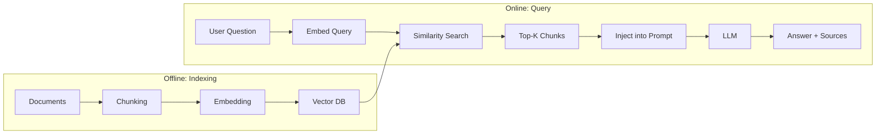

# Chapter 09 — RAG: Retrieval Augmented Generation

> **Previous**: [SmolAgents](frameworks/08-SmolAgents.md) | **Next**: [Chapter 10 — Multi-Agent Systems](Chapter-10-Multi-Agent-Systems.md)

---

## 9.1 Why RAG?

LLMs are trained on fixed data. They do not know:
- Your private documents
- Events after their training cutoff
- Internal company knowledge

**RAG** solves this by retrieving relevant documents at query time and injecting them into the prompt.



---

## 9.2 Chunking Strategies

Documents must be split into chunks before embedding. Chunk size is one of the most important RAG parameters.

```python
from langchain_text_splitters import (
    RecursiveCharacterTextSplitter,
    MarkdownHeaderTextSplitter,
    TokenTextSplitter
)

text = open("technical_guide.md").read()

# Strategy 1: Recursive — best default
recursive = RecursiveCharacterTextSplitter(
    chunk_size=1000,
    chunk_overlap=200,           # overlap prevents losing context at boundaries
    separators=["\n\n", "\n", ". ", " ", ""]
)
chunks = recursive.split_text(text)

# Strategy 2: Token-based — precise budget control
token = TokenTextSplitter(chunk_size=512, chunk_overlap=50)

# Strategy 3: Markdown-aware — respects document structure
md = MarkdownHeaderTextSplitter(headers_to_split_on=[
    ("#",   "section"),
    ("##",  "subsection"),
    ("###", "subsubsection")
])
md_chunks = md.split_text(text)
```

### Chunk Size Guidelines

| Chunk Size | Best For |
|---|---|
| 200–400 tokens | Precise Q&A, short facts |
| 500–1000 tokens | General purpose (start here) |
| 1000–2000 tokens | Summarization, broad context |
| 2000+ tokens | Full documents (use carefully) |

---

## 9.3 Embeddings

Embeddings convert text into vectors that capture semantic meaning. Similar text has similar vectors.

```python
from langchain_openai import OpenAIEmbeddings
from langchain_community.embeddings import HuggingFaceEmbeddings

# OpenAI (paid, high quality)
openai_emb = OpenAIEmbeddings(model="text-embedding-3-large")  # 3072 dims

# Free local model (private, no API cost)
local_emb = HuggingFaceEmbeddings(
    model_name="BAAI/bge-large-en-v1.5",
    model_kwargs={"device": "cpu"}
)

# Check similarity
v1 = openai_emb.embed_query("Python programming language")
v2 = openai_emb.embed_query("snake")

import numpy as np
similarity = np.dot(v1, v2) / (np.linalg.norm(v1) * np.linalg.norm(v2))
print(f"Similarity: {similarity:.3f}")  # low — different meanings
```

---

## 9.4 Vector Databases

| Database | Type | Best For |
|---|---|---|
| Chroma | In-process | Development, local |
| FAISS | In-process | Fast read-heavy |
| Pinecone | Cloud | Production scale |
| Qdrant | Cloud/self-hosted | Metadata filtering |
| pgvector | PostgreSQL | Existing Postgres stack |

```python
from langchain_chroma import Chroma
from langchain_openai import OpenAIEmbeddings
from langchain_community.document_loaders import PyPDFLoader

# Load
loader = PyPDFLoader("technical_docs.pdf")
docs = loader.load()

# Chunk
from langchain_text_splitters import RecursiveCharacterTextSplitter
splitter = RecursiveCharacterTextSplitter(chunk_size=1000, chunk_overlap=200)
chunks = splitter.split_documents(docs)

# Index
embeddings = OpenAIEmbeddings(model="text-embedding-3-small")
vectorstore = Chroma.from_documents(
    chunks,
    embeddings,
    persist_directory="./chroma_db"
)

# Query
results = vectorstore.similarity_search("How does authentication work?", k=5)
for r in results:
    print(f"[{r.metadata.get('page', '?')}] {r.page_content[:150]}")
```

---

## 9.5 Basic RAG Chain

```python
from langchain_openai import ChatOpenAI, OpenAIEmbeddings
from langchain_chroma import Chroma
from langchain_core.prompts import ChatPromptTemplate
from langchain_core.output_parsers import StrOutputParser
from langchain_core.runnables import RunnablePassthrough

llm = ChatOpenAI(model="gpt-4o", temperature=0)
vectorstore = Chroma(persist_directory="./chroma_db",
                     embedding_function=OpenAIEmbeddings())
retriever = vectorstore.as_retriever(search_kwargs={"k": 5})

def format_docs(docs):
    return "\n\n".join([
        f"[Source: {d.metadata.get('source', 'unknown')}]\n{d.page_content}"
        for d in docs
    ])

rag_prompt = ChatPromptTemplate.from_messages([
    ("system", """Answer using only the provided context.
    If the answer is not in the context, say so.
    Always cite the source."""),
    ("human", "Context:\n{context}\n\nQuestion: {question}")
])

rag_chain = (
    {"context": retriever | format_docs, "question": RunnablePassthrough()}
    | rag_prompt
    | llm
    | StrOutputParser()
)

answer = rag_chain.invoke("What authentication methods are supported?")
print(answer)
```

---

## 9.6 Advanced: Corrective RAG

Add relevance grading and web search fallback for when retrieval fails.

```python
from langgraph.graph import StateGraph, START, END
from langchain_openai import ChatOpenAI
from typing import TypedDict, Literal

class RAGState(TypedDict):
    query: str
    documents: list
    web_results: str
    answer: str
    relevance_score: float

llm = ChatOpenAI(model="gpt-4o", temperature=0)

def retrieve(state: RAGState) -> RAGState:
    docs = vectorstore.similarity_search(state["query"], k=5)
    return {"documents": docs}

def grade_relevance(state: RAGState) -> RAGState:
    """LLM grades each document 1–5 for relevance."""
    scored = []
    for doc in state["documents"]:
        resp = llm.invoke(f"""
        Query: {state['query']}
        Document: {doc.page_content[:400]}
        Relevance 1-5 (just the number):
        """)
        try:
            score = int(resp.content.strip())
        except ValueError:
            score = 1
        if score >= 3:
            scored.append(doc)

    ratio = len(scored) / max(len(state["documents"]), 1)
    return {"documents": scored, "relevance_score": ratio}

def route(state: RAGState) -> Literal["generate", "web_search", "rewrite"]:
    if state["relevance_score"] >= 0.6:
        return "generate"
    elif state["relevance_score"] < 0.2:
        return "web_search"
    return "rewrite"

def rewrite_query(state: RAGState) -> RAGState:
    rewritten = llm.invoke(
        f"Rewrite this query to be clearer and retrieve better documents:\n{state['query']}"
    )
    return {"query": rewritten.content}

def web_search(state: RAGState) -> RAGState:
    from langchain_community.tools.tavily_search import TavilySearchResults
    search = TavilySearchResults(max_results=3)
    results = search.invoke(state["query"])
    return {"web_results": str(results)}

def generate(state: RAGState) -> RAGState:
    docs_text = "\n\n".join([d.page_content for d in state["documents"]])
    web_text  = state.get("web_results", "")
    context   = f"{docs_text}\n\nWeb:\n{web_text}".strip()

    answer = llm.invoke(
        f"Answer based on context below. Cite sources.\n\nContext:\n{context}\n\nQ: {state['query']}"
    )
    return {"answer": answer.content}

builder = StateGraph(RAGState)
builder.add_node("retrieve",  retrieve)
builder.add_node("grade",     grade_relevance)
builder.add_node("rewrite",   rewrite_query)
builder.add_node("web_search", web_search)
builder.add_node("generate",  generate)

builder.add_edge(START, "retrieve")
builder.add_edge("retrieve", "grade")
builder.add_conditional_edges("grade", route,
    {"generate": "generate", "web_search": "web_search", "rewrite": "rewrite"})
builder.add_edge("rewrite",    "retrieve")
builder.add_edge("web_search", "generate")
builder.add_edge("generate",   END)

corrective_rag = builder.compile()
```

---

## 9.7 Hybrid Search

Combine semantic (vector) and keyword (BM25) search for better coverage:

```python
from langchain_community.retrievers import BM25Retriever
from langchain.retrievers import EnsembleRetriever

# Dense retriever (semantic)
dense = vectorstore.as_retriever(search_kwargs={"k": 5})

# Sparse retriever (keyword — no embeddings needed)
sparse = BM25Retriever.from_documents(chunks)
sparse.k = 5

# Ensemble: 60% semantic, 40% keyword
hybrid = EnsembleRetriever(
    retrievers=[dense, sparse],
    weights=[0.6, 0.4]
)

results = hybrid.invoke("authentication JWT token")
```

---

## RAG Quality Checklist

```
[ ] Chunk size tuned (start with 1000, experiment)
[ ] Overlap set (10–20% of chunk size)
[ ] Embedding model chosen appropriately
[ ] k (number of retrieved docs) tuned
[ ] Relevance grading added for high-stakes answers
[ ] Web fallback for current-events queries
[ ] Sources included in every answer
[ ] Evaluated on 20+ test cases
```

---

## Summary

- RAG = Index documents → retrieve relevant chunks → inject into prompt → generate
- Start with `RecursiveCharacterTextSplitter(chunk_size=1000, chunk_overlap=200)`
- Use `Chroma` for development, `Pinecone` or `Qdrant` for production
- Corrective RAG adds LLM-as-judge grading and fallback to web search
- Hybrid search (dense + BM25) outperforms either alone

## Exercises

1. Build a RAG system over 3 PDF files. Test with 5 questions.
2. Experiment with chunk sizes 200, 500, 1000, 2000 — measure answer quality.
3. Add relevance grading to your RAG chain. Verify it rejects irrelevant chunks.
4. Build the corrective RAG graph and test with a question your docs don't answer.

---

> **Next**: [Chapter 10 — Multi-Agent Systems](Chapter-10-Multi-Agent-Systems.md)
