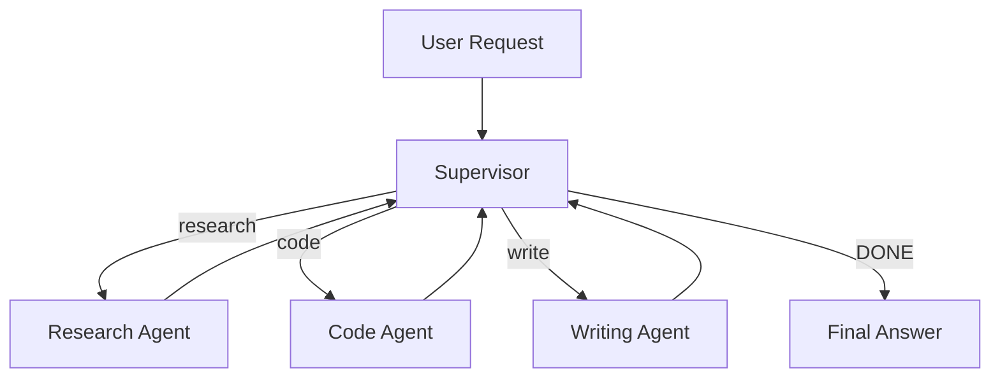

# Chapter 10 — Multi-Agent Systems

> **Previous**: [Chapter 09 — RAG](Chapter-09-RAG.md) | **Next**: [Chapter 11 — MCP](Chapter-11-MCP.md)

---

## 10.1 Why Multiple Agents?

A single agent fails when tasks are:
- Too complex for one reasoning thread
- Requiring specialization (research vs. writing vs. coding)
- Parallelizable (research 4 topics simultaneously)
- Needing independent verification

---

## 10.2 Supervisor Pattern

A supervisor routes tasks to specialist workers and aggregates their results.



```python
from langgraph.graph import StateGraph, START, END
from langchain_openai import ChatOpenAI
from typing import TypedDict, Annotated, Literal
import operator

class SupervisorState(TypedDict):
    messages: Annotated[list, operator.add]
    next_agent: str
    task_results: Annotated[list, operator.add]

llm = ChatOpenAI(model="gpt-4o", temperature=0)

# Specialist nodes
def research_agent(state: SupervisorState) -> SupervisorState:
    task = state["messages"][0]   # original request
    result = llm.invoke(f"Research this thoroughly and cite sources: {task}")
    return {"task_results": [{"agent": "research", "output": result.content}]}

def code_agent(state: SupervisorState) -> SupervisorState:
    task = state["messages"][0]
    result = llm.invoke(f"Write clean Python code with tests for: {task}")
    return {"task_results": [{"agent": "code", "output": result.content}]}

def writing_agent(state: SupervisorState) -> SupervisorState:
    task = state["messages"][0]
    context = "\n".join([r["output"] for r in state.get("task_results", [])])
    result = llm.invoke(f"Write a clear explanation for:\n{task}\n\nUsing:\n{context}")
    return {"task_results": [{"agent": "write", "output": result.content}]}

# Supervisor decides what to do next
def supervisor(state: SupervisorState) -> SupervisorState:
    results_so_far = "\n".join([
        f"[{r['agent']}]: {r['output'][:100]}..."
        for r in state.get("task_results", [])
    ])
    decision = llm.invoke(f"""
    Request: {state['messages'][0]}
    Work done: {results_so_far or 'none yet'}

    What should happen next? Reply with exactly one of:
    RESEARCH, CODE, WRITE, DONE
    """).content.strip().upper()

    for keyword in ["RESEARCH", "CODE", "WRITE", "DONE"]:
        if keyword in decision:
            return {"next_agent": keyword.lower()}
    return {"next_agent": "done"}

def route(state: SupervisorState) -> str:
    return state.get("next_agent", "done")

builder = StateGraph(SupervisorState)
builder.add_node("supervisor", supervisor)
builder.add_node("research",   research_agent)
builder.add_node("code",       code_agent)
builder.add_node("write",      writing_agent)

builder.add_edge(START, "supervisor")
builder.add_conditional_edges("supervisor", route,
    {"research": "research", "code": "code", "write": "write", "done": END})
builder.add_edge("research", "supervisor")
builder.add_edge("code",     "supervisor")
builder.add_edge("write",    "supervisor")

supervisor_graph = builder.compile()
```

---

## 10.3 Parallel Execution

Run multiple agents simultaneously for tasks with independent subtasks:

```python
import asyncio
from langchain_openai import ChatOpenAI

llm = ChatOpenAI(model="gpt-4o-mini")

async def research_subtopic(subtopic: str) -> dict:
    """Research one subtopic — runs in parallel."""
    result = await llm.ainvoke(f"Provide 3 key facts about: {subtopic}")
    return {"subtopic": subtopic, "facts": result.content}

async def parallel_research(main_topic: str) -> list:
    """Decompose topic and research all subtopics at once."""
    decomp = await llm.ainvoke(
        f"List 4 distinct research angles for '{main_topic}'. One per line, no numbers."
    )
    subtopics = [s.strip() for s in decomp.content.strip().split("\n") if s.strip()][:4]

    # All 4 tasks run simultaneously
    results = await asyncio.gather(*[research_subtopic(st) for st in subtopics])
    return list(results)

# Usage
results = asyncio.run(parallel_research("Quantum computing in finance"))
for r in results:
    print(f"\n## {r['subtopic']}")
    print(r['facts'])
```

---

## 10.4 Agent-to-Agent (A2A) Communication

Agents communicate by passing messages to each other via a hub:

```python
import asyncio
from dataclasses import dataclass, field
from typing import Any

@dataclass
class A2AMessage:
    sender: str
    receiver: str       # agent name or "broadcast"
    content: str
    task_id: str
    payload: dict[str, Any] = field(default_factory=dict)

class AgentHub:
    """Message router for A2A communication."""

    def __init__(self):
        self.agents: dict[str, "A2AAgent"] = {}
        self.queue: asyncio.Queue = asyncio.Queue()

    def register(self, agent: "A2AAgent"):
        self.agents[agent.name] = agent

    async def send(self, msg: A2AMessage):
        await self.queue.put(msg)

    async def route(self):
        """Continuously route messages to target agents."""
        while True:
            msg = await self.queue.get()
            if msg.receiver == "broadcast":
                for name, agent in self.agents.items():
                    if name != msg.sender:
                        await agent.receive(msg)
            elif msg.receiver in self.agents:
                await self.agents[msg.receiver].receive(msg)
            self.queue.task_done()

class A2AAgent:
    def __init__(self, name: str, hub: AgentHub):
        self.name = name
        self.hub = hub
        self.inbox: asyncio.Queue = asyncio.Queue()
        hub.register(self)

    async def receive(self, msg: A2AMessage):
        await self.inbox.put(msg)

    async def send_to(self, receiver: str, content: str, task_id: str):
        await self.hub.send(A2AMessage(
            sender=self.name,
            receiver=receiver,
            content=content,
            task_id=task_id
        ))

# Example: Research agent asks Fact-check agent to verify
hub = AgentHub()
researcher  = A2AAgent("researcher",   hub)
fact_checker = A2AAgent("fact_checker", hub)

async def researcher_task():
    claim = "Python was created in 1999"
    await researcher.send_to("fact_checker", f"Verify: {claim}", "task-001")
    response = await fact_checker.inbox.get()
    print(f"Fact check result: {response.content}")

async def fact_checker_task():
    msg = await fact_checker.inbox.get()
    result = await llm.ainvoke(f"Is this claim accurate? {msg.content}")
    await fact_checker.send_to(msg.sender, result.content, msg.task_id)
```

---

## 10.5 Debate / Verification Pattern

Two agents debate a claim; a judge decides:

```python
from langchain_openai import ChatOpenAI

llm = ChatOpenAI(model="gpt-4o")

async def debate(claim: str) -> dict:
    """Two agents argue for and against a claim; judge decides."""

    # Proponent argues for
    pro = await llm.ainvoke(
        f"Argue strongly FOR this claim with evidence:\n{claim}"
    )

    # Opponent argues against
    con = await llm.ainvoke(
        f"Argue strongly AGAINST this claim with evidence:\n{claim}"
    )

    # Judge evaluates both sides
    verdict = await llm.ainvoke(f"""
    Claim: {claim}

    For: {pro.content}
    Against: {con.content}

    Based on both arguments, what is the most accurate assessment?
    Provide a balanced verdict with confidence level.
    """)

    return {
        "claim": claim,
        "for": pro.content,
        "against": con.content,
        "verdict": verdict.content
    }

result = asyncio.run(debate("LLMs can truly reason, not just pattern match"))
print("Verdict:", result["verdict"])
```

---

## When to Use Multi-Agent

| Pattern | Use when |
|---|---|
| Supervisor | Tasks naturally split into specialist roles |
| Parallel | Independent subtasks that don't need each other's results |
| A2A | Agents need to query or verify each other dynamically |
| Debate | High-stakes claims needing adversarial verification |

---

## Summary

- Supervisor pattern: one orchestrator routes to specialists
- Parallel execution uses `asyncio.gather()` for simultaneous work
- A2A uses a message hub to let agents communicate directly
- Debate pattern uses adversarial agents + a judge for verification

## Exercises

1. Build a supervisor with 3 specialists. Route based on task type.
2. Research 5 subtopics in parallel and combine results into a summary.
3. Build a debate agent: test it on a controversial technical claim.
4. Time sequential vs. parallel execution of 4 LLM calls — measure the speedup.

---

> **Next**: [Chapter 11 — MCP](Chapter-11-MCP.md)
