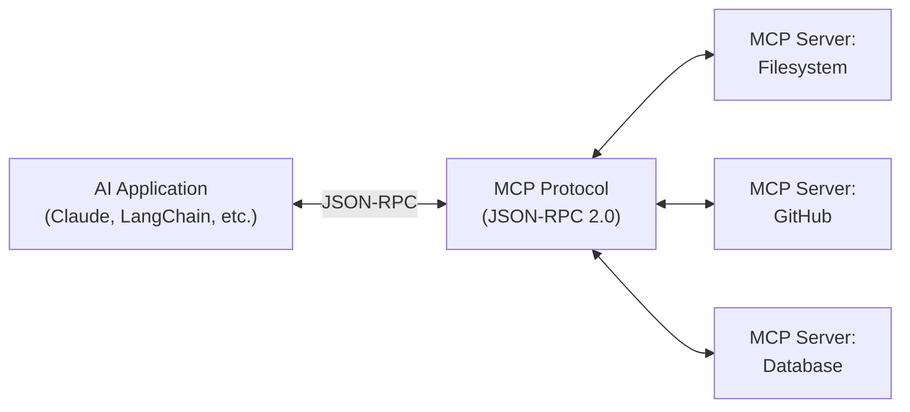

# Chapter 11 — MCP: Model Context Protocol

> **Previous**: [Chapter 10 — Multi-Agent Systems](Chapter-10-Multi-Agent-Systems.md) | **Next**: [Chapter 12 — Production Engineering](Chapter-12-Production-Engineering.md)

---

## 11.1 What Problem Does MCP Solve?

Before MCP, every AI app defined tools differently. LangChain tools don't work in Claude. OpenAI tools don't work in other frameworks. Every integration is custom and fragile.

**MCP** (Model Context Protocol) is an open standard by Anthropic that defines how AI clients discover and call tools, read resources, and use prompts — regardless of which framework or model is used.

```
Before MCP:
  Claude → custom integration → your tool
  LangChain → different custom integration → same tool
  OpenAI → yet another integration → same tool

After MCP:
  Any AI client → MCP Protocol → one server → your tool
```

---

## 11.2 MCP Architecture



**Three types of MCP primitives:**

| Primitive | Description | Example |
|---|---|---|
| **Resources** | Read-only data exposed to the client | Documentation, configs |
| **Tools** | Callable functions | Search, create ticket |
| **Prompts** | Reusable prompt templates | "Summarize this document" |

---

## 11.3 Building an MCP Server

```python
# my_mcp_server.py
from mcp.server import Server
from mcp.server.stdio import stdio_server
from mcp.types import Resource, Tool, TextContent
from pydantic import AnyUrl
import json, asyncio

app = Server("knowledge-tools")

# ─── Resources (read-only data) ────────────────────────────────────────────
@app.list_resources()
async def list_resources() -> list[Resource]:
    return [
        Resource(
            uri=AnyUrl("docs://company/handbook"),
            name="Company Handbook",
            description="Internal policies and procedures",
            mimeType="text/markdown"
        ),
        Resource(
            uri=AnyUrl("docs://company/faq"),
            name="FAQ",
            description="Frequently asked questions",
            mimeType="text/plain"
        )
    ]

@app.read_resource()
async def read_resource(uri: AnyUrl) -> str:
    path_map = {
        "docs://company/handbook": "handbook.md",
        "docs://company/faq":      "faq.txt"
    }
    filepath = path_map.get(str(uri))
    if not filepath:
        raise ValueError(f"Unknown resource: {uri}")
    return open(filepath).read()

# ─── Tools (callable functions) ────────────────────────────────────────────
@app.list_tools()
async def list_tools() -> list[Tool]:
    return [
        Tool(
            name="search_knowledge_base",
            description="Search the company knowledge base",
            inputSchema={
                "type": "object",
                "properties": {
                    "query":       {"type": "string"},
                    "max_results": {"type": "integer", "default": 5}
                },
                "required": ["query"]
            }
        ),
        Tool(
            name="create_ticket",
            description="Create a support ticket",
            inputSchema={
                "type": "object",
                "properties": {
                    "title":    {"type": "string"},
                    "body":     {"type": "string"},
                    "priority": {"type": "string", "enum": ["low", "medium", "high"]}
                },
                "required": ["title", "body"]
            }
        )
    ]

@app.call_tool()
async def call_tool(name: str, arguments: dict) -> list[TextContent]:
    if name == "search_knowledge_base":
        results = vectorstore.similarity_search(
            arguments["query"],
            k=arguments.get("max_results", 5)
        )
        output = json.dumps([{"content": r.page_content} for r in results])
        return [TextContent(type="text", text=output)]

    elif name == "create_ticket":
        ticket_id = abs(hash(arguments["title"])) % 9999
        msg = f"Ticket #{ticket_id} created: {arguments['title']}"
        return [TextContent(type="text", text=msg)]

    raise ValueError(f"Unknown tool: {name}")

# Run as a stdio server
if __name__ == "__main__":
    asyncio.run(stdio_server(app))
```

---

## 11.4 Using MCP with LangChain

```python
# pip install langchain-mcp-adapters
from langchain_mcp_adapters.tools import load_mcp_tools
from langgraph.prebuilt import create_react_agent
from langchain_openai import ChatOpenAI
from mcp import ClientSession, StdioServerParameters
from mcp.client.stdio import stdio_client
import asyncio

async def build_mcp_agent():
    # Start MCP server as a subprocess
    server_params = StdioServerParameters(
        command="python",
        args=["my_mcp_server.py"]
    )

    async with stdio_client(server_params) as (read, write):
        async with ClientSession(read, write) as session:
            await session.initialize()

            # Load MCP tools — they become LangChain tools
            tools = await load_mcp_tools(session)
            print(f"Loaded {len(tools)} MCP tools: {[t.name for t in tools]}")

            llm   = ChatOpenAI(model="gpt-4o")
            agent = create_react_agent(llm, tools)

            result = await agent.ainvoke({
                "messages": [("user",
                    "Search for 'onboarding process' and create a ticket if anything is unclear"
                )]
            })

            return result["messages"][-1].content

print(asyncio.run(build_mcp_agent()))
```

---

## 11.5 Pre-built MCP Servers

You don't need to build everything from scratch. Pre-built servers exist for common tools:

```bash
# Filesystem
npx @modelcontextprotocol/server-filesystem /path/to/allowed/dir

# GitHub
npx @modelcontextprotocol/server-github

# Brave Search
npx @modelcontextprotocol/server-brave-search

# SQLite
npx @modelcontextprotocol/server-sqlite --db-path ./data.db

# Slack
npx @modelcontextprotocol/server-slack
```

---

## 11.6 Why MCP Matters

| Without MCP | With MCP |
|---|---|
| Custom integration per tool per framework | One server, any client |
| Brittle, version-specific bindings | Stable protocol |
| Duplicate tool definitions | Write once, reuse everywhere |
| Hard to audit tool permissions | Explicit resource/tool separation |

---

## Summary

- MCP is the HTTP of AI tool integration — a universal protocol
- Three primitives: Resources (data), Tools (functions), Prompts (templates)
- Build one MCP server; use it with Claude, LangChain, any MCP client
- Pre-built servers exist for filesystem, GitHub, databases, and more

## Exercises

1. Build an MCP server with 2 tools and 1 resource. Run it locally.
2. Connect your MCP server to a LangChain agent using `load_mcp_tools`.
3. Use the `filesystem` pre-built MCP server and query a local directory.
4. Design an MCP server schema for a CRM system (what tools would you expose?).

---

> **Next**: [Chapter 12 — Production Engineering](Chapter-12-Production-Engineering.md)
