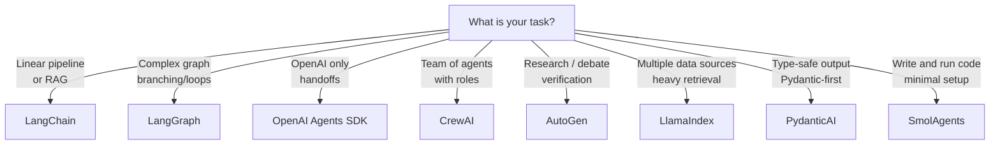
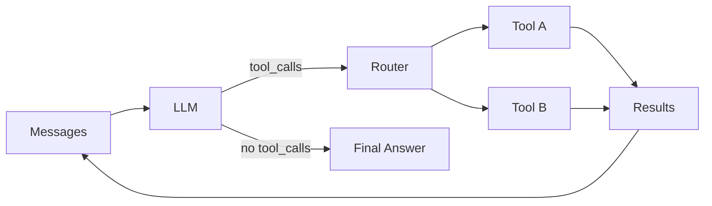

# Frameworks — Overview and Comparison

> **Previous**: [Chapter 07 — Patterns](../Chapter-07-Agent-Architecture-Patterns.md) | **Next**: [LangChain](01-LangChain.md)

---

## Which Framework Should You Learn First?

Start with **LangChain** (chains and tools) → then **LangGraph** (complex workflows). Everything else builds on these two.

---

## Comparison Table

| Framework | Paradigm | Best For | Learning Curve | Production Ready |
|---|---|---|---|---|
| LangChain | Chains, LCEL pipes | Pipelines, RAG, quick tools | Low | Yes |
| LangGraph | State machines, graphs | Complex branching agents | Medium | Yes |
| OpenAI Agents SDK | Handoffs, tracing | OpenAI-native, simple | Low | Yes |
| CrewAI | Role-based crews | Team-of-agents tasks | Low | Partial |
| AutoGen | Conversation agents | Research, debate, verification | Medium | Partial |
| LlamaIndex | Data-centric indexes | RAG over diverse sources | Medium | Yes |
| PydanticAI | Type-safe, model-agnostic | Structured extraction | Low | Yes |
| SmolAgents | Code-writing agents | Code execution tasks | Low | Partial |

---

## When to Use Each

---

## Common Architecture Across All Frameworks

Every framework is an abstraction over the same underlying flow:

The frameworks differ in:
- **How** state is represented
- **How** tools are defined
- **How** routing decisions are made
- **How** multiple agents coordinate

---

## Framework Files

| Framework | File | Key Concept |
|---|---|---|
| LangChain | [01-LangChain.md](01-LangChain.md) | LCEL pipe operator `|` |
| LangGraph | [02-LangGraph.md](02-LangGraph.md) | `StateGraph` + `TypedDict` |
| OpenAI Agents SDK | [03-OpenAI-Agents-SDK.md](03-OpenAI-Agents-SDK.md) | `handoff()` between agents |
| CrewAI | [04-CrewAI.md](04-CrewAI.md) | `Agent` + `Task` + `Crew` |
| AutoGen | [05-AutoGen.md](05-AutoGen.md) | `AssistantAgent` + `GroupChat` |
| LlamaIndex | [06-LlamaIndex.md](06-LlamaIndex.md) | `QueryEngineTool` + `ReActAgent` |
| PydanticAI | [07-PydanticAI.md](07-PydanticAI.md) | `Agent(result_type=MyModel)` |
| SmolAgents | [08-SmolAgents.md](08-SmolAgents.md) | `CodeAgent` writes Python |

---

> **Start with**: [01 — LangChain](01-LangChain.md)
