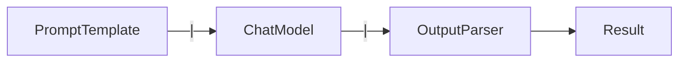

# Framework 01 — LangChain

> **Previous**: [Framework Overview](00-Framework-Overview.md) | **Next**: [LangGraph](02-LangGraph.md)

---

## What Is LangChain?

LangChain is a framework for building LLM applications using reusable, composable components. Its core idea is **LCEL** (LangChain Expression Language) — composing components with the `|` pipe operator.

```
Prompt | Model | OutputParser
```

---

## Architecture



Every component implements the `Runnable` interface:
- `.invoke(input)` — sync
- `.ainvoke(input)` — async
- `.stream(input)` — streaming
- `.batch(inputs)` — parallel batch

---

## Installation

```bash
pip install langchain langchain-openai langchain-community
```

---

## Core Components

### PromptTemplate

```python
from langchain_core.prompts import ChatPromptTemplate

prompt = ChatPromptTemplate.from_messages([
    ("system", "You are a helpful assistant."),
    ("human", "Translate '{text}' to {language}")
])

# Format — returns a list of messages
messages = prompt.format_messages(text="Hello", language="French")
```

### ChatModel

```python
from langchain_openai import ChatOpenAI

llm = ChatOpenAI(model="gpt-4o", temperature=0)

# Direct call
response = llm.invoke("What is LangChain?")
print(response.content)

# Streaming
for chunk in llm.stream("Explain RAG in 3 sentences"):
    print(chunk.content, end="", flush=True)
```

### OutputParsers

```python
from langchain_core.output_parsers import StrOutputParser
from langchain.output_parsers import CommaSeparatedListOutputParser

str_parser = StrOutputParser()            # plain text
list_parser = CommaSeparatedListOutputParser()  # comma-separated list

# Modern: use Pydantic instead
from pydantic import BaseModel
structured_llm = llm.with_structured_output(MyModel)
```

---

## Building Chains with LCEL

### Basic Chain

```python
from langchain_openai import ChatOpenAI
from langchain_core.prompts import ChatPromptTemplate
from langchain_core.output_parsers import StrOutputParser

prompt = ChatPromptTemplate.from_template(
    "Write a 3-line haiku about {topic}"
)
llm = ChatOpenAI(model="gpt-4o")
parser = StrOutputParser()

chain = prompt | llm | parser

result = chain.invoke({"topic": "artificial intelligence"})
print(result)
```

### Chain with Retrieval (RAG Chain)

```python
from langchain_core.runnables import RunnablePassthrough

def format_docs(docs):
    return "\n\n".join(doc.page_content for doc in docs)

rag_prompt = ChatPromptTemplate.from_messages([
    ("system", "Answer using only the context below. If unsure, say so."),
    ("human", "Context:\n{context}\n\nQuestion: {question}")
])

rag_chain = (
    {
        "context":  (lambda x: x["question"]) | retriever | format_docs,
        "question": RunnablePassthrough()
    }
    | rag_prompt
    | llm
    | StrOutputParser()
)

answer = rag_chain.invoke({"question": "What is RAG?"})
```

### Parallel Chains

```python
from langchain_core.runnables import RunnableParallel

parallel = RunnableParallel(
    summary=  (prompt_summary | llm | StrOutputParser()),
    keywords= (prompt_keywords | llm | StrOutputParser()),
    sentiment=(prompt_sentiment | llm | StrOutputParser())
)

# All three run at the same time
result = parallel.invoke({"text": "LangChain is a powerful framework..."})
print(result["summary"])
print(result["keywords"])
print(result["sentiment"])
```

---

## Defining and Using Tools

```python
from langchain_core.tools import tool
from langchain_openai import ChatOpenAI

@tool
def search_web(query: str) -> str:
    """Search the web for current information.

    Args:
        query: The search query string

    Returns:
        Search result summary
    """
    # Real: call Tavily, SerpAPI, etc.
    return f"Search results for '{query}': [top 3 results]"

@tool
def get_stock_price(ticker: str) -> str:
    """Get the current stock price for a ticker symbol.

    Args:
        ticker: Stock ticker, e.g. 'AAPL'

    Returns:
        Current price as a string
    """
    return f"{ticker}: $150.00"

llm = ChatOpenAI(model="gpt-4o")
llm_with_tools = llm.bind_tools([search_web, get_stock_price])

# Execute tool calls in a simple loop
def run_with_tools(query: str) -> str:
    from langchain_core.messages import HumanMessage, ToolMessage

    messages = [HumanMessage(content=query)]

    for _ in range(10):
        response = llm_with_tools.invoke(messages)
        messages.append(response)

        if not response.tool_calls:
            return response.content

        for tc in response.tool_calls:
            if tc["name"] == "search_web":
                result = search_web.invoke(tc["args"])
            elif tc["name"] == "get_stock_price":
                result = get_stock_price.invoke(tc["args"])
            else:
                result = "Tool not found"

            messages.append(ToolMessage(
                content=str(result),
                tool_call_id=tc["id"]
            ))

    return "Max iterations reached"

print(run_with_tools("What is AAPL's stock price and any recent Apple news?"))
```

---

## Complete Example: Research Pipeline

```python
from langchain_openai import ChatOpenAI
from langchain_core.prompts import ChatPromptTemplate
from langchain_core.output_parsers import StrOutputParser
from langchain_community.tools.tavily_search import TavilySearchResults
from pydantic import BaseModel
from typing import List

class ResearchReport(BaseModel):
    topic: str
    summary: str
    key_points: List[str]
    sources: List[str]

llm = ChatOpenAI(model="gpt-4o")
search = TavilySearchResults(max_results=5)

def format_results(results):
    return "\n\n".join([r["content"] for r in results])

report_prompt = ChatPromptTemplate.from_messages([
    ("system", "You are a research analyst. Create a structured report."),
    ("human", "Topic: {topic}\n\nSearch results:\n{context}")
])

# Chain: search → format → structured report
research_chain = (
    {
        "topic":   lambda x: x["topic"],
        "context": (lambda x: x["topic"]) | search | format_results
    }
    | report_prompt
    | llm.with_structured_output(ResearchReport)
)

report = research_chain.invoke({"topic": "LangGraph multi-agent patterns"})
print(f"## {report.topic}")
print(report.summary)
for pt in report.key_points:
    print(f"- {pt}")
```

---

## Best Practices

- Use `ChatPromptTemplate` (not `PromptTemplate`) for all chat models
- Use `.with_structured_output(Model)` instead of string parsing
- Add `.with_retry()` to chains in production
- Use LCEL (`|`) over legacy `LLMChain`, `RetrievalQA` classes
- Keep chains small and composable — one purpose per chain

## Limitations

- High abstraction can hide what's happening (hard to debug)
- Frequent breaking API changes between versions
- Not designed for complex branching → use LangGraph instead

## Advantages

- Fastest way to prototype
- Huge ecosystem of integrations
- Well-documented with many examples
- Streaming is first-class

---

> **Next**: [02 — LangGraph](02-LangGraph.md)
