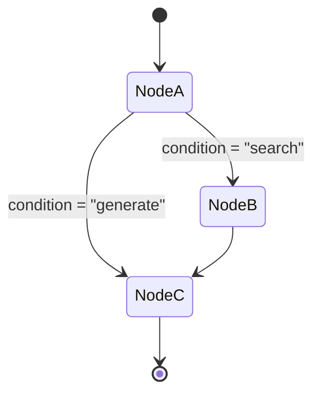

# Framework 02 — LangGraph

> **Previous**: [LangChain](01-LangChain.md) | **Next**: [OpenAI Agents SDK](03-OpenAI-Agents-SDK.md)

---

## What Is LangGraph?

LangGraph is a library for building **stateful, multi-step agent workflows** as directed graphs. It is built on top of LangChain but provides much more control than LCEL chains.

**Rule of thumb**:
- Use LangChain for linear pipelines
- Use LangGraph when you need branching, loops, retries, or parallel nodes

---

## Core Concepts

| Concept | Description |
|---|---|
| `StateGraph` | The graph builder |
| `TypedDict` | Defines the shared state schema |
| `Annotated[list, operator.add]` | Makes a list field append-only |
| Node | A Python function that reads/writes state |
| Edge | A fixed connection between two nodes |
| Conditional edge | A function that decides the next node at runtime |
| `START` / `END` | Built-in entry and exit points |
| `MemorySaver` | Checkpoints state for multi-turn conversations |
| `interrupt()` | Pauses graph for human-in-the-loop |

---

## Architecture



---

## Installation

```bash
pip install langgraph langchain-openai
```

---

## Building Your First Graph

```python
from langgraph.graph import StateGraph, START, END
from langchain_openai import ChatOpenAI
from langchain_core.messages import BaseMessage, HumanMessage
from typing import TypedDict, Annotated
import operator

# 1. Define state
class AgentState(TypedDict):
    messages: Annotated[list[BaseMessage], operator.add]  # append-only
    answer: str

llm = ChatOpenAI(model="gpt-4o")

# 2. Define nodes
def call_llm(state: AgentState) -> AgentState:
    response = llm.invoke(state["messages"])
    return {
        "messages": [response],
        "answer": response.content
    }

# 3. Build graph
builder = StateGraph(AgentState)
builder.add_node("llm", call_llm)
builder.add_edge(START, "llm")
builder.add_edge("llm", END)

# 4. Compile and run
graph = builder.compile()
result = graph.invoke({
    "messages": [HumanMessage(content="What is LangGraph?")],
    "answer": ""
})
print(result["answer"])
```

---

## Conditional Edges (Branching)

```python
from typing import Literal

class SearchState(TypedDict):
    query: str
    documents: list
    web_results: str
    answer: str
    relevance_score: float

def retrieve(state: SearchState) -> SearchState:
    docs = vectorstore.similarity_search(state["query"], k=5)
    return {"documents": docs}

def grade(state: SearchState) -> SearchState:
    scored = [d for d in state["documents"] if relevance(d) >= 0.6]
    score = len(scored) / max(len(state["documents"]), 1)
    return {"documents": scored, "relevance_score": score}

# This function decides the next node
def route(state: SearchState) -> Literal["generate", "web_search"]:
    if state["relevance_score"] >= 0.5:
        return "generate"
    return "web_search"

def web_search(state: SearchState) -> SearchState:
    results = search_api.invoke(state["query"])
    return {"web_results": str(results)}

def generate(state: SearchState) -> SearchState:
    context = "\n".join([d.page_content for d in state["documents"]])
    web = state.get("web_results", "")
    answer = llm.invoke(f"Answer based on:\n{context}\n{web}\n\nQ: {state['query']}")
    return {"answer": answer.content}

builder = StateGraph(SearchState)
builder.add_node("retrieve",   retrieve)
builder.add_node("grade",      grade)
builder.add_node("web_search", web_search)
builder.add_node("generate",   generate)

builder.add_edge(START, "retrieve")
builder.add_edge("retrieve", "grade")
builder.add_conditional_edges("grade", route,
    {"generate": "generate", "web_search": "web_search"})
builder.add_edge("web_search", "generate")
builder.add_edge("generate", END)

graph = builder.compile()
```

---

## Loops (Retry Logic)

```python
class RetryState(TypedDict):
    task: str
    result: str
    retry_count: int
    success: bool

def process(state: RetryState) -> RetryState:
    try:
        result = do_work(state["task"])
        return {"result": result, "success": True}
    except Exception:
        return {"result": "", "success": False}

def should_retry(state: RetryState) -> str:
    if state["success"] or state["retry_count"] >= 3:
        return "done"
    return "retry"

def increment_retry(state: RetryState) -> RetryState:
    return {"retry_count": state["retry_count"] + 1}

builder = StateGraph(RetryState)
builder.add_node("process",  process)
builder.add_node("retry",    increment_retry)

builder.add_edge(START, "process")
builder.add_conditional_edges("process", should_retry,
    {"retry": "retry", "done": END})
builder.add_edge("retry", "process")  # loop back
```

---

## Multi-Turn Conversations with MemorySaver

```python
from langgraph.checkpoint.memory import MemorySaver

memory = MemorySaver()
graph = builder.compile(checkpointer=memory)

# Thread ID identifies the conversation
config = {"configurable": {"thread_id": "user-abc"}}

# First message
graph.invoke({"messages": [HumanMessage(content="My name is Alice")]}, config)

# Second message — graph remembers the first one
result = graph.invoke({"messages": [HumanMessage(content="What is my name?")]}, config)
print(result["messages"][-1].content)  # "Your name is Alice"
```

---

## Complete Example: Customer Support Agent

```python
from langgraph.graph import StateGraph, START, END
from langgraph.prebuilt import ToolNode
from langchain_openai import ChatOpenAI
from langchain_core.tools import tool
from langchain_core.messages import SystemMessage, BaseMessage, HumanMessage
from typing import TypedDict, Annotated
import operator

class SupportState(TypedDict):
    messages: Annotated[list[BaseMessage], operator.add]

@tool
def lookup_order(order_id: str) -> str:
    """Look up an order by ID and return its status.

    Args:
        order_id: Order ID like 'ORD-001'
    """
    orders = {
        "ORD-001": "Shipped — arriving Tuesday",
        "ORD-002": "Processing",
        "ORD-003": "Delivered yesterday"
    }
    return orders.get(order_id, "Order not found")

@tool
def create_ticket(issue: str, priority: str = "medium") -> str:
    """Create a support ticket for unresolved issues.

    Args:
        issue: Description of the issue
        priority: 'low', 'medium', or 'high'
    """
    ticket_id = abs(hash(issue)) % 10000
    return f"Ticket #TKT-{ticket_id} created with {priority} priority"

tools = [lookup_order, create_ticket]
tool_node = ToolNode(tools)

llm = ChatOpenAI(model="gpt-4o").bind_tools(tools)

SYSTEM = """You are a helpful customer support agent.
Use lookup_order to check order status.
Use create_ticket for unresolved issues.
Be concise and professional."""

def agent(state: SupportState) -> SupportState:
    messages = [SystemMessage(content=SYSTEM)] + state["messages"]
    return {"messages": [llm.invoke(messages)]}

def should_continue(state: SupportState) -> str:
    last = state["messages"][-1]
    if getattr(last, "tool_calls", None):
        return "tools"
    return "end"

builder = StateGraph(SupportState)
builder.add_node("agent", agent)
builder.add_node("tools", tool_node)
builder.add_edge(START, "agent")
builder.add_conditional_edges("agent", should_continue,
                              {"tools": "tools", "end": END})
builder.add_edge("tools", "agent")

support_graph = builder.compile()

result = support_graph.invoke({
    "messages": [HumanMessage(content="Where is my order ORD-001?")]
})
print(result["messages"][-1].content)
```

---

## LangChain vs. LangGraph

| Aspect | LangChain (LCEL) | LangGraph |
|---|---|---|
| Paradigm | Linear pipeline | Graph state machine |
| Branching | Limited | Full support |
| Loops | Not built-in | Built-in |
| Debugging | Harder | Clearer state flow |
| Human-in-loop | Complex | Built-in `interrupt()` |
| Best for | Chains, RAG | Agents, multi-step |

---

## Best Practices

- Always define explicit `END` conditions — never let a graph loop forever
- Use `Annotated[list, operator.add]` for message lists
- Use `MemorySaver` for multi-turn chat agents
- Use `interrupt_before` for human approval steps
- Start with `create_react_agent` for simple cases; build custom graphs for complex ones

---

> **Next**: [03 — OpenAI Agents SDK](03-OpenAI-Agents-SDK.md)
