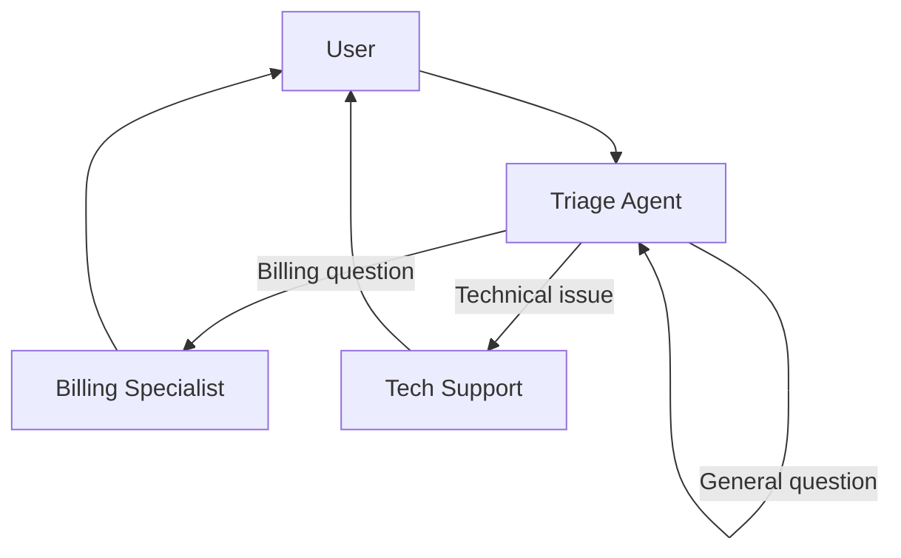

# Framework 03 — OpenAI Agents SDK

> **Previous**: [LangGraph](02-LangGraph.md) | **Next**: [CrewAI](04-CrewAI.md)

---

## What Is the OpenAI Agents SDK?

An official Python SDK from OpenAI for building agents. Its killer feature is **handoffs** — agents can transfer control to other agents seamlessly. Built-in tracing requires no setup.

**Best for**: OpenAI-only stacks that need clean agent-to-agent routing.

---

## Installation

```bash
pip install openai-agents
```

---

## Core Concepts

| Concept | Description |
|---|---|
| `Agent` | An LLM with a name, instructions, and tools |
| `function_tool` | Decorator to expose Python functions as tools |
| `handoff()` | Transfer control to another agent |
| `Runner.run()` | Execute an agent and get the final output |
| Built-in tracing | All runs are automatically traced |

---

## Basic Agent

```python
from agents import Agent, Runner, function_tool
import asyncio, os

@function_tool
def get_weather(location: str) -> str:
    """Get current weather for a location.

    Args:
        location: City name, e.g. 'Paris'
    """
    return f"Weather in {location}: 22°C, sunny"

agent = Agent(
    name="Weather Assistant",
    instructions="""You are a weather assistant.
    Use get_weather to check conditions.
    Always respond in a friendly, conversational tone.""",
    tools=[get_weather]
)

async def main():
    result = await Runner.run(agent, "What's the weather like in Tokyo?")
    print(result.final_output)

asyncio.run(main())
```

---

## Agent Handoffs

Handoffs let one agent delegate to a specialist. The triage agent reads the request and transfers to the right specialist.



```python
from agents import Agent, Runner, handoff, function_tool

@function_tool
def lookup_invoice(invoice_id: str) -> str:
    """Look up an invoice by ID."""
    invoices = {"INV-001": "$250 — paid", "INV-002": "$480 — outstanding"}
    return invoices.get(invoice_id, "Invoice not found")

@function_tool
def check_system_status() -> str:
    """Check if all services are operational."""
    return "All systems operational. Latency: 45ms"

# Specialist agents
billing_agent = Agent(
    name="Billing Specialist",
    instructions="""You handle billing and invoice questions.
    Look up invoices to give accurate information.
    Never share one customer's data with another.""",
    tools=[lookup_invoice]
)

tech_agent = Agent(
    name="Technical Support",
    instructions="""You handle technical issues and outages.
    Check system status for performance questions.
    Escalate hardware issues to field support.""",
    tools=[check_system_status]
)

# Triage agent routes to specialists
triage_agent = Agent(
    name="Support Triage",
    instructions="""You are the first point of contact.
    Route billing/invoice questions to Billing Specialist.
    Route technical/system questions to Technical Support.
    Handle general questions directly.""",
    handoffs=[
        handoff(billing_agent, "Route billing and invoice questions here"),
        handoff(tech_agent,    "Route technical and system questions here")
    ]
)

async def handle(query: str) -> str:
    result = await Runner.run(triage_agent, query)
    return result.final_output

import asyncio
print(asyncio.run(handle("I was double-charged on invoice INV-001")))
print(asyncio.run(handle("The dashboard is loading slowly")))
```

---

## Streaming

```python
from agents import Runner

async def stream_response(query: str):
    async with Runner.run_streamed(agent, query) as stream:
        async for event in stream.stream_events():
            if event.type == "raw_response_event":
                if hasattr(event.data, "delta"):
                    print(event.data.delta, end="", flush=True)
    print()  # newline

asyncio.run(stream_response("Explain quantum computing simply"))
```

---

## Complete Example: Multi-Department Support

```python
from agents import Agent, Runner, handoff, function_tool
from pydantic import BaseModel

class Ticket(BaseModel):
    department: str
    priority: str
    summary: str

@function_tool
def create_support_ticket(department: str, priority: str, summary: str) -> str:
    """Create a support ticket.

    Args:
        department: 'billing', 'technical', or 'general'
        priority: 'low', 'medium', 'high', 'critical'
        summary: Brief description of the issue
    """
    ticket_num = abs(hash(summary)) % 9999
    return f"Ticket #{ticket_num} created for {department} ({priority}): {summary}"

@function_tool
def get_account_info(account_id: str) -> str:
    """Get account information.

    Args:
        account_id: Customer account ID
    """
    accounts = {
        "ACC-100": {"name": "Alice Smith", "plan": "Pro", "status": "Active"},
        "ACC-200": {"name": "Bob Jones", "plan": "Basic", "status": "Past due"}
    }
    return str(accounts.get(account_id, {"error": "Account not found"}))

# Specialists
account_agent = Agent(
    name="Account Manager",
    instructions="Handle account status, plan upgrades, and billing disputes.",
    tools=[get_account_info, create_support_ticket]
)

escalation_agent = Agent(
    name="Escalation Manager",
    instructions="""Handle complex or critical issues that regular agents cannot resolve.
    Always acknowledge the severity and provide a resolution timeline.""",
    tools=[create_support_ticket]
)

# Triage with two handoffs
support_bot = Agent(
    name="Support Bot",
    instructions="""You are the front-line support agent.
    - For account/billing questions: handoff to Account Manager
    - For critical/escalated issues: handoff to Escalation Manager
    - For simple questions: answer directly""",
    handoffs=[
        handoff(account_agent,    "Account, billing, and plan questions"),
        handoff(escalation_agent, "Critical issues or unresolved complaints")
    ]
)

async def demo():
    queries = [
        "I need to upgrade my account ACC-100 to Enterprise",
        "This is urgent — my entire team can't access the platform and we have a deadline",
        "How do I reset my password?"
    ]
    for q in queries:
        print(f"\nQ: {q}")
        result = await Runner.run(support_bot, q)
        print(f"A: {result.final_output}")

asyncio.run(demo())
```

---

## Advantages

- Clean handoff API — agent routing is explicit and readable
- Zero-config built-in tracing
- Strongly typed with Pydantic
- Streaming is first-class

## Limitations

- Tightly coupled to OpenAI models (limited multi-provider support)
- Less flexible than LangGraph for complex stateful workflows
- Smaller ecosystem than LangChain

---

> **Next**: [04 — CrewAI](04-CrewAI.md)
