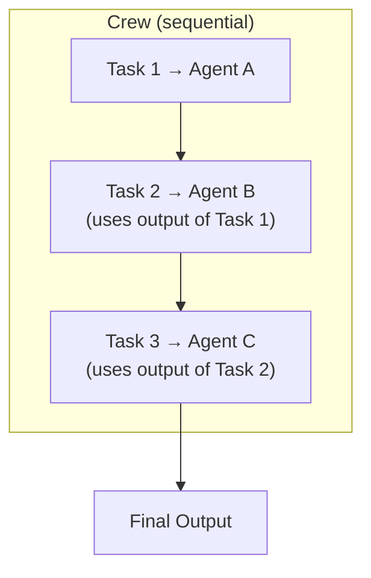

# Framework 04 — CrewAI

> **Previous**: [OpenAI Agents SDK](03-OpenAI-Agents-SDK.md) | **Next**: [AutoGen](05-AutoGen.md)

---

## What Is CrewAI?

CrewAI models a team of AI agents working together. Each agent has a **role**, **goal**, and **backstory**. Tasks are assigned to agents and run in sequence or parallel.

**Best for**: Tasks that naturally map to human team roles — researcher, writer, editor, analyst.

---

## Installation

```bash
pip install crewai crewai-tools
```

---

## Core Concepts

| Concept | Description |
|---|---|
| `Agent` | An LLM with a role, goal, and backstory |
| `Task` | A specific job with a description, expected output, and assigned agent |
| `Crew` | A collection of agents and tasks |
| `Process` | `sequential` (one after another) or `hierarchical` (manager decides) |
| `context` | A task can receive output from previous tasks |

---

## Architecture



---

## Basic Crew

```python
from crewai import Agent, Task, Crew, Process
from crewai_tools import SerperDevTool

search_tool = SerperDevTool()

# Define agents with distinct roles
researcher = Agent(
    role="Senior Research Analyst",
    goal="Find comprehensive, accurate information on {topic}",
    backstory="""You are an expert researcher who excels at finding
    and verifying information from multiple credible sources.
    You always provide citations.""",
    tools=[search_tool],
    verbose=True
)

writer = Agent(
    role="Technical Content Writer",
    goal="Write clear, accurate, engaging technical content",
    backstory="""You transform complex research into accessible articles.
    Your writing is precise, well-structured, and suitable for developers.""",
    verbose=True
)

# Define tasks
research_task = Task(
    description="""Research {topic} thoroughly.
    Find at least 5 credible sources.
    Identify key concepts, recent developments, and expert opinions.
    Output: a structured research brief with citations.""",
    expected_output="Structured research brief with 5+ sources",
    agent=researcher
)

writing_task = Task(
    description="""Using the research brief, write a 1000-word technical article on {topic}.
    Target: intermediate developers.
    Include: introduction, key concepts, practical examples, conclusion.""",
    expected_output="Complete 1000-word article",
    agent=writer,
    context=[research_task]   # receives output of research_task
)

# Assemble and run
crew = Crew(
    agents=[researcher, writer],
    tasks=[research_task, writing_task],
    process=Process.sequential,
    verbose=True
)

result = crew.kickoff(inputs={"topic": "LangGraph for production AI agents"})
print(result.raw)
```

---

## Complete Example: Content Team

```python
from crewai import Agent, Task, Crew, Process
from crewai_tools import SerperDevTool, WebsiteSearchTool

search_tool = SerperDevTool()
web_tool = WebsiteSearchTool()

# Three-agent team
researcher = Agent(
    role="Lead Researcher",
    goal="Gather accurate, up-to-date information with citations",
    backstory="Expert at finding and verifying technical information.",
    tools=[search_tool, web_tool],
    allow_delegation=False,
    verbose=True
)

writer = Agent(
    role="Technical Writer",
    goal="Produce clear, well-structured technical content",
    backstory="Skilled at making complex topics accessible to developers.",
    allow_delegation=False,
    verbose=True
)

editor = Agent(
    role="Senior Editor",
    goal="Ensure accuracy, clarity, and quality of final content",
    backstory="Critical eye for accuracy, structure, and citation quality.",
    allow_delegation=True,   # can delegate back to researcher/writer
    verbose=True
)

# Three-task pipeline
research_task = Task(
    description="""Research {topic}.
    Find: definition, key components, use cases, limitations, expert opinions.
    Provide 5+ cited sources.""",
    expected_output="Research brief with citations",
    agent=researcher
)

draft_task = Task(
    description="""Write a complete technical article about {topic} using the research.
    Structure: intro, concepts, code examples, use cases, conclusion.
    Length: 1500 words.""",
    expected_output="1500-word article draft",
    agent=writer,
    context=[research_task]
)

edit_task = Task(
    description="""Review the draft. Check for:
    - Factual accuracy (use research brief)
    - Logical structure
    - Code correctness
    - Proper citations
    Produce the final polished version.""",
    expected_output="Final edited article",
    agent=editor,
    context=[draft_task, research_task]
)

content_crew = Crew(
    agents=[researcher, writer, editor],
    tasks=[research_task, draft_task, edit_task],
    process=Process.sequential,
    verbose=True
)

result = content_crew.kickoff(inputs={"topic": "Multi-agent AI systems in production"})
print(result.raw)
```

---

## Hierarchical Process

In hierarchical mode, a manager agent delegates to workers:

```python
from crewai import Agent, Task, Crew, Process
from langchain_openai import ChatOpenAI

manager_llm = ChatOpenAI(model="gpt-4o")

manager = Agent(
    role="Project Manager",
    goal="Coordinate team to complete the project efficiently",
    backstory="Experienced PM who delegates effectively and tracks progress.",
    allow_delegation=True
)

dev = Agent(
    role="Developer",
    goal="Write clean, working code",
    backstory="Expert Python developer.",
    allow_delegation=False
)

qa = Agent(
    role="QA Engineer",
    goal="Find bugs and verify quality",
    backstory="Thorough tester who catches edge cases.",
    allow_delegation=False
)

project_task = Task(
    description="Build and test a Python function that validates email addresses",
    expected_output="Tested, working Python function with test cases",
    # No agent assigned — manager decides
)

project_crew = Crew(
    agents=[manager, dev, qa],
    tasks=[project_task],
    process=Process.hierarchical,
    manager_llm=manager_llm,
    verbose=True
)

result = project_crew.kickoff()
```

---

## Advantages

- Intuitive team metaphor — easy to explain to stakeholders
- `context` parameter chains tasks elegantly
- Role + backstory creates natural specialization
- `allow_delegation` enables flexible handoffs

## Limitations

- Less control than LangGraph over exact execution flow
- Production reliability is lower than LangGraph
- Not ideal for event-driven or real-time systems

---

> **Next**: [05 — AutoGen](05-AutoGen.md)
