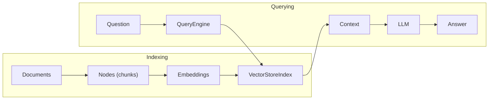

# Framework 06 — LlamaIndex

> **Previous**: [AutoGen](05-AutoGen.md) | **Next**: [PydanticAI](07-PydanticAI.md)

---

## What Is LlamaIndex?

LlamaIndex is a **data-centric** framework for building LLM applications over diverse data sources. Its strength is building indexes over documents, databases, and APIs — then querying them with natural language.

**Best for**: Multi-document Q&A, structured data querying, knowledge bases, agentic RAG over diverse sources.

---

## Installation

```bash
pip install llama-index llama-index-llms-openai llama-index-embeddings-openai
```

---

## Core Concepts

| Concept | Description |
|---|---|
| `Document` | A loaded piece of content (PDF, text, etc.) |
| `Node` | A chunk of a document with metadata |
| `VectorStoreIndex` | Index for semantic similarity search |
| `QueryEngine` | Answers questions over an index |
| `QueryEngineTool` | Wraps a query engine as an agent tool |
| `ReActAgent` | Agent that selects from tools |
| `Settings` | Global config for LLM and embedding model |

---

## Architecture



---

## Basic Index and Query

```python
from llama_index.core import VectorStoreIndex, SimpleDirectoryReader, Settings
from llama_index.llms.openai import OpenAI
from llama_index.embeddings.openai import OpenAIEmbedding

# Configure globally
Settings.llm = OpenAI(model="gpt-4o", temperature=0)
Settings.embed_model = OpenAIEmbedding(model="text-embedding-3-small")

# Load documents from a folder
documents = SimpleDirectoryReader("./docs").load_data()

# Build index
index = VectorStoreIndex.from_documents(documents)

# Query
query_engine = index.as_query_engine(similarity_top_k=5)
response = query_engine.query("What are the main features of LangGraph?")
print(response)
print("\nSources:")
for node in response.source_nodes:
    print(f"  - {node.metadata.get('file_name', 'unknown')} (score: {node.score:.3f})")
```

---

## Multi-Index Agent

Create separate indexes for different data sources, then build an agent that picks the right one:

```python
from llama_index.core import VectorStoreIndex, SimpleDirectoryReader, Settings
from llama_index.core.tools import QueryEngineTool, ToolMetadata
from llama_index.core.agent import ReActAgent
from llama_index.llms.openai import OpenAI

Settings.llm = OpenAI(model="gpt-4o")

# Build separate indexes
annual_reports = SimpleDirectoryReader("data/annual_reports").load_data()
product_docs   = SimpleDirectoryReader("data/product_docs").load_data()
tech_specs     = SimpleDirectoryReader("data/tech_specs").load_data()

index_reports  = VectorStoreIndex.from_documents(annual_reports)
index_products = VectorStoreIndex.from_documents(product_docs)
index_specs    = VectorStoreIndex.from_documents(tech_specs)

# Wrap as query engine tools
tools = [
    QueryEngineTool(
        query_engine=index_reports.as_query_engine(similarity_top_k=5),
        metadata=ToolMetadata(
            name="annual_reports",
            description="Annual financial reports, revenue, profit/loss, growth"
        )
    ),
    QueryEngineTool(
        query_engine=index_products.as_query_engine(similarity_top_k=5),
        metadata=ToolMetadata(
            name="product_docs",
            description="Product features, pricing, roadmap, release notes"
        )
    ),
    QueryEngineTool(
        query_engine=index_specs.as_query_engine(similarity_top_k=5),
        metadata=ToolMetadata(
            name="tech_specs",
            description="Technical specifications, APIs, architecture, integrations"
        )
    )
]

# Agent picks the right tool for each query
agent = ReActAgent.from_tools(tools, verbose=True)

# Agent will select product_docs + annual_reports automatically
response = agent.chat(
    "Compare our Q4 revenue with the new product launch — "
    "did the launch coincide with the revenue spike?"
)
print(response)
```

---

## Custom Document Loader

```python
from llama_index.core import Document
from llama_index.core.node_parser import SentenceSplitter
import json

def load_json_data(filepath: str) -> list[Document]:
    """Load a JSON file as LlamaIndex documents."""
    with open(filepath) as f:
        records = json.load(f)

    documents = []
    for record in records:
        doc = Document(
            text=record["content"],
            metadata={
                "id":       record.get("id", ""),
                "category": record.get("category", ""),
                "date":     record.get("date", "")
            }
        )
        documents.append(doc)
    return documents

# Parse into nodes with overlap
parser = SentenceSplitter(chunk_size=512, chunk_overlap=50)
docs = load_json_data("knowledge_base.json")
nodes = parser.get_nodes_from_documents(docs)

index = VectorStoreIndex(nodes)
```

---

## Metadata Filtering

```python
from llama_index.core.vector_stores import MetadataFilters, ExactMatchFilter

# Only search documents in the "legal" category
filters = MetadataFilters(filters=[
    ExactMatchFilter(key="category", value="legal")
])

filtered_engine = index.as_query_engine(
    similarity_top_k=5,
    filters=filters
)

response = filtered_engine.query("What are the indemnification clauses?")
```

---

## Advantages

- Best-in-class for multi-source document RAG
- Metadata filtering is powerful and easy
- Many built-in loaders (PDF, Notion, Confluence, SQL, etc.)
- `QueryEngineTool` makes any index an agent tool

## Limitations

- More complex setup than LangChain for simple tasks
- Agent capabilities less flexible than LangGraph
- Documentation can be fragmented across versions

---

> **Next**: [07 — PydanticAI](07-PydanticAI.md)
