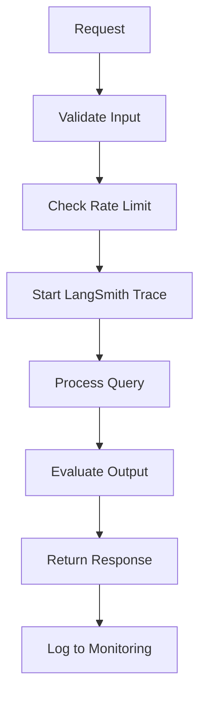

# DAY 14: Production Concerns + Security Review

## Learning Objectives

- [ ] Add production observability (LangSmith)
- [ ] Implement error handling and retries
- [ ] Add security controls (injection, SSRF, rate limits)
- [ ] Create evaluation datasets
- [ ] Deploy LLM applications safely

## Key Concepts

### 1. Production Checklist

```
[ ] Observability - trace all calls
[ ] Evaluation - measure quality
[ ] Error handling - graceful failures
[ ] Retries - handle transient errors
[ ] Rate limiting - protect backend
[ ] Security - defend against attacks
[ ] Monitoring - alert on issues
[ ] Documentation - code clarity
```

### 2. LangSmith Observability

Trace all LLM calls for debugging:

```python
from langsmith import traceable

@traceable
def my_chain(query: str) -> str:
    """Traced chain execution."""
    # LangSmith will auto-log:
    # - Input
    # - Output
    # - Duration
    # - Errors
    result = llm.invoke(query)
    return result.content

# Enable tracing
import os
os.environ["LANGCHAIN_API_KEY"] = "your-key"
os.environ["LANGCHAIN_TRACING_V2"] = "true"
```

View traces at https://smith.langchain.com/

### 3. Error Handling and Retries

```python
from tenacity import retry, stop_after_attempt, wait_exponential

@retry(
    stop=stop_after_attempt(3),
    wait=wait_exponential(multiplier=1, min=2, max=10)
)
def call_llm_with_retry(query: str):
    """Retry failed LLM calls."""
    try:
        return llm.invoke(query)
    except Exception as e:
        print(f"Error: {e}. Retrying...")
        raise
```

### 4. Input Validation (Injection Defense)

```python
from pydantic import BaseModel, validator

class UserQuery(BaseModel):
    """Validate user input."""
    query: str

    @validator("query")
    def check_length(cls, v):
        if len(v) > 10000:
            raise ValueError("Query too long")
        return v

    @validator("query")
    def check_injection(cls, v):
        # Check for SQL injection patterns
        dangerous = ["DROP", "DELETE", "INSERT"]
        if any(d in v.upper() for d in dangerous):
            raise ValueError("Potentially dangerous query")
        return v
```

### 5. Output Validation (Injection Defense)

Never trust LLM output directly:

```python
def safe_execute(code: str) -> str:
    """Execute code safely."""
    # Whitelist allowed imports
    allowed = ["math", "random"]

    # Blacklist dangerous functions
    dangerous = ["exec", "eval", "__import__", "open"]

    for func in dangerous:
        if func in code:
            return "Error: Dangerous function not allowed"

    # Execute in restricted namespace
    namespace = {name: __import__(name) for name in allowed}
    exec(code, namespace)
    return namespace.get("result", "No result")
```

### 6. Rate Limiting

```python
from slowapi import Limiter

limiter = Limiter(key_func=get_remote_address)

@limiter.limit("10/minute")
@app.post("/query")
def query_endpoint(query: UserQuery):
    """Rate limited endpoint."""
    return process_query(query.query)
```

### 7. SSRF Protection

Prevent agents from accessing internal URLs:

```python
from urllib.parse import urlparse

INTERNAL_IPS = ["127.0.0.1", "localhost", "192.168."]
BLOCKED_DOMAINS = ["internal.company.com"]

def safe_web_search(query: str) -> str:
    """Ensure search doesn't access internal resources."""
    results = tavily_search(query)

    for result in results:
        url = result.get("url", "")
        parsed = urlparse(url)

        # Block internal IPs
        if any(ip in parsed.netloc for ip in INTERNAL_IPS):
            continue

        # Block internal domains
        if any(domain in parsed.netloc for domain in BLOCKED_DOMAINS):
            continue

        # Safe to use
        yield result
```

### 8. Evaluation Dataset

Build dataset to measure quality:

```python
from langsmith import Client

client = Client()

# Create evaluation dataset
dataset = client.create_dataset("rag-qa", description="RAG QA pairs")

# Add test cases
examples = [
    {
        "query": "What is RAG?",
        "expected": "RAG is Retrieval Augmented Generation",
    },
    {
        "query": "How does LangGraph differ from LangChain?",
        "expected": "LangGraph is for stateful workflows",
    }
]

for ex in examples:
    client.create_example(
        dataset_id=dataset.id,
        inputs={"query": ex["query"]},
        outputs={"answer": ex["expected"]}
    )
```

### 9. Evaluation Function

```python
def evaluate_answer(predicted: str, expected: str) -> dict:
    """Score answer quality."""

    # Exact match
    exact_match = 1.0 if predicted.lower() == expected.lower() else 0.0

    # Semantic similarity (embeddings)
    pred_emb = embeddings.embed_query(predicted)
    exp_emb = embeddings.embed_query(expected)
    similarity = np.dot(pred_emb, exp_emb)

    # LLM-based evaluation
    llm_eval = llm.invoke(f"""
    Is this answer correct?
    Expected: {expected}
    Got: {predicted}
    """)

    is_correct = "yes" in llm_eval.content.lower()

    return {
        "exact_match": exact_match,
        "semantic_similarity": similarity,
        "llm_approval": 1.0 if is_correct else 0.0
    }
```

### 10. Common LLM App Security Issues

| Issue                | Defense                                |
| -------------------- | -------------------------------------- |
| Prompt Injection     | Input sanitization, role-based prompts |
| SSRF                 | URL whitelist, sandbox search results  |
| SQL Injection        | Parameterized queries, validation      |
| Token theft          | Secure env vars, key rotation          |
| Rate limiting bypass | Multi-layer rate limits                |
| Jailbreaks           | Guardrails, instruction hierarchy      |
| Data leakage         | Don't log sensitive data               |

### 11. Production Deployment Checklist

```
[ ] LangSmith tracing enabled
[ ] Error handling + retries
[ ] Input validation
[ ] Output validation
[ ] Rate limiting
[ ] SSRF protection
[ ] Evaluation metrics tracked
[ ] Security review completed
[ ] Load testing done
[ ] Monitoring alerts setup
[ ] Fallback model available
[ ] Documentation complete
[ ] Team trained on security
```

## Security-Hardened RAG Example

```python
from fastapi import FastAPI, Depends, HTTPException
from slowapi import Limiter
from pydantic import BaseModel, validator
from langsmith import traceable
import logging

app = FastAPI()
limiter = Limiter(key_func=lambda: "global")
logger = logging.getLogger(__name__)

class SafeQuery(BaseModel):
    query: str

    @validator("query")
    def validate_query(cls, v):
        if len(v) > 1000:
            raise ValueError("Query too long")
        dangerous_patterns = ["DROP", "DELETE", "exec"]
        if any(p in v for p in dangerous_patterns):
            raise ValueError("Suspicious query")
        return v

@traceable
def safe_rag_query(query: str) -> str:
    """Production-ready RAG with security."""
    try:
        # Retrieve
        docs = vectorstore.similarity_search(query, k=3)

        # Grade relevance
        graded = [d for d in docs if grade_relevance(query, d) >= 0.7]

        if not graded:
            return "No relevant documents found"

        # Generate
        context = "\n".join([d.page_content for d in graded])
        answer = llm.invoke(f"Based on: {context}\n\nAnswer: {query}")

        # Log success
        logger.info(f"Query processed: {query[:50]}...")

        return answer.content

    except Exception as e:
        logger.error(f"Query failed: {e}")
        return "Unable to process query. Please try again."

@app.post("/query")
@limiter.limit("10/minute")
def query_endpoint(safe_q: SafeQuery):
    """Rate-limited, validated endpoint."""
    try:
        result = safe_rag_query(safe_q.query)
        return {"answer": result}
    except Exception as e:
        raise HTTPException(status_code=500, detail="Internal error")
```

## Production Flow Diagram



## Code Lab: Productionize RAG Application

**Goal**: Convert your RAG to production-ready with all safeguards.

```python
# 1. Add LangSmith tracing
# 2. Add input validation (length, injection patterns)
# 3. Add retry logic
# 4. Add rate limiting
# 5. Add error handling
# 6. Add output validation
# 7. Create evaluation dataset
# 8. Deploy with monitoring
# 9. Test security with attack patterns
```

## Resources from Course

- Section 12: LLM Applications In Production (9 lectures)
- Section 25: Agent Security (1 lecture)
- Section 26: The Dark Side of "Vibe Coding" (6 lectures)

## Final Checklist

- [ ] Can trace with LangSmith
- [ ] Implement error handling + retries
- [ ] Add input/output validation
- [ ] Protect against injection attacks
- [ ] Add SSRF defenses
- [ ] Rate limit endpoints
- [ ] Create evaluation metrics
- [ ] Deploy securely
- [ ] Monitor in production
- [ ] Know security best practices

---
