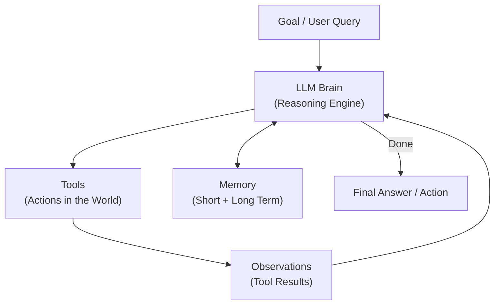
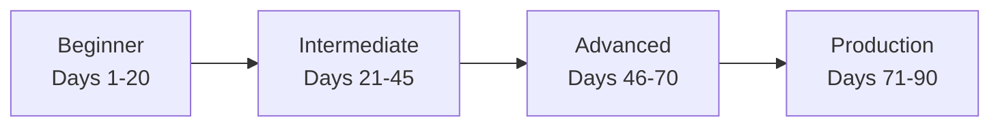
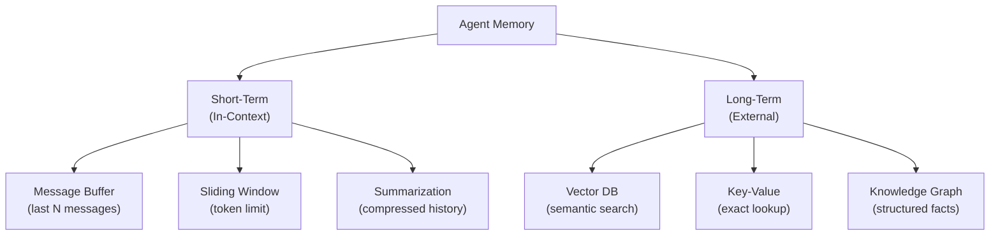
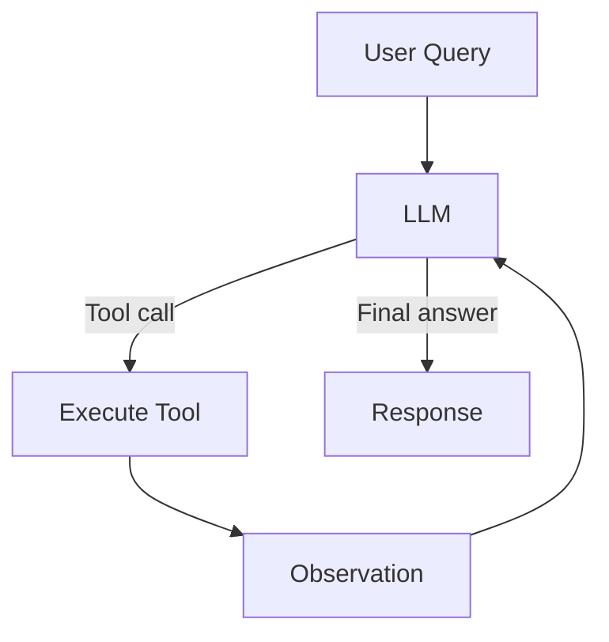
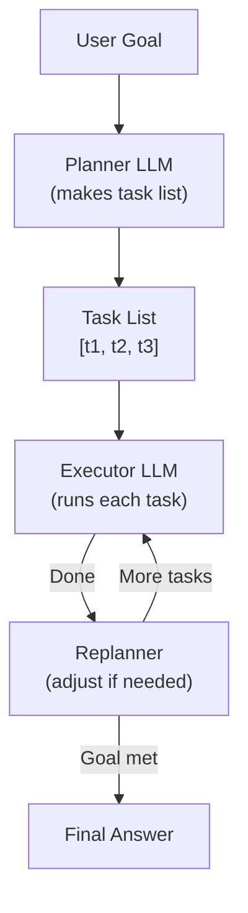
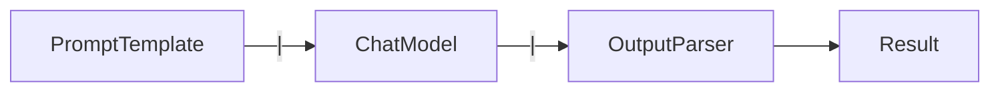
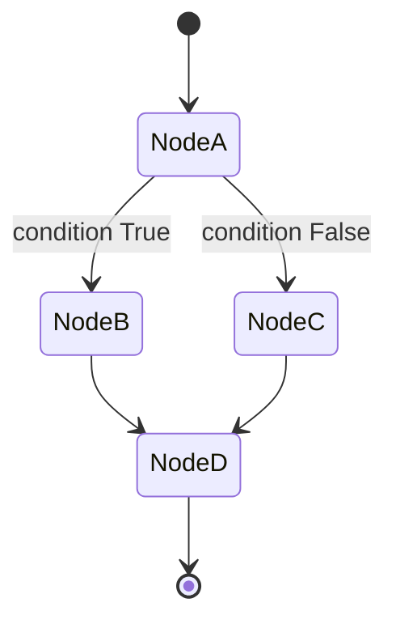
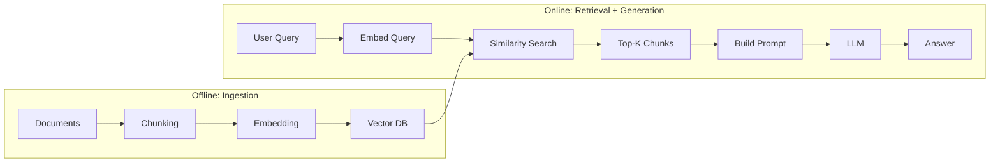
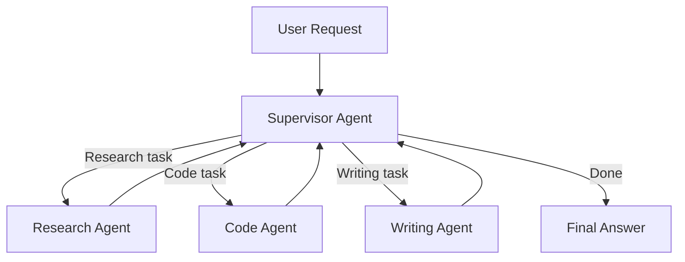
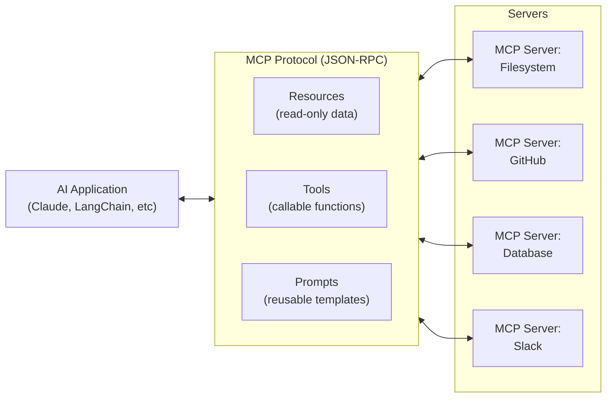

# The Complete AI Agent Development Guide
## From Fundamentals to Production — Python-First, Framework-Complete

> **Who this is for**: Beginners with Python experience who want to build production-grade AI agents. Every concept is explained before it is used. Every section builds on the previous one.

---

## Table of Contents

1. [What Is an AI Agent?](#1-what-is-an-ai-agent)
2. [Learning Roadmap](#2-learning-roadmap)
3. [Python Fundamentals for Agent Development](#3-python-fundamentals-for-agent-development)
4. [LLM Core Concepts](#4-llm-core-concepts)
5. [Prompting, Structured Output, and Tool Calling](#5-prompting-structured-output-and-tool-calling)
6. [Memory, Context, and State Management](#6-memory-context-and-state-management)
7. [Agent Architecture Patterns](#7-agent-architecture-patterns)
8. [Framework Deep Dives](#8-framework-deep-dives)
9. [RAG — Retrieval Augmented Generation](#9-rag--retrieval-augmented-generation)
10. [Multi-Agent Systems](#10-multi-agent-systems)
11. [MCP — Model Context Protocol](#11-mcp--model-context-protocol)
12. [Production Engineering](#12-production-engineering)
13. [Testing and Evaluation](#13-testing-and-evaluation)
14. [Real-World Projects](#14-real-world-projects)
15. [Project Architecture and Coding Standards](#15-project-architecture-and-coding-standards)
16. [90-Day Learning Plan](#16-90-day-learning-plan)
17. [Resources](#17-resources)

---

## 1. What Is an AI Agent?

### 1.1 The Core Idea

An **AI Agent** is software that uses a large language model (LLM) as its reasoning engine, combined with the ability to take actions in the world — searching the web, running code, reading files, calling APIs — and to loop until a goal is accomplished.

The word "agent" is borrowed from philosophy and robotics, where an agent is anything that perceives its environment and acts on it to achieve a goal.

```
Traditional Software:     Input → Hard-coded Logic → Output

LLM Application:          Input → LLM → Output (one-shot)

AI Agent:                 Goal → [Think → Act → Observe] × N → Done
```

### 1.2 What Makes an Agent Different

| Property | Traditional Software | LLM Application | AI Agent |
|---|---|---|---|
| Control flow | Fixed code paths | Fixed prompt | Dynamic, emergent |
| Actions | Hard-coded | Text only | External tools |
| Loops | Explicit | None | Self-directed |
| Memory | Explicit state | Context window | Short + long-term |
| Goal-seeking | No | No | Yes |
| Handles novelty | No | Partially | Yes |
| Self-correction | No | No | Yes |

### 1.3 Anatomy of an Agent

Every agent, regardless of framework, has these building blocks:



**The five components:**

1. **LLM** — the reasoning engine; decides what to do next
2. **Tools** — functions the agent can call (web search, code execution, database queries)
3. **Memory** — stores conversation history, facts, past actions
4. **Orchestration** — the loop that drives the agent forward
5. **Output** — the final result or action

### 1.4 Agents vs. Workflows vs. Automation

These terms are often confused:

| Term | Who decides? | Example |
|---|---|---|
| Script/Automation | Developer | Cron job, Zapier |
| Workflow | Developer + LLM | LangChain chain |
| Agent | LLM | ReAct agent with tools |
| Autonomous Agent | LLM fully | AutoGPT-style systems |

**Key distinction**: In a workflow, the developer writes the control flow. In an agent, the LLM decides the control flow at runtime.

### 1.5 ReAct: The Foundation of Modern Agents

**ReAct** (Reason + Act) is the fundamental pattern behind almost all agents:

```
Thought: I need to find the weather in Paris.
Action: get_weather(location="Paris")
Observation: 18°C, cloudy
Thought: I have the weather. I can answer now.
Final Answer: The weather in Paris is 18°C and cloudy.
```

This was introduced in the paper "ReAct: Synergizing Reasoning and Acting in Language Models" (Yao et al., 2022). It is the intellectual ancestor of function calling, tool use, and agentic frameworks.

---

**Key Concepts**
- AI agents use LLMs as reasoning engines that loop until a goal is met
- Agents differ from scripts by having LLM-driven, dynamic control flow
- ReAct (Reason-Act-Observe) is the foundational loop pattern
- Every agent has: LLM, tools, memory, orchestration, output

**Common Mistakes**
- Calling everything with an LLM an "agent" — a single LLM call is not an agent
- Over-engineering with agents when a simple chain is sufficient
- Not defining a clear stopping condition, causing infinite loops

**Interview Questions**
1. What distinguishes an AI agent from a regular LLM application?
2. Explain the ReAct loop.
3. When would you use a chain vs. an agent?

---

## 2. Learning Roadmap

### 2.1 Overview



### 2.2 Beginner Milestones (Days 1–20)

- [ ] Call an LLM via API (OpenAI, Anthropic, Ollama)
- [ ] Write and use prompt templates
- [ ] Build a simple chain (prompt → model → parser)
- [ ] Define and call a tool
- [ ] Build your first ReAct agent
- [ ] Understand function calling / tool calling
- [ ] Use Pydantic for structured output
- [ ] Build a basic RAG pipeline
- [ ] Understand embeddings and vector databases

### 2.3 Intermediate Milestones (Days 21–45)

- [ ] Build a LangGraph state machine
- [ ] Implement reflection and self-critique
- [ ] Build an Agentic RAG system
- [ ] Add short-term and long-term memory
- [ ] Implement human-in-the-loop checkpoints
- [ ] Compare and use at least 2 frameworks
- [ ] Build a multi-tool agent from scratch
- [ ] Understand MCP architecture

### 2.4 Advanced Milestones (Days 46–70)

- [ ] Implement multi-agent coordination
- [ ] Build custom agent architectures
- [ ] A2A (Agent-to-Agent) communication
- [ ] Event-driven agents
- [ ] Advanced RAG (corrective, self-reflective, adaptive)
- [ ] Build a production FastAPI agent API
- [ ] Implement observability with LangSmith / OpenTelemetry

### 2.5 Production Milestones (Days 71–90)

- [ ] Security hardening (injection, SSRF, rate limits)
- [ ] Full evaluation pipeline
- [ ] CI/CD for agent systems
- [ ] Deploy to cloud (Docker, Kubernetes)
- [ ] Cost and token optimization
- [ ] Monitoring and alerting
- [ ] Complete capstone project

---

## 3. Python Fundamentals for Agent Development

You need specific Python skills for agent work. This section covers what matters most.

### 3.1 Type Hints and Pydantic

Type hints make agent code readable and enable validation:

```python
from typing import TypedDict, Annotated, Literal, Optional, List
import operator

# TypedDict is the foundation of LangGraph state
class AgentState(TypedDict):
    query: str
    documents: list
    answer: str
    # Annotated + operator.add means "append, don't replace"
    messages: Annotated[list, operator.add]
    retry_count: int

# Pydantic for validation and structured output
from pydantic import BaseModel, Field, field_validator

class ToolInput(BaseModel):
    location: str = Field(description="City name, e.g. 'Paris'")
    units: Literal["celsius", "fahrenheit"] = "celsius"

    @field_validator("location")
    @classmethod
    def location_not_empty(cls, v: str) -> str:
        if not v.strip():
            raise ValueError("Location cannot be empty")
        return v.strip()

class AgentResponse(BaseModel):
    answer: str
    confidence: float = Field(ge=0.0, le=1.0)
    sources: List[str] = []
    reasoning: Optional[str] = None
```

### 3.2 Async Python

Most production agent code is async:

```python
import asyncio
from typing import AsyncGenerator

async def stream_agent_response(query: str) -> AsyncGenerator[str, None]:
    """Async generator that streams tokens."""
    async for chunk in llm.astream(query):
        yield chunk.content

async def run_parallel_tools(queries: list[str]) -> list[str]:
    """Run multiple tool calls in parallel."""
    # Create coroutines for each query
    tasks = [web_search(q) for q in queries]
    # Execute all at once
    results = await asyncio.gather(*tasks)
    return list(results)

# In an async agent
async def agent_loop(goal: str) -> str:
    messages = [{"role": "user", "content": goal}]

    for _ in range(10):  # max iterations
        response = await llm.ainvoke(messages)

        if response.tool_calls:
            # Run tool calls in parallel
            tool_tasks = [
                execute_tool(tc.name, tc.args)
                for tc in response.tool_calls
            ]
            results = await asyncio.gather(*tool_tasks)
            messages.extend(format_tool_results(results))
        else:
            return response.content

    return "Max iterations reached"
```

### 3.3 Decorators for Agent Tools

```python
from functools import wraps
import time
import logging

logger = logging.getLogger(__name__)

def tool_with_logging(func):
    """Decorator that logs tool calls and timing."""
    @wraps(func)
    def wrapper(*args, **kwargs):
        start = time.time()
        logger.info(f"Tool called: {func.__name__} args={args} kwargs={kwargs}")
        try:
            result = func(*args, **kwargs)
            elapsed = time.time() - start
            logger.info(f"Tool success: {func.__name__} took {elapsed:.2f}s")
            return result
        except Exception as e:
            logger.error(f"Tool error: {func.__name__} - {e}")
            raise
    return wrapper

@tool_with_logging
def search_database(query: str, limit: int = 5) -> list:
    """Search the database for relevant records."""
    return db.search(query, limit=limit)
```

### 3.4 Context Managers for Resource Safety

```python
from contextlib import asynccontextmanager

@asynccontextmanager
async def managed_agent_session(session_id: str):
    """Ensure cleanup even if agent crashes."""
    session = await create_session(session_id)
    try:
        yield session
    except Exception as e:
        await session.record_error(e)
        raise
    finally:
        await session.close()

# Usage
async with managed_agent_session("user-123") as session:
    result = await run_agent(session, query="...")
```

### 3.5 Dataclasses and NamedTuples for Agent Messages

```python
from dataclasses import dataclass, field
from datetime import datetime

@dataclass
class AgentMessage:
    role: str  # "user", "assistant", "tool"
    content: str
    timestamp: datetime = field(default_factory=datetime.now)
    tool_call_id: str | None = None
    metadata: dict = field(default_factory=dict)

    def to_dict(self) -> dict:
        return {
            "role": self.role,
            "content": self.content,
            "timestamp": self.timestamp.isoformat()
        }
```

### 3.6 Environment and Configuration

```python
from pydantic_settings import BaseSettings
from functools import lru_cache

class AgentConfig(BaseSettings):
    """Type-safe configuration from environment variables."""
    openai_api_key: str
    anthropic_api_key: str = ""
    model_name: str = "gpt-4o-mini"
    max_iterations: int = 10
    temperature: float = 0.0
    langsmith_api_key: str = ""
    langsmith_tracing: bool = False

    class Config:
        env_file = ".env"
        env_file_encoding = "utf-8"

@lru_cache
def get_config() -> AgentConfig:
    """Cached singleton config — load once, use everywhere."""
    return AgentConfig()

# Usage
config = get_config()
```

---

**Key Concepts**
- TypedDict is the standard for LangGraph state
- Pydantic validates tool inputs and structures LLM output
- Async programming enables parallel tool execution
- Environment variables via pydantic-settings prevent hardcoded secrets

---

## 4. LLM Core Concepts

### 4.1 How LLMs Work (What You Need to Know)

An LLM is a transformer neural network trained on text. It takes a sequence of tokens as input and predicts the next token. Repeated sampling produces complete responses.

Key concepts for agent builders:

| Concept | What it means | Why it matters |
|---|---|---|
| Temperature | Randomness (0=deterministic, 1=creative) | Low for agents (0-0.2), high for creativity |
| Context window | Max tokens the model can see | Limits memory, affects cost |
| Token | ~0.75 words | Billing unit, context limit unit |
| System prompt | Instructions before the conversation | Where you define agent behavior |
| Completion | The model's output | Can include text or tool calls |
| Logprobs | Probability of each token | Useful for confidence scoring |

### 4.2 Chat Models vs. Completion Models

```
Completion Model (GPT-3 style):
  Input:  "The capital of France is"
  Output: " Paris"

Chat Model (GPT-4 style):
  Input:  [{"role": "user", "content": "What is the capital of France?"}]
  Output: [{"role": "assistant", "content": "Paris"}]
```

All modern agent work uses **chat models**. The message format is:

```python
messages = [
    {"role": "system",    "content": "You are a research assistant."},
    {"role": "user",      "content": "What is quantum computing?"},
    {"role": "assistant", "content": "Quantum computing uses..."},
    {"role": "user",      "content": "How is it different from classical?"},
]
```

### 4.3 The System Prompt: Your Most Important Tool

The system prompt is the developer's primary control surface. It defines:

- Who the agent is (persona)
- What it can do (capabilities)
- What it must not do (constraints)
- How to use its tools
- Output format expectations

```python
AGENT_SYSTEM_PROMPT = """
You are a research assistant with access to web search and document retrieval.

## Capabilities
- Search the web for current information
- Retrieve and analyze documents
- Summarize and synthesize information

## Rules
- Always cite your sources
- If uncertain, say so rather than guessing
- Never share personal data from documents
- Use tools to verify claims before presenting them

## Output Format
When answering:
1. Provide a direct answer
2. Explain your reasoning
3. List sources used

## When to Stop
Return your final answer when:
- You have sufficient information
- You have used at most 5 tool calls
- Further search will not meaningfully improve the answer
"""
```

### 4.4 Token Counting and Context Management

```python
import tiktoken

def count_tokens(text: str, model: str = "gpt-4o") -> int:
    """Count tokens before sending to avoid context overflow."""
    encoding = tiktoken.encoding_for_model(model)
    return len(encoding.encode(text))

def trim_messages_to_fit(
    messages: list[dict],
    max_tokens: int = 100_000,
    model: str = "gpt-4o"
) -> list[dict]:
    """Keep only messages that fit within the context limit."""
    total = 0
    kept = []
    # Always keep system message
    system = [m for m in messages if m["role"] == "system"]
    others = [m for m in messages if m["role"] != "system"]

    for m in system:
        total += count_tokens(m["content"], model)
        kept.append(m)

    # Keep most recent messages
    for m in reversed(others):
        tokens = count_tokens(str(m.get("content", "")), model)
        if total + tokens < max_tokens:
            total += tokens
            kept.insert(len(system), m)  # insert after system
        else:
            break

    return kept
```

### 4.5 Model Comparison for Agents

| Model | Provider | Context | Strengths | Best For |
|---|---|---|---|---|
| gpt-4o | OpenAI | 128k | Balanced, fast, cheap | General agents |
| gpt-4o-mini | OpenAI | 128k | Very cheap | High-volume tasks |
| claude-3-5-sonnet | Anthropic | 200k | Long context, coding | Document analysis |
| claude-3-5-haiku | Anthropic | 200k | Fast, cheap | Routing/classification |
| gemini-2.0-flash | Google | 1M | Huge context | Book-length docs |
| llama-3.3-70b | Meta (open) | 128k | Free, local | Privacy, cost |
| deepseek-r1 | DeepSeek | 64k | Reasoning | Math, coding |

---

## 5. Prompting, Structured Output, and Tool Calling

### 5.1 Prompt Engineering for Agents

#### Zero-Shot Prompting
No examples given. Works for simple tasks:

```python
prompt = "Summarize this article in 3 bullet points: {article}"
```

#### Few-Shot Prompting
Show examples to guide format and reasoning:

```python
prompt = """
Classify the sentiment. Examples:

"I love this!" → positive
"Terrible service" → negative
"It's okay" → neutral

Now classify: "{text}"
"""
```

#### Chain of Thought (CoT)
Ask the model to reason step-by-step:

```python
prompt = """
Solve this step by step:

Problem: {problem}

Step 1: Identify what is being asked
Step 2: Identify the relevant information
Step 3: Apply the solution
Step 4: Verify the answer

Solution:
"""
```

#### ReAct Prompt Pattern
The template that drives tool-using agents:

```
You have access to these tools:
{tools}

Use this format:
Thought: What do I need to do?
Action: tool_name
Action Input: {"param": "value"}
Observation: [tool result]
... (repeat as needed)
Thought: I have enough information now.
Final Answer: [your answer]

Begin!
Question: {input}
```

### 5.2 Structured Output with Pydantic

Getting structured data from LLMs is critical for agents that need to parse results:

```python
from langchain_openai import ChatOpenAI
from pydantic import BaseModel, Field
from typing import List, Optional

# Define the output structure
class ResearchFindings(BaseModel):
    """Structured research output."""
    topic: str = Field(description="The research topic")
    key_facts: List[str] = Field(description="3-5 key facts found")
    confidence: float = Field(ge=0, le=1, description="Confidence score")
    sources: List[str] = Field(description="URLs or document titles")
    summary: str = Field(description="2-3 sentence summary")
    follow_up_questions: Optional[List[str]] = Field(
        default=None,
        description="Questions for further research"
    )

# Use .with_structured_output() — the modern approach
llm = ChatOpenAI(model="gpt-4o")
structured_llm = llm.with_structured_output(ResearchFindings)

result = structured_llm.invoke(
    "Research the latest advances in quantum computing"
)

# result is now a ResearchFindings object, not a string
print(result.topic)
print(result.key_facts)
print(result.confidence)
```

### 5.3 Function Calling / Tool Calling

Function calling is the mechanism by which LLMs signal that they want to call a tool:

```python
import json
from openai import OpenAI

client = OpenAI()

# Define tools with JSON schema
tools = [
    {
        "type": "function",
        "function": {
            "name": "search_web",
            "description": "Search the web for current information",
            "parameters": {
                "type": "object",
                "properties": {
                    "query": {
                        "type": "string",
                        "description": "The search query"
                    },
                    "max_results": {
                        "type": "integer",
                        "description": "Maximum number of results (1-10)",
                        "default": 5
                    }
                },
                "required": ["query"]
            }
        }
    },
    {
        "type": "function",
        "function": {
            "name": "run_python",
            "description": "Execute Python code and return the result",
            "parameters": {
                "type": "object",
                "properties": {
                    "code": {
                        "type": "string",
                        "description": "Python code to execute"
                    }
                },
                "required": ["code"]
            }
        }
    }
]

def execute_tool(name: str, args: dict) -> str:
    """Route tool calls to actual Python functions."""
    if name == "search_web":
        return search_web(**args)
    elif name == "run_python":
        return run_python(**args)
    raise ValueError(f"Unknown tool: {name}")

def agent_loop(user_query: str, max_iterations: int = 10) -> str:
    """Complete agent loop with tool calling."""
    messages = [{"role": "user", "content": user_query}]

    for i in range(max_iterations):
        response = client.chat.completions.create(
            model="gpt-4o",
            messages=messages,
            tools=tools,
            tool_choice="auto"
        )

        msg = response.choices[0].message

        # No tool call → agent is done
        if not msg.tool_calls:
            return msg.content

        # Add assistant message with tool calls
        messages.append({"role": "assistant", "content": msg.content,
                         "tool_calls": [tc.model_dump() for tc in msg.tool_calls]})

        # Execute each tool call
        for tool_call in msg.tool_calls:
            args = json.loads(tool_call.function.arguments)
            result = execute_tool(tool_call.function.name, args)

            # Add tool result to messages
            messages.append({
                "role": "tool",
                "tool_call_id": tool_call.id,
                "content": str(result)
            })

    return "Max iterations reached without final answer"
```

### 5.4 LangChain Tools Abstraction

LangChain wraps functions as tools with automatic JSON schema generation:

```python
from langchain_core.tools import tool
from langchain_openai import ChatOpenAI

@tool
def get_weather(location: str, units: str = "celsius") -> str:
    """Get current weather for a city.

    Args:
        location: City name (e.g., 'Paris')
        units: Temperature units — 'celsius' or 'fahrenheit'

    Returns:
        Weather description string
    """
    # In production, call a real weather API
    return f"Weather in {location}: 22°{units[0].upper()}, sunny"

@tool
def calculate(expression: str) -> str:
    """Evaluate a mathematical expression.

    Args:
        expression: A valid Python math expression, e.g. '(5 + 3) * 2'

    Returns:
        The numerical result as a string
    """
    try:
        # Restrict to safe operations
        allowed = set("0123456789+-*/().** ")
        if not all(c in allowed for c in expression):
            return "Error: Only numeric expressions allowed"
        return str(eval(expression))  # noqa: S307 — validated above
    except Exception as e:
        return f"Error: {e}"

# Bind tools to model
llm = ChatOpenAI(model="gpt-4o")
llm_with_tools = llm.bind_tools([get_weather, calculate])

# The model can now decide to call tools
response = llm_with_tools.invoke("What's the weather in Rome? Also calculate 15 * 7")

if response.tool_calls:
    for tc in response.tool_calls:
        print(f"Tool: {tc['name']}, Args: {tc['args']}")
```

---

**Key Concepts**
- System prompts define agent personality and constraints
- Few-shot examples improve consistency
- Pydantic + `.with_structured_output()` is the modern way to parse LLM output
- Function calling lets the LLM signal which tool to call and with what arguments

**Common Mistakes**
- Using raw string parsing for LLM output — use Pydantic instead
- Writing ambiguous tool descriptions — the model can't choose correctly
- Not handling tool errors — always wrap tool execution in try/except
- Using `eval()` on arbitrary LLM output — always sanitize first

**Exercises**
1. Build a tool that queries a SQLite database. Add input validation with Pydantic.
2. Create a `ResearchReport` Pydantic model with 6+ fields and use `.with_structured_output()`.
3. Write a raw agent loop (no framework) that uses 3 tools and runs for max 5 iterations.

---

## 6. Memory, Context, and State Management

### 6.1 Types of Memory



### 6.2 Short-Term Memory: Message Buffer

```python
from collections import deque
from langchain_openai import ChatOpenAI
from langchain_core.messages import HumanMessage, AIMessage, SystemMessage

class BufferedAgent:
    """Agent with a fixed-size message history."""

    def __init__(self, model: str = "gpt-4o", max_messages: int = 20):
        self.llm = ChatOpenAI(model=model)
        self.history: deque = deque(maxlen=max_messages)
        self.system = SystemMessage(content="You are a helpful assistant.")

    def chat(self, user_input: str) -> str:
        self.history.append(HumanMessage(content=user_input))

        messages = [self.system] + list(self.history)
        response = self.llm.invoke(messages)

        self.history.append(response)
        return response.content

    def clear(self):
        self.history.clear()

agent = BufferedAgent(max_messages=10)
print(agent.chat("My name is Alice"))
print(agent.chat("What is my name?"))  # Should remember "Alice"
```

### 6.3 Short-Term Memory: Sliding Window with Token Limit

```python
import tiktoken
from langchain_core.messages import BaseMessage

def trim_history(
    messages: list[BaseMessage],
    max_tokens: int = 8000,
    model: str = "gpt-4o"
) -> list[BaseMessage]:
    """Keep most recent messages within token budget."""
    enc = tiktoken.encoding_for_model(model)

    def token_count(m: BaseMessage) -> int:
        return len(enc.encode(str(m.content)))

    system_msgs = [m for m in messages if m.type == "system"]
    other_msgs = [m for m in messages if m.type != "system"]

    budget = max_tokens - sum(token_count(m) for m in system_msgs)
    kept = []

    for m in reversed(other_msgs):
        cost = token_count(m)
        if budget - cost >= 0:
            budget -= cost
            kept.insert(0, m)
        else:
            break

    return system_msgs + kept
```

### 6.4 Long-Term Memory: Vector Store

```python
from langchain_openai import OpenAIEmbeddings
from langchain_chroma import Chroma
from datetime import datetime

class LongTermMemory:
    """Semantic long-term memory backed by a vector store."""

    def __init__(self, collection_name: str = "agent_memory"):
        self.embeddings = OpenAIEmbeddings(model="text-embedding-3-small")
        self.store = Chroma(
            collection_name=collection_name,
            embedding_function=self.embeddings,
            persist_directory="./memory_db"
        )

    def remember(self, content: str, metadata: dict | None = None) -> None:
        """Store a memory with metadata."""
        meta = {"timestamp": datetime.now().isoformat(), **(metadata or {})}
        self.store.add_texts([content], metadatas=[meta])

    def recall(self, query: str, k: int = 5) -> list[str]:
        """Retrieve semantically similar memories."""
        results = self.store.similarity_search(query, k=k)
        return [doc.page_content for doc in results]

    def recall_with_scores(self, query: str, k: int = 5, threshold: float = 0.7):
        """Retrieve memories above a relevance threshold."""
        results = self.store.similarity_search_with_score(query, k=k)
        return [
            (doc.page_content, score)
            for doc, score in results
            if score >= threshold
        ]

# Usage
memory = LongTermMemory()
memory.remember("User prefers Python over JavaScript", {"user": "alice"})
memory.remember("User is working on a finance application", {"user": "alice"})

relevant = memory.recall("what programming language does the user prefer?")
print(relevant)
```

### 6.5 LangGraph State Management

LangGraph is the modern standard for managing state in multi-step agents:

```python
from typing import TypedDict, Annotated
from langchain_core.messages import BaseMessage, HumanMessage, AIMessage
import operator
from langgraph.graph import StateGraph, START, END
from langchain_openai import ChatOpenAI

# State is a TypedDict shared between all nodes
class ConversationState(TypedDict):
    messages: Annotated[list[BaseMessage], operator.add]  # append-only
    user_name: str
    topic: str
    turn_count: int

llm = ChatOpenAI(model="gpt-4o")

def greet_node(state: ConversationState) -> ConversationState:
    """Extract user name and greet."""
    last_msg = state["messages"][-1].content
    # Simple extraction (in production use structured output)
    name = last_msg.split()[-1] if "name" in last_msg.lower() else "friend"
    greeting = f"Hello, {name}! How can I help you today?"
    return {
        "messages": [AIMessage(content=greeting)],
        "user_name": name
    }

def respond_node(state: ConversationState) -> ConversationState:
    """Generate contextual response."""
    response = llm.invoke(state["messages"])
    return {
        "messages": [response],
        "turn_count": state.get("turn_count", 0) + 1
    }

def should_continue(state: ConversationState) -> str:
    """Route based on state."""
    if state.get("turn_count", 0) >= 10:
        return "end"
    return "respond"

# Build graph
builder = StateGraph(ConversationState)
builder.add_node("greet", greet_node)
builder.add_node("respond", respond_node)

builder.add_edge(START, "greet")
builder.add_conditional_edges("greet", should_continue,
                              {"respond": "respond", "end": END})
builder.add_conditional_edges("respond", should_continue,
                              {"respond": "respond", "end": END})

graph = builder.compile()
```

---

## 7. Agent Architecture Patterns

### 7.1 Single-Agent: ReAct

The simplest agent pattern. One LLM, many tools, one loop.



```python
from langchain_openai import ChatOpenAI
from langchain_core.tools import tool
from langgraph.prebuilt import create_react_agent

llm = ChatOpenAI(model="gpt-4o")

@tool
def search(query: str) -> str:
    """Search the web for information."""
    # Real implementation would call Tavily, SerpAPI, etc.
    return f"Search results for '{query}': ..."

@tool
def calculator(expression: str) -> str:
    """Evaluate a math expression."""
    try:
        return str(eval(expression))  # noqa: S307
    except Exception as e:
        return f"Error: {e}"

# create_react_agent is LangGraph's built-in ReAct implementation
agent = create_react_agent(llm, tools=[search, calculator])

result = agent.invoke({
    "messages": [("user", "What's 15% of 847? Then search for today's top AI news.")]
})

print(result["messages"][-1].content)
```

### 7.2 Single-Agent: Plan-and-Execute

Separate planning from execution. Useful for complex multi-step tasks:



```python
from pydantic import BaseModel
from typing import List, Optional
from langchain_openai import ChatOpenAI

llm = ChatOpenAI(model="gpt-4o", temperature=0)

class Plan(BaseModel):
    steps: List[str]
    reasoning: str

class Replan(BaseModel):
    action: str  # "continue", "replan", "done"
    updated_steps: Optional[List[str]] = None
    final_answer: Optional[str] = None

planner_llm = llm.with_structured_output(Plan)
replanner_llm = llm.with_structured_output(Replan)

def plan_and_execute(goal: str) -> str:
    # Step 1: Create plan
    plan = planner_llm.invoke(
        f"Create a step-by-step plan to accomplish: {goal}"
    )
    print(f"Plan: {plan.steps}")

    results = []
    remaining = list(plan.steps)

    while remaining:
        step = remaining.pop(0)
        print(f"Executing: {step}")

        # Execute step with tools
        result = agent.invoke({"messages": [("user", step)]})
        step_result = result["messages"][-1].content
        results.append({"step": step, "result": step_result})

        # Check if we need to replan
        context = f"Goal: {goal}\nCompleted: {results}\nRemaining: {remaining}"
        replan = replanner_llm.invoke(
            f"Should we continue, replan, or are we done?\n{context}"
        )

        if replan.action == "done":
            return replan.final_answer or step_result
        elif replan.action == "replan":
            remaining = replan.updated_steps or remaining

    return str(results[-1]["result"])
```

### 7.3 Reflection Pattern

Generate → Critique → Revise, until quality threshold is met:

```python
from langgraph.graph import StateGraph, START, END
from typing import TypedDict
import re

class ReflectionState(TypedDict):
    task: str
    draft: str
    critique: str
    score: int
    iteration: int
    final: str

llm = ChatOpenAI(model="gpt-4o")

def generate(state: ReflectionState) -> ReflectionState:
    prompt = f"Complete this task well:\n{state['task']}"
    if state.get("critique"):
        prompt += f"\n\nPrevious critique: {state['critique']}\nImprove based on this."
    result = llm.invoke(prompt)
    return {"draft": result.content, "iteration": state.get("iteration", 0) + 1}

def critique(state: ReflectionState) -> ReflectionState:
    prompt = f"""
    Task: {state['task']}
    Submission: {state['draft']}

    Rate quality on a scale of 1-10 and explain what could be improved.
    Start your response with just the number, then a colon, then explanation.
    Example: "7: The answer is correct but lacks examples."
    """
    result = llm.invoke(prompt)
    content = result.content.strip()

    # Extract score from "7: explanation" format
    match = re.match(r"(\d+):", content)
    score = int(match.group(1)) if match else 5

    return {"critique": content, "score": score}

def should_revise(state: ReflectionState) -> str:
    if state["score"] >= 8 or state["iteration"] >= 3:
        return "done"
    return "revise"

def finalize(state: ReflectionState) -> ReflectionState:
    return {"final": state["draft"]}

builder = StateGraph(ReflectionState)
builder.add_node("generate", generate)
builder.add_node("critique", critique)
builder.add_node("finalize", finalize)

builder.add_edge(START, "generate")
builder.add_edge("generate", "critique")
builder.add_conditional_edges("critique", should_revise,
                              {"revise": "generate", "done": "finalize"})
builder.add_edge("finalize", END)

reflection_agent = builder.compile()

result = reflection_agent.invoke({
    "task": "Write a Python function that reverses a linked list",
    "draft": "", "critique": "", "score": 0, "iteration": 0, "final": ""
})
print(result["final"])
```

### 7.4 Reflexion Pattern

Maintains memory of past failures to improve future attempts:

```python
class ReflexionState(TypedDict):
    task: str
    current_answer: str
    attempts: Annotated[list, operator.add]  # [{answer, feedback}]
    attempt_count: int
    is_solved: bool
    final_answer: str

def actor(state: ReflexionState) -> ReflexionState:
    """Attempt to solve using past feedback."""
    past_feedback = ""
    if state["attempts"]:
        feedback_items = "\n".join([
            f"Attempt {i+1} feedback: {a['feedback']}"
            for i, a in enumerate(state["attempts"])
        ])
        past_feedback = f"\n\nPast feedback (use this to improve):\n{feedback_items}"

    prompt = f"Solve this task:\n{state['task']}{past_feedback}"
    answer = llm.invoke(prompt)
    return {
        "current_answer": answer.content,
        "attempt_count": state.get("attempt_count", 0) + 1
    }

def evaluator(state: ReflexionState) -> ReflexionState:
    """Evaluate and provide specific feedback."""
    prompt = f"""
    Task: {state['task']}
    Proposed answer: {state['current_answer']}

    Is this answer correct and complete?
    Respond with JSON: {{"is_correct": true/false, "feedback": "specific improvement suggestion"}}
    """
    result = llm.with_structured_output({"is_correct": bool, "feedback": str}).invoke(prompt)

    new_attempt = {
        "answer": state["current_answer"],
        "feedback": result.get("feedback", "")
    }

    return {
        "attempts": [new_attempt],
        "is_solved": result.get("is_correct", False)
    }

def should_retry(state: ReflexionState) -> str:
    if state["is_solved"] or state["attempt_count"] >= 4:
        return "done"
    return "retry"
```

### 7.5 Human-in-the-Loop

Pause execution and wait for human input at critical decision points:

```python
from langgraph.graph import StateGraph, START, END
from langgraph.checkpoint.memory import MemorySaver
from langgraph.types import interrupt

class ApprovalState(TypedDict):
    task: str
    plan: str
    approved: bool
    result: str

def create_plan(state: ApprovalState) -> ApprovalState:
    plan = llm.invoke(f"Create a detailed plan for: {state['task']}")
    return {"plan": plan.content}

def await_approval(state: ApprovalState) -> ApprovalState:
    """Pause here and wait for human approval."""
    # interrupt() pauses the graph and returns control to the caller
    human_decision = interrupt({
        "question": "Do you approve this plan?",
        "plan": state["plan"]
    })
    return {"approved": human_decision.get("approved", False)}

def execute_plan(state: ApprovalState) -> ApprovalState:
    if not state["approved"]:
        return {"result": "Plan rejected by human reviewer"}
    result = llm.invoke(f"Execute this plan: {state['plan']}")
    return {"result": result.content}

# Use MemorySaver to persist state across interrupts
memory = MemorySaver()

builder = StateGraph(ApprovalState)
builder.add_node("plan", create_plan)
builder.add_node("approval", await_approval)
builder.add_node("execute", execute_plan)

builder.add_edge(START, "plan")
builder.add_edge("plan", "approval")
builder.add_edge("approval", "execute")
builder.add_edge("execute", END)

hitl_graph = builder.compile(checkpointer=memory, interrupt_before=["approval"])

# First run — stops before approval
config = {"configurable": {"thread_id": "task-001"}}
result = hitl_graph.invoke({"task": "Deploy to production"}, config)
print("Plan:", result["plan"])

# After human reviews, resume with decision
final = hitl_graph.invoke(
    {"approved": True},  # Human's decision
    config
)
print("Result:", final["result"])
```

### 7.6 Event-Driven Agents

Agents that react to external events rather than explicit invocation:

```python
import asyncio
from dataclasses import dataclass
from typing import Callable, Any

@dataclass
class AgentEvent:
    event_type: str
    payload: dict
    timestamp: float

class EventDrivenAgent:
    """Agent that listens for events and responds."""

    def __init__(self):
        self.handlers: dict[str, list[Callable]] = {}
        self.queue: asyncio.Queue = asyncio.Queue()

    def on(self, event_type: str):
        """Decorator to register event handlers."""
        def decorator(func: Callable):
            if event_type not in self.handlers:
                self.handlers[event_type] = []
            self.handlers[event_type].append(func)
            return func
        return decorator

    async def emit(self, event: AgentEvent):
        """Put event on queue for processing."""
        await self.queue.put(event)

    async def run(self):
        """Process events from queue."""
        while True:
            event = await self.queue.get()
            handlers = self.handlers.get(event.event_type, [])
            for handler in handlers:
                await handler(event)
            self.queue.task_done()

agent = EventDrivenAgent()

@agent.on("new_document")
async def handle_new_doc(event: AgentEvent):
    """Process new documents as they arrive."""
    doc = event.payload["document"]
    summary = await llm.ainvoke(f"Summarize: {doc}")
    await store_summary(summary.content)

@agent.on("user_message")
async def handle_message(event: AgentEvent):
    """Respond to user messages."""
    response = await llm.ainvoke(event.payload["message"])
    await send_response(response.content)
```

---

## 8. Framework Deep Dives

### 8.1 Framework Comparison Overview

| Framework | Paradigm | Best For | Learning Curve | Production Ready |
|---|---|---|---|---|
| LangChain | Chains + LCEL | Pipelines, RAG | Low | Yes |
| LangGraph | State machines | Complex workflows | Medium | Yes |
| OpenAI Agents SDK | Handoffs | OpenAI-native | Low | Yes |
| CrewAI | Role-based agents | Collaborative tasks | Low | Partial |
| AutoGen | Conversation | Research, debate | Medium | Partial |
| LlamaIndex | Data-centric | RAG, data querying | Medium | Yes |
| PydanticAI | Type-safe | Structured agents | Low | Yes |
| Agno | Multi-modal | Complex agents | Medium | Yes |
| SmolAgents | Minimal | Code agents | Low | Partial |

### 8.2 LangChain

**Architecture**: LCEL (LangChain Expression Language) uses the `|` pipe operator to compose components.



**Core Concepts**:
- `Runnable` — base interface for all LCEL components
- `PromptTemplate` — parameterized prompts
- `ChatModel` — LLM wrapper
- `OutputParser` — structure LLM output
- `Retriever` — fetch relevant documents
- `Tool` — callable function with schema

**Installation**:
```bash
pip install langchain langchain-openai langchain-community
```

**Complete Example: Research Chain**:
```python
from langchain_openai import ChatOpenAI
from langchain_core.prompts import ChatPromptTemplate
from langchain_core.output_parsers import StrOutputParser
from langchain_core.runnables import RunnablePassthrough, RunnableLambda
from langchain_community.tools.tavily_search import TavilySearchResults

llm = ChatOpenAI(model="gpt-4o")
search = TavilySearchResults(max_results=3)

# Format search results as context
def format_docs(docs):
    return "\n\n".join([d["content"] for d in docs])

# Research chain: search → format → generate
research_prompt = ChatPromptTemplate.from_template("""
You are a research assistant. Use the following search results to answer the question.

Search Results:
{context}

Question: {question}

Provide a comprehensive, cited answer.
""")

research_chain = (
    {
        "context": (lambda x: x["question"]) | search | format_docs,
        "question": RunnablePassthrough()
    }
    | research_prompt
    | llm
    | StrOutputParser()
)

result = research_chain.invoke({"question": "What are the latest LLM benchmarks?"})
print(result)
```

**Best Practices**:
- Use LCEL (`|` operator) over legacy `Chain` classes
- Always use `ChatPromptTemplate` over `PromptTemplate` for chat models
- Prefer `.with_structured_output()` over `PydanticOutputParser`
- Use `.with_retry()` for production chains

**Limitations**:
- High abstraction can obscure debugging
- Frequent breaking changes between versions
- Not ideal for complex branching workflows (use LangGraph instead)

### 8.3 LangGraph

**Architecture**: Directed graph where nodes are Python functions and edges are transitions. State flows through the graph as a TypedDict.



**Installation**:
```bash
pip install langgraph langchain-openai
```

**Complete Example: Customer Support Agent**:
```python
from langgraph.graph import StateGraph, START, END
from langgraph.prebuilt import ToolNode
from langchain_openai import ChatOpenAI
from langchain_core.tools import tool
from typing import TypedDict, Annotated
from langchain_core.messages import BaseMessage, HumanMessage
import operator

class SupportState(TypedDict):
    messages: Annotated[list[BaseMessage], operator.add]
    category: str
    resolved: bool

@tool
def lookup_order(order_id: str) -> str:
    """Look up an order by ID. Returns order status."""
    orders = {
        "ORD-001": "Shipped, arriving Tuesday",
        "ORD-002": "Processing",
        "ORD-003": "Delivered yesterday"
    }
    return orders.get(order_id, "Order not found")

@tool
def create_ticket(issue: str, priority: str = "medium") -> str:
    """Create a support ticket for unresolved issues."""
    return f"Ticket #TKT-{hash(issue) % 10000} created with {priority} priority"

tools = [lookup_order, create_ticket]
tool_node = ToolNode(tools)

llm = ChatOpenAI(model="gpt-4o").bind_tools(tools)

def classify(state: SupportState) -> SupportState:
    """Classify the support request."""
    last_msg = state["messages"][-1].content

    if any(w in last_msg.lower() for w in ["order", "shipping", "delivery"]):
        return {"category": "order_inquiry"}
    elif any(w in last_msg.lower() for w in ["refund", "return", "cancel"]):
        return {"category": "refund_request"}
    else:
        return {"category": "general"}

def agent(state: SupportState) -> SupportState:
    """Main agent reasoning."""
    system = """You are a helpful customer support agent.
    Use lookup_order to check order status.
    Use create_ticket for issues you cannot resolve directly.
    Be concise and professional."""

    from langchain_core.messages import SystemMessage
    messages = [SystemMessage(content=system)] + state["messages"]
    response = llm.invoke(messages)
    return {"messages": [response]}

def should_continue(state: SupportState) -> str:
    """Check if agent called tools or finished."""
    last = state["messages"][-1]
    if hasattr(last, "tool_calls") and last.tool_calls:
        return "tools"
    return "end"

builder = StateGraph(SupportState)
builder.add_node("classify", classify)
builder.add_node("agent", agent)
builder.add_node("tools", tool_node)

builder.add_edge(START, "classify")
builder.add_edge("classify", "agent")
builder.add_conditional_edges("agent", should_continue,
                              {"tools": "tools", "end": END})
builder.add_edge("tools", "agent")

support_graph = builder.compile()

result = support_graph.invoke({
    "messages": [HumanMessage(content="Where is my order ORD-001?")],
    "category": "",
    "resolved": False
})

print(result["messages"][-1].content)
```

**Best Practices**:
- Always define explicit `END` conditions to avoid infinite loops
- Use `Annotated[list, operator.add]` for message lists
- Use `interrupt_before` for human-in-the-loop
- Compile with `MemorySaver` for multi-turn conversations

### 8.4 OpenAI Agents SDK

**Architecture**: Built-in agent loop with handoffs between agents. Tightly integrated with OpenAI's APIs.

**Installation**:
```bash
pip install openai-agents
```

**Complete Example: Triage + Specialist System**:
```python
from agents import Agent, Runner, handoff, function_tool
from pydantic import BaseModel

class EscalationRequest(BaseModel):
    reason: str
    urgency: str

@function_tool
def search_knowledge_base(query: str) -> str:
    """Search internal knowledge base for answers."""
    # Real implementation calls your search system
    return f"KB result for '{query}': Check our FAQ at /help/{query.replace(' ', '-')}"

@function_tool
def check_system_status() -> str:
    """Check if all systems are operational."""
    return "All systems operational. Response time: 45ms"

# Specialist agents
billing_agent = Agent(
    name="Billing Specialist",
    instructions="""You handle billing questions.
    You can access payment records and process refunds.
    Always verify the customer's identity before sharing billing data.""",
    tools=[search_knowledge_base]
)

technical_agent = Agent(
    name="Technical Support",
    instructions="""You handle technical issues.
    Check system status first for outage-related questions.
    Escalate hardware issues to field support.""",
    tools=[check_system_status, search_knowledge_base]
)

# Triage agent decides who handles the request
triage_agent = Agent(
    name="Support Triage",
    instructions="""You are the first point of contact.
    Route billing questions to the Billing Specialist.
    Route technical issues to Technical Support.
    Handle general questions directly.""",
    handoffs=[
        handoff(billing_agent, "Route billing and payment questions"),
        handoff(technical_agent, "Route technical and system questions")
    ]
)

# Run with streaming
async def handle_customer(query: str):
    result = await Runner.run(triage_agent, query)
    return result.final_output

import asyncio
response = asyncio.run(handle_customer("I was double charged on my last invoice"))
print(response)
```

### 8.5 CrewAI

**Architecture**: Role-based agents working as a crew. Each agent has a role, goal, and backstory. Tasks are assigned to agents.

**Installation**:
```bash
pip install crewai crewai-tools
```

**Complete Example: Research and Writing Team**:
```python
from crewai import Agent, Task, Crew, Process
from crewai_tools import SerperDevTool, WebsiteSearchTool

search_tool = SerperDevTool()

# Define the team
researcher = Agent(
    role="Senior Research Analyst",
    goal="Find comprehensive, accurate information on {topic}",
    backstory="""You are an expert researcher who excels at finding
    relevant information from diverse sources. You verify facts and
    always provide citations.""",
    tools=[search_tool],
    verbose=True,
    allow_delegation=False
)

writer = Agent(
    role="Technical Content Writer",
    goal="Write engaging, accurate technical content",
    backstory="""You transform complex research into clear, engaging
    articles that readers can actually understand and use.""",
    verbose=True,
    allow_delegation=False
)

editor = Agent(
    role="Senior Editor",
    goal="Ensure content quality, accuracy, and readability",
    backstory="""You review content with a critical eye, checking
    for accuracy, clarity, structure, and proper citations.""",
    verbose=True,
    allow_delegation=True  # Can delegate back to researcher/writer
)

# Define tasks
research_task = Task(
    description="""Research {topic} thoroughly.
    Find at least 5 credible sources.
    Identify key concepts, recent developments, and expert opinions.
    Output: A structured research brief with citations.""",
    agent=researcher,
    expected_output="Structured research brief with sources"
)

writing_task = Task(
    description="""Using the research brief, write a 1500-word article on {topic}.
    Target audience: intermediate developers.
    Include: introduction, main concepts, practical examples, conclusion.
    Output: Complete article draft.""",
    agent=writer,
    expected_output="Complete 1500-word article",
    context=[research_task]  # Has access to research output
)

editing_task = Task(
    description="""Review and improve the article draft.
    Check: accuracy, clarity, structure, citations, tone.
    Output: Final polished article.""",
    agent=editor,
    expected_output="Final edited article",
    context=[writing_task]
)

# Assemble crew
crew = Crew(
    agents=[researcher, writer, editor],
    tasks=[research_task, writing_task, editing_task],
    process=Process.sequential,  # Tasks run in order
    verbose=True
)

result = crew.kickoff(inputs={"topic": "LangGraph for production AI agents"})
print(result.raw)
```

### 8.6 AutoGen

**Architecture**: Conversation-based. Agents communicate via messages. Supports group chat and nested conversations.

**Installation**:
```bash
pip install pyautogen
```

**Complete Example: Code Review System**:
```python
from autogen import AssistantAgent, UserProxyAgent, GroupChat, GroupChatManager
import os

config_list = [{"model": "gpt-4o", "api_key": os.environ["OPENAI_API_KEY"]}]
llm_config = {"config_list": config_list, "temperature": 0}

# Define agents
coder = AssistantAgent(
    name="Coder",
    system_message="""You are an expert Python developer.
    Write clean, efficient, well-documented code.
    Always include error handling and type hints.""",
    llm_config=llm_config
)

reviewer = AssistantAgent(
    name="CodeReviewer",
    system_message="""You are a senior code reviewer.
    Check for: bugs, security issues, performance, readability, best practices.
    Provide specific, actionable feedback.""",
    llm_config=llm_config
)

security_auditor = AssistantAgent(
    name="SecurityAuditor",
    system_message="""You are a security expert.
    Identify OWASP Top 10 vulnerabilities, injection risks, and data exposure.
    Rate severity: Critical/High/Medium/Low.""",
    llm_config=llm_config
)

# User proxy can execute code
user_proxy = UserProxyAgent(
    name="Developer",
    human_input_mode="NEVER",
    code_execution_config={"work_dir": "code_review", "use_docker": False},
    max_consecutive_auto_reply=3,
    is_termination_msg=lambda msg: "APPROVED" in msg.get("content", "")
)

# Group chat for collaborative review
group_chat = GroupChat(
    agents=[user_proxy, coder, reviewer, security_auditor],
    messages=[],
    max_round=10
)

manager = GroupChatManager(
    groupchat=group_chat,
    llm_config=llm_config
)

# Start the review session
user_proxy.initiate_chat(
    manager,
    message="""Please review this code:

    def process_user_data(user_id, query):
        conn = sqlite3.connect('users.db')
        result = conn.execute(f'SELECT * FROM users WHERE id = {user_id} AND data LIKE {query}')
        return result.fetchall()
    """
)
```

### 8.7 LlamaIndex

**Architecture**: Data-centric. Designed around indexing, querying, and retrieving from diverse data sources.

**Installation**:
```bash
pip install llama-index llama-index-llms-openai llama-index-embeddings-openai
```

**Complete Example: Multi-Document Query Engine**:
```python
from llama_index.core import VectorStoreIndex, SimpleDirectoryReader, Settings
from llama_index.core.tools import QueryEngineTool, ToolMetadata
from llama_index.core.agent import ReActAgent
from llama_index.llms.openai import OpenAI
from llama_index.embeddings.openai import OpenAIEmbedding

# Configure
Settings.llm = OpenAI(model="gpt-4o")
Settings.embed_model = OpenAIEmbedding(model="text-embedding-3-small")

# Build indexes for different document collections
docs_2023 = SimpleDirectoryReader("data/reports_2023").load_data()
docs_2024 = SimpleDirectoryReader("data/reports_2024").load_data()
products = SimpleDirectoryReader("data/product_docs").load_data()

index_2023 = VectorStoreIndex.from_documents(docs_2023)
index_2024 = VectorStoreIndex.from_documents(docs_2024)
product_index = VectorStoreIndex.from_documents(products)

# Create query engines
engine_2023 = index_2023.as_query_engine(similarity_top_k=5)
engine_2024 = index_2024.as_query_engine(similarity_top_k=5)
product_engine = product_index.as_query_engine(similarity_top_k=5)

# Wrap as tools
tools = [
    QueryEngineTool(
        query_engine=engine_2023,
        metadata=ToolMetadata(
            name="reports_2023",
            description="Annual reports and data from 2023"
        )
    ),
    QueryEngineTool(
        query_engine=engine_2024,
        metadata=ToolMetadata(
            name="reports_2024",
            description="Annual reports and data from 2024"
        )
    ),
    QueryEngineTool(
        query_engine=product_engine,
        metadata=ToolMetadata(
            name="product_docs",
            description="Product documentation and specifications"
        )
    )
]

# Agent selects the right tool for each query
agent = ReActAgent.from_tools(tools, verbose=True)

response = agent.chat(
    "Compare revenue growth between 2023 and 2024, "
    "and identify which product contributed most to the change."
)
print(response)
```

### 8.8 PydanticAI

**Architecture**: Type-safe, Pydantic-first agent framework. Explicit about types throughout.

**Installation**:
```bash
pip install pydantic-ai
```

**Complete Example: Structured Data Extraction Agent**:
```python
from pydantic_ai import Agent
from pydantic_ai.models.openai import OpenAIModel
from pydantic import BaseModel, Field
from typing import List, Optional
import httpx

class CompanyProfile(BaseModel):
    name: str
    industry: str
    founded_year: Optional[int] = None
    headquarters: str
    key_products: List[str] = Field(min_length=1)
    employee_count_estimate: str
    recent_news: List[str] = []

# Type-safe agent with structured output
model = OpenAIModel("gpt-4o")

company_extractor = Agent(
    model,
    result_type=CompanyProfile,
    system_prompt="""You are a business analyst.
    Extract accurate company information from the provided text.
    Be conservative — only include information explicitly stated."""
)

async def extract_company_profile(company_name: str) -> CompanyProfile:
    """Search and extract structured company data."""
    # Fetch Wikipedia data (simplified)
    async with httpx.AsyncClient() as client:
        resp = await client.get(
            f"https://en.wikipedia.org/api/rest_v1/page/summary/{company_name}"
        )
        data = resp.json()
        text = data.get("extract", "")

    result = await company_extractor.run(
        f"Extract company profile from this text:\n{text}"
    )
    return result.data  # TypedDict: already a CompanyProfile

import asyncio
profile = asyncio.run(extract_company_profile("OpenAI"))
print(f"Company: {profile.name}")
print(f"Industry: {profile.industry}")
print(f"Products: {profile.key_products}")
```

### 8.9 SmolAgents

**Architecture**: Minimal framework from Hugging Face. Agents that write and execute Python code.

**Installation**:
```bash
pip install smolagents
```

**Complete Example: Code-Writing Agent**:
```python
from smolagents import CodeAgent, tool, HfApiModel, DuckDuckGoSearchTool

@tool
def read_csv_summary(filepath: str) -> str:
    """Read a CSV file and return a statistical summary.

    Args:
        filepath: Path to the CSV file

    Returns:
        Statistical summary as a string
    """
    import pandas as pd
    df = pd.read_csv(filepath)
    return df.describe().to_string()

@tool
def plot_chart(data_description: str, chart_type: str = "bar") -> str:
    """Create a chart from data.

    Args:
        data_description: Description of what to plot
        chart_type: Type of chart (bar, line, scatter)

    Returns:
        Confirmation with file path
    """
    # Implementation would use matplotlib
    return f"Chart saved to output/{chart_type}_chart.png"

# CodeAgent writes Python code to accomplish tasks
model = HfApiModel("meta-llama/Llama-3.3-70B-Instruct")

agent = CodeAgent(
    tools=[read_csv_summary, plot_chart, DuckDuckGoSearchTool()],
    model=model,
    max_steps=5
)

result = agent.run(
    "Read the sales data from data/sales_2024.csv, "
    "find the top 3 products by revenue, and create a bar chart."
)
print(result)
```

---

## 9. RAG — Retrieval Augmented Generation

### 9.1 Why RAG?

LLMs have a knowledge cutoff and no access to private data. RAG solves both by retrieving relevant information before generation.



### 9.2 Chunking Strategies

```python
from langchain_text_splitters import (
    RecursiveCharacterTextSplitter,
    MarkdownHeaderTextSplitter,
    TokenTextSplitter
)

# Strategy 1: Recursive (best default)
recursive_splitter = RecursiveCharacterTextSplitter(
    chunk_size=1000,
    chunk_overlap=200,
    separators=["\n\n", "\n", ". ", " ", ""]
)

# Strategy 2: Markdown-aware (for documentation)
markdown_splitter = MarkdownHeaderTextSplitter(
    headers_to_split_on=[
        ("#", "h1"),
        ("##", "h2"),
        ("###", "h3")
    ]
)

# Strategy 3: Token-based (precise token control)
token_splitter = TokenTextSplitter(
    chunk_size=512,
    chunk_overlap=50
)

# Compare chunk count and quality
text = open("technical_doc.md").read()
recursive_chunks = recursive_splitter.split_text(text)
token_chunks = token_splitter.split_text(text)

print(f"Recursive: {len(recursive_chunks)} chunks")
print(f"Token: {len(token_chunks)} chunks")
```

### 9.3 Embedding Models

```python
from langchain_openai import OpenAIEmbeddings
from langchain_community.embeddings import HuggingFaceEmbeddings

# OpenAI (paid, high quality)
openai_embeddings = OpenAIEmbeddings(model="text-embedding-3-large")

# Local (free, lower quality but private)
local_embeddings = HuggingFaceEmbeddings(
    model_name="BAAI/bge-large-en-v1.5",
    model_kwargs={"device": "cpu"}
)

# Compare dimensions
sample = "Hello world"
openai_dim = len(openai_embeddings.embed_query(sample))  # 3072
local_dim = len(local_embeddings.embed_query(sample))    # 1024
```

### 9.4 Vector Databases Comparison

| Database | Type | Best For | Free Tier |
|---|---|---|---|
| Chroma | In-process | Development, local | Yes |
| FAISS | In-process | Fast similarity search | Yes |
| Pinecone | Cloud | Production, scale | Yes (limited) |
| Weaviate | Cloud/Self-hosted | Enterprise | Yes |
| Qdrant | Cloud/Self-hosted | Filtering, metadata | Yes |
| pgvector | PostgreSQL | Existing Postgres users | Yes |

```python
from langchain_chroma import Chroma
from langchain_community.vectorstores import FAISS
from langchain_pinecone import PineconeVectorStore

# Chroma — great for development
chroma_store = Chroma.from_documents(
    documents=chunks,
    embedding=embeddings,
    persist_directory="./chroma_db",
    collection_name="my_docs"
)

# FAISS — fastest for read-heavy workloads
faiss_store = FAISS.from_documents(chunks, embeddings)
faiss_store.save_local("./faiss_index")

# Pinecone — production cloud
pinecone_store = PineconeVectorStore.from_documents(
    chunks,
    embeddings,
    index_name="my-index"
)
```

### 9.5 Advanced RAG: Corrective RAG

Add relevance grading and fallback to web search:

```python
from langgraph.graph import StateGraph, START, END
from langchain_openai import ChatOpenAI
from langchain_core.tools import tool
from typing import TypedDict, Literal

class RAGState(TypedDict):
    query: str
    documents: list
    web_results: str
    answer: str
    relevance_score: float

llm = ChatOpenAI(model="gpt-4o", temperature=0)

def retrieve(state: RAGState) -> RAGState:
    docs = vectorstore.similarity_search(state["query"], k=5)
    return {"documents": docs}

def grade_relevance(state: RAGState) -> RAGState:
    """LLM-as-judge for document relevance."""
    scores = []
    for doc in state["documents"]:
        response = llm.invoke(f"""
        Query: {state['query']}
        Document: {doc.page_content[:300]}

        Is this document relevant to the query? Reply with only a number 1-5.
        """)
        try:
            scores.append(int(response.content.strip()))
        except ValueError:
            scores.append(1)

    avg = sum(scores) / len(scores) if scores else 0
    relevant = [d for d, s in zip(state["documents"], scores) if s >= 3]
    return {"documents": relevant, "relevance_score": avg / 5}

def route_after_grading(state: RAGState) -> Literal["generate", "web_search", "rewrite"]:
    if state["relevance_score"] >= 0.6:
        return "generate"
    elif state["relevance_score"] < 0.2:
        return "web_search"
    return "rewrite"

def rewrite_query(state: RAGState) -> RAGState:
    """Make the query more specific for better retrieval."""
    rewritten = llm.invoke(
        f"Rewrite this query to be more specific and likely to retrieve relevant documents:\n{state['query']}"
    )
    return {"query": rewritten.content}

def web_search(state: RAGState) -> RAGState:
    from langchain_community.tools.tavily_search import TavilySearchResults
    search = TavilySearchResults(max_results=3)
    results = search.invoke(state["query"])
    return {"web_results": str(results)}

def generate(state: RAGState) -> RAGState:
    docs_text = "\n\n".join([d.page_content for d in state["documents"]])
    web_text = state.get("web_results", "")
    context = f"{docs_text}\n\nWeb Results:\n{web_text}".strip()

    answer = llm.invoke(f"""
    Answer based on the following context. Cite your sources.

    Context: {context}

    Question: {state['query']}
    """)
    return {"answer": answer.content}

# Build the graph
builder = StateGraph(RAGState)
builder.add_node("retrieve", retrieve)
builder.add_node("grade", grade_relevance)
builder.add_node("rewrite", rewrite_query)
builder.add_node("web_search", web_search)
builder.add_node("generate", generate)

builder.add_edge(START, "retrieve")
builder.add_edge("retrieve", "grade")
builder.add_conditional_edges("grade", route_after_grading,
    {"generate": "generate", "web_search": "web_search", "rewrite": "rewrite"})
builder.add_edge("rewrite", "retrieve")
builder.add_edge("web_search", "generate")
builder.add_edge("generate", END)

corrective_rag = builder.compile()
```

### 9.6 Hybrid Search (Dense + Sparse)

Combine semantic (vector) and keyword (BM25) search for best coverage:

```python
from langchain_community.retrievers import BM25Retriever
from langchain.retrievers import EnsembleRetriever
from langchain_chroma import Chroma
from langchain_openai import OpenAIEmbeddings

# Dense retriever (semantic)
vectorstore = Chroma.from_documents(chunks, OpenAIEmbeddings())
dense_retriever = vectorstore.as_retriever(search_kwargs={"k": 5})

# Sparse retriever (keyword, BM25)
sparse_retriever = BM25Retriever.from_documents(chunks)
sparse_retriever.k = 5

# Ensemble: combine both
hybrid_retriever = EnsembleRetriever(
    retrievers=[dense_retriever, sparse_retriever],
    weights=[0.6, 0.4]  # Semantic gets more weight
)

results = hybrid_retriever.invoke("How does LangGraph handle state?")
```

---

## 10. Multi-Agent Systems

### 10.1 Why Multiple Agents?

Single agents fail at:
- Tasks too complex for one prompt
- Tasks requiring specialization
- Parallel execution
- Independent verification

Multi-agent systems solve these by distributing work.

### 10.2 Supervisor Pattern

A supervisor routes tasks to specialized worker agents:



```python
from langgraph.graph import StateGraph, START, END
from langchain_openai import ChatOpenAI
from typing import TypedDict, Annotated, Literal
import operator

class SupervisorState(TypedDict):
    messages: Annotated[list, operator.add]
    next_agent: str
    task_results: Annotated[list, operator.add]

llm = ChatOpenAI(model="gpt-4o")

# Specialist agents
def research_agent(state: SupervisorState) -> SupervisorState:
    task = state["messages"][-1]
    result = llm.invoke(f"Research this thoroughly: {task}")
    return {"task_results": [{"agent": "research", "result": result.content}]}

def code_agent(state: SupervisorState) -> SupervisorState:
    task = state["messages"][-1]
    result = llm.invoke(f"Write Python code for: {task}")
    return {"task_results": [{"agent": "code", "result": result.content}]}

def writing_agent(state: SupervisorState) -> SupervisorState:
    task = state["messages"][-1]
    result = llm.invoke(f"Write a clear explanation for: {task}")
    return {"task_results": [{"agent": "writing", "result": result.content}]}

def supervisor(state: SupervisorState) -> SupervisorState:
    """Decide which agent to call or if we're done."""
    all_results = state.get("task_results", [])
    results_summary = "\n".join([f"{r['agent']}: {r['result'][:100]}" for r in all_results])

    prompt = f"""
    User request: {state['messages'][0]}
    Work done so far: {results_summary}

    What should happen next?
    Reply with exactly one of: RESEARCH, CODE, WRITE, DONE
    """
    decision = llm.invoke(prompt).content.strip().upper()

    if "RESEARCH" in decision:
        return {"next_agent": "research"}
    elif "CODE" in decision:
        return {"next_agent": "code"}
    elif "WRITE" in decision:
        return {"next_agent": "write"}
    return {"next_agent": "DONE"}

def route_to_agent(state: SupervisorState) -> str:
    next_a = state.get("next_agent", "DONE")
    if next_a == "research":
        return "research"
    elif next_a == "code":
        return "code"
    elif next_a == "write":
        return "write"
    return "end"

builder = StateGraph(SupervisorState)
builder.add_node("supervisor", supervisor)
builder.add_node("research", research_agent)
builder.add_node("code", code_agent)
builder.add_node("write", writing_agent)

builder.add_edge(START, "supervisor")
builder.add_conditional_edges("supervisor", route_to_agent,
    {"research": "research", "code": "code", "write": "write", "end": END})
builder.add_edge("research", "supervisor")
builder.add_edge("code", "supervisor")
builder.add_edge("write", "supervisor")

multi_agent = builder.compile()
```

### 10.3 A2A: Agent-to-Agent Communication

Agents communicate directly, passing structured messages:

```python
from dataclasses import dataclass
from typing import Any
import asyncio

@dataclass
class AgentMessage:
    sender: str
    receiver: str
    content: str
    message_type: str  # "request", "response", "broadcast"
    task_id: str
    payload: dict[str, Any] | None = None

class AgentHub:
    """Message broker for agent communication."""

    def __init__(self):
        self.agents: dict[str, "BaseAgent"] = {}
        self.message_queue: asyncio.Queue = asyncio.Queue()

    def register(self, agent: "BaseAgent"):
        self.agents[agent.name] = agent

    async def send(self, message: AgentMessage):
        await self.message_queue.put(message)

    async def dispatch(self):
        """Route messages to target agents."""
        while True:
            msg = await self.message_queue.get()
            if msg.receiver == "broadcast":
                for agent in self.agents.values():
                    if agent.name != msg.sender:
                        await agent.receive(msg)
            elif msg.receiver in self.agents:
                await self.agents[msg.receiver].receive(msg)

class BaseAgent:
    def __init__(self, name: str, hub: AgentHub):
        self.name = name
        self.hub = hub
        hub.register(self)
        self.inbox: asyncio.Queue = asyncio.Queue()

    async def receive(self, message: AgentMessage):
        await self.inbox.put(message)

    async def send_to(self, receiver: str, content: str, task_id: str):
        msg = AgentMessage(
            sender=self.name,
            receiver=receiver,
            content=content,
            message_type="request",
            task_id=task_id
        )
        await self.hub.send(msg)
```

### 10.4 Parallel Agent Execution

```python
import asyncio
from langchain_openai import ChatOpenAI

llm = ChatOpenAI(model="gpt-4o-mini")

async def research_subtopic(subtopic: str) -> dict:
    """Research a single subtopic in parallel."""
    result = await llm.ainvoke(f"Provide 3 key facts about: {subtopic}")
    return {"subtopic": subtopic, "facts": result.content}

async def parallel_research(main_topic: str) -> list:
    """Research multiple angles in parallel."""
    # First, decompose the topic
    decomp = await llm.ainvoke(
        f"List 4 distinct subtopics for researching '{main_topic}'. One per line."
    )
    subtopics = [s.strip() for s in decomp.content.strip().split("\n") if s.strip()][:4]

    # Research all subtopics in parallel
    tasks = [research_subtopic(st) for st in subtopics]
    results = await asyncio.gather(*tasks)

    return list(results)

async def main():
    results = await parallel_research("Quantum computing applications in finance")
    for r in results:
        print(f"\n## {r['subtopic']}")
        print(r['facts'])

asyncio.run(main())
```

---

## 11. MCP — Model Context Protocol

### 11.1 What Is MCP?

MCP (Model Context Protocol) is an open standard by Anthropic that defines how AI applications discover and interact with external tools, data sources, and services. Think of it as the HTTP of AI tool integration.



**Before MCP**: Every app defines tools differently. Hard to reuse, fragile integrations.

**After MCP**: Standard protocol. One server works with any MCP-compatible client.

### 11.2 Building an MCP Server

```python
from mcp.server import Server
from mcp.server.stdio import stdio_server
from mcp.types import Resource, Tool, TextContent
from pydantic import AnyUrl
import json

# Create server
app = Server("my-agent-tools")

# Define resources (read-only data)
@app.list_resources()
async def list_resources() -> list[Resource]:
    return [
        Resource(
            uri=AnyUrl("docs://company/handbook"),
            name="Company Handbook",
            description="Internal company policies and procedures",
            mimeType="text/markdown"
        )
    ]

@app.read_resource()
async def read_resource(uri: AnyUrl) -> str:
    if str(uri) == "docs://company/handbook":
        return open("handbook.md").read()
    raise ValueError(f"Unknown resource: {uri}")

# Define tools (callable functions)
@app.list_tools()
async def list_tools() -> list[Tool]:
    return [
        Tool(
            name="search_database",
            description="Search the product database",
            inputSchema={
                "type": "object",
                "properties": {
                    "query": {"type": "string"},
                    "max_results": {"type": "integer", "default": 5}
                },
                "required": ["query"]
            }
        ),
        Tool(
            name="send_notification",
            description="Send a notification to a team channel",
            inputSchema={
                "type": "object",
                "properties": {
                    "channel": {"type": "string"},
                    "message": {"type": "string"},
                    "priority": {"type": "string", "enum": ["low", "medium", "high"]}
                },
                "required": ["channel", "message"]
            }
        )
    ]

@app.call_tool()
async def call_tool(name: str, arguments: dict) -> list[TextContent]:
    if name == "search_database":
        results = db.search(arguments["query"], arguments.get("max_results", 5))
        return [TextContent(type="text", text=json.dumps(results))]
    elif name == "send_notification":
        send_slack_message(arguments["channel"], arguments["message"])
        return [TextContent(type="text", text="Notification sent")]
    raise ValueError(f"Unknown tool: {name}")

# Run server
if __name__ == "__main__":
    import asyncio
    asyncio.run(stdio_server(app))
```

### 11.3 Using MCP with LangChain

```python
from langchain_mcp_adapters.tools import load_mcp_tools
from langgraph.prebuilt import create_react_agent
from langchain_openai import ChatOpenAI
from mcp import ClientSession, StdioServerParameters
from mcp.client.stdio import stdio_client

async def run_agent_with_mcp():
    server_params = StdioServerParameters(
        command="python",
        args=["my_mcp_server.py"]
    )

    async with stdio_client(server_params) as (read, write):
        async with ClientSession(read, write) as session:
            await session.initialize()

            # Load MCP tools as LangChain tools
            tools = await load_mcp_tools(session)

            # Create agent with MCP tools
            llm = ChatOpenAI(model="gpt-4o")
            agent = create_react_agent(llm, tools)

            result = await agent.ainvoke({
                "messages": [("user", "Search for 'Python tutorials' and send the top result to #dev-channel")]
            })

            return result["messages"][-1].content

import asyncio
print(asyncio.run(run_agent_with_mcp()))
```

---

## 12. Production Engineering

### 12.1 Observability with LangSmith

```python
import os
from langsmith import traceable, Client

# Enable tracing
os.environ["LANGCHAIN_TRACING_V2"] = "true"
os.environ["LANGCHAIN_API_KEY"] = os.environ["LANGSMITH_API_KEY"]
os.environ["LANGCHAIN_PROJECT"] = "my-agent-production"

@traceable(name="research_pipeline", tags=["rag", "research"])
def research_query(query: str, user_id: str) -> dict:
    """Fully traced research pipeline."""
    docs = retrieve_docs(query)         # Auto-traced
    answer = generate_answer(docs, query)  # Auto-traced

    return {
        "answer": answer,
        "sources": [d.metadata.get("source") for d in docs],
        "user_id": user_id
    }

# Manual feedback submission
client = Client()

def submit_feedback(run_id: str, score: float, comment: str = ""):
    """Record human feedback on agent runs."""
    client.create_feedback(
        run_id=run_id,
        key="user_rating",
        score=score,
        comment=comment
    )
```

### 12.2 Structured Logging

```python
import logging
import json
from datetime import datetime
import uuid

class AgentLogger:
    """Structured JSON logger for agent operations."""

    def __init__(self, agent_name: str):
        self.agent_name = agent_name
        self.logger = logging.getLogger(agent_name)

        handler = logging.StreamHandler()
        handler.setFormatter(logging.Formatter("%(message)s"))
        self.logger.addHandler(handler)
        self.logger.setLevel(logging.INFO)

    def _log(self, level: str, event: str, **kwargs):
        record = {
            "timestamp": datetime.utcnow().isoformat(),
            "agent": self.agent_name,
            "level": level,
            "event": event,
            **kwargs
        }
        getattr(self.logger, level.lower())(json.dumps(record))

    def tool_called(self, tool: str, args: dict, result_length: int, duration_ms: float):
        self._log("INFO", "tool_called",
                  tool=tool, args_keys=list(args.keys()),
                  result_length=result_length, duration_ms=duration_ms)

    def iteration_complete(self, iteration: int, action: str):
        self._log("INFO", "iteration_complete",
                  iteration=iteration, action=action)

    def error(self, error: str, context: dict | None = None):
        self._log("ERROR", "agent_error",
                  error=error, context=context or {})

agent_log = AgentLogger("research-agent")
```

### 12.3 Retries with Exponential Backoff

```python
from tenacity import (
    retry, stop_after_attempt, wait_exponential,
    retry_if_exception_type, before_sleep_log
)
import logging
from openai import RateLimitError, APITimeoutError

logger = logging.getLogger(__name__)

@retry(
    retry=retry_if_exception_type((RateLimitError, APITimeoutError)),
    stop=stop_after_attempt(5),
    wait=wait_exponential(multiplier=1, min=2, max=60),
    before_sleep=before_sleep_log(logger, logging.WARNING)
)
async def call_llm_with_retry(messages: list) -> str:
    """Resilient LLM call with automatic retries."""
    response = await llm.ainvoke(messages)
    return response.content

# Retry at the tool level
@retry(
    stop=stop_after_attempt(3),
    wait=wait_exponential(min=1, max=10)
)
def search_with_retry(query: str) -> list:
    """Retry failed web searches."""
    return search_api.search(query)
```

### 12.4 Rate Limiting

```python
from asyncio import Semaphore
import asyncio
from collections import deque
from datetime import datetime, timedelta

class RateLimiter:
    """Token bucket rate limiter for API calls."""

    def __init__(self, max_calls: int, period_seconds: float):
        self.max_calls = max_calls
        self.period = timedelta(seconds=period_seconds)
        self.calls: deque = deque()
        self._lock = asyncio.Lock()

    async def acquire(self):
        async with self._lock:
            now = datetime.now()
            # Remove expired calls
            while self.calls and now - self.calls[0] > self.period:
                self.calls.popleft()

            if len(self.calls) >= self.max_calls:
                # Wait until oldest call expires
                wait_time = (self.calls[0] + self.period - now).total_seconds()
                await asyncio.sleep(wait_time)

            self.calls.append(now)

# 60 calls per minute
llm_rate_limiter = RateLimiter(max_calls=60, period_seconds=60)

async def rate_limited_llm_call(messages: list) -> str:
    await llm_rate_limiter.acquire()
    return await call_llm_with_retry(messages)
```

### 12.5 Security: Input Validation

```python
from pydantic import BaseModel, field_validator, Field
import re

INJECTION_PATTERNS = [
    r"ignore.{0,20}(previous|above|all).{0,20}instruction",
    r"you are now",
    r"pretend.{0,20}(you are|to be)",
    r"disregard.{0,20}(previous|all).{0,20}instruction",
    r"<script",
    r"javascript:",
]

SQL_INJECTION_PATTERNS = [
    r"(DROP|DELETE|INSERT|UPDATE|EXEC|EXECUTE)\s",
    r"UNION\s+SELECT",
    r"--\s*$",
    r";\s*(DROP|DELETE)"
]

class SafeUserQuery(BaseModel):
    query: str = Field(max_length=5000)
    user_id: str

    @field_validator("query")
    @classmethod
    def check_prompt_injection(cls, v: str) -> str:
        v_lower = v.lower()
        for pattern in INJECTION_PATTERNS:
            if re.search(pattern, v_lower, re.IGNORECASE):
                raise ValueError("Query contains potentially unsafe content")
        return v

    @field_validator("query")
    @classmethod
    def check_sql_injection(cls, v: str) -> str:
        for pattern in SQL_INJECTION_PATTERNS:
            if re.search(pattern, v, re.IGNORECASE):
                raise ValueError("Query contains SQL injection patterns")
        return v

class SafeToolInput(BaseModel):
    """Validate all inputs before passing to tools."""
    url: str | None = None
    file_path: str | None = None

    @field_validator("url")
    @classmethod
    def validate_url(cls, v: str | None) -> str | None:
        if v is None:
            return v
        # Block internal URLs (SSRF prevention)
        import ipaddress
        from urllib.parse import urlparse
        parsed = urlparse(v)
        blocked_hosts = {"localhost", "127.0.0.1", "0.0.0.0", "::1",
                        "169.254.169.254"}  # AWS metadata
        if parsed.hostname in blocked_hosts:
            raise ValueError(f"Access to {v} is not allowed")
        try:
            ip = ipaddress.ip_address(parsed.hostname or "")
            if ip.is_private or ip.is_loopback:
                raise ValueError("Access to private IPs is not allowed")
        except ValueError:
            pass  # Not an IP, hostname is fine
        return v

    @field_validator("file_path")
    @classmethod
    def validate_file_path(cls, v: str | None) -> str | None:
        if v is None:
            return v
        # Prevent path traversal
        import pathlib
        path = pathlib.Path(v).resolve()
        allowed_base = pathlib.Path("./data").resolve()
        if not str(path).startswith(str(allowed_base)):
            raise ValueError("File access outside allowed directory")
        return str(path)
```

### 12.6 FastAPI Production Agent API

```python
from fastapi import FastAPI, HTTPException, Depends, Request
from fastapi.middleware.cors import CORSMiddleware
from slowapi import Limiter, _rate_limit_exceeded_handler
from slowapi.util import get_remote_address
from slowapi.errors import RateLimitExceeded
from pydantic import BaseModel
from langsmith import traceable
import logging
import time
import uuid

app = FastAPI(title="Agent API", version="1.0.0")

# Rate limiting
limiter = Limiter(key_func=get_remote_address)
app.state.limiter = limiter
app.add_exception_handler(RateLimitExceeded, _rate_limit_exceeded_handler)

# CORS
app.add_middleware(
    CORSMiddleware,
    allow_origins=["https://yourdomain.com"],
    allow_methods=["POST", "GET"],
    allow_headers=["Authorization", "Content-Type"]
)

class QueryRequest(BaseModel):
    query: str
    session_id: str | None = None
    stream: bool = False

class QueryResponse(BaseModel):
    answer: str
    session_id: str
    run_id: str
    processing_time_ms: float

logger = logging.getLogger(__name__)

@app.post("/query", response_model=QueryResponse)
@limiter.limit("20/minute")
@traceable(name="api_query")
async def query_agent(
    request: Request,
    body: QueryRequest
):
    start_time = time.time()
    run_id = str(uuid.uuid4())
    session_id = body.session_id or str(uuid.uuid4())

    try:
        # Validate input
        safe_query = SafeUserQuery(
            query=body.query,
            user_id=request.headers.get("X-User-ID", "anonymous")
        )

        # Run agent
        result = await agent.ainvoke({
            "messages": [("user", safe_query.query)],
            "session_id": session_id
        })

        answer = result["messages"][-1].content
        processing_ms = (time.time() - start_time) * 1000

        logger.info(f"Query processed run_id={run_id} ms={processing_ms:.0f}")

        return QueryResponse(
            answer=answer,
            session_id=session_id,
            run_id=run_id,
            processing_time_ms=processing_ms
        )

    except ValueError as e:
        raise HTTPException(status_code=400, detail=str(e))
    except Exception as e:
        logger.error(f"Agent error run_id={run_id}: {e}")
        raise HTTPException(status_code=500, detail="Internal agent error")

@app.get("/health")
async def health():
    return {"status": "healthy", "version": "1.0.0"}
```

### 12.7 Cost Optimization

```python
from langchain_openai import ChatOpenAI
from langchain_core.caches import InMemoryCache
from langchain_community.cache import SQLiteCache
import langchain

# Enable response caching — identical prompts return cached responses
langchain.llm_cache = SQLiteCache(database_path=".langchain_cache.db")

class CostAwareLLM:
    """LLM wrapper that tracks and optimizes cost."""

    # Pricing per 1M tokens (approximate, check OpenAI for current)
    PRICES = {
        "gpt-4o": {"input": 2.50, "output": 10.00},
        "gpt-4o-mini": {"input": 0.15, "output": 0.60},
        "gpt-3.5-turbo": {"input": 0.50, "output": 1.50}
    }

    def __init__(self, model: str = "gpt-4o"):
        self.model = model
        self.llm = ChatOpenAI(model=model)
        self.total_input_tokens = 0
        self.total_output_tokens = 0

    def invoke(self, messages: list, **kwargs):
        response = self.llm.invoke(messages, **kwargs)
        usage = response.response_metadata.get("token_usage", {})

        self.total_input_tokens += usage.get("prompt_tokens", 0)
        self.total_output_tokens += usage.get("completion_tokens", 0)

        return response

    @property
    def total_cost_usd(self) -> float:
        prices = self.PRICES.get(self.model, {"input": 0, "output": 0})
        input_cost = (self.total_input_tokens / 1_000_000) * prices["input"]
        output_cost = (self.total_output_tokens / 1_000_000) * prices["output"]
        return input_cost + output_cost

    def route_by_complexity(self, task: str) -> ChatOpenAI:
        """Use cheap model for simple tasks, expensive for complex."""
        simple_indicators = ["summarize", "translate", "classify", "extract"]
        if any(ind in task.lower() for ind in simple_indicators):
            return ChatOpenAI(model="gpt-4o-mini")
        return ChatOpenAI(model="gpt-4o")
```

### 12.8 Deployment with Docker

```dockerfile
# Dockerfile
FROM python:3.12-slim

WORKDIR /app

# Install dependencies
COPY requirements.txt .
RUN pip install --no-cache-dir -r requirements.txt

# Copy application
COPY . .

# Non-root user for security
RUN adduser --disabled-password --gecos "" appuser
USER appuser

# Health check
HEALTHCHECK --interval=30s --timeout=10s --start-period=5s --retries=3 \
    CMD curl -f http://localhost:8000/health || exit 1

EXPOSE 8000

CMD ["uvicorn", "main:app", "--host", "0.0.0.0", "--port", "8000", "--workers", "4"]
```

```yaml
# docker-compose.yml
version: "3.9"
services:
  agent-api:
    build: .
    ports:
      - "8000:8000"
    environment:
      - OPENAI_API_KEY=${OPENAI_API_KEY}
      - LANGSMITH_API_KEY=${LANGSMITH_API_KEY}
      - REDIS_URL=redis://redis:6379
    depends_on:
      - redis
      - chromadb
    restart: unless-stopped

  redis:
    image: redis:7-alpine
    volumes:
      - redis_data:/data
    restart: unless-stopped

  chromadb:
    image: chromadb/chroma:latest
    ports:
      - "8001:8000"
    volumes:
      - chroma_data:/chroma/chroma
    restart: unless-stopped

volumes:
  redis_data:
  chroma_data:
```

---

## 13. Testing and Evaluation

### 13.1 Unit Testing Agent Components

```python
import pytest
from unittest.mock import AsyncMock, patch, MagicMock
from langchain_core.messages import HumanMessage, AIMessage

@pytest.fixture
def mock_llm():
    """Deterministic mock LLM for testing."""
    llm = MagicMock()
    llm.invoke.return_value = AIMessage(content="Test response")
    llm.ainvoke = AsyncMock(return_value=AIMessage(content="Async test response"))
    return llm

def test_tool_input_validation():
    """Test that tools reject invalid input."""
    with pytest.raises(ValueError):
        SafeUserQuery(query="DROP TABLE users;", user_id="test")

def test_tool_input_clean():
    """Test that clean input passes validation."""
    q = SafeUserQuery(query="What is Python?", user_id="test")
    assert q.query == "What is Python?"

@pytest.mark.asyncio
async def test_agent_loop_terminates(mock_llm):
    """Agent should stop after max_iterations."""
    with patch("myagent.llm", mock_llm):
        result = await agent_loop("test query", max_iterations=3)
        assert mock_llm.ainvoke.call_count <= 3

def test_rate_limiter_blocks_excess():
    """Rate limiter should block after limit."""
    import asyncio
    limiter = RateLimiter(max_calls=2, period_seconds=60)

    async def test():
        await limiter.acquire()  # 1 - OK
        await limiter.acquire()  # 2 - OK
        # 3rd call should wait; we timeout to confirm blocking
        with pytest.raises(asyncio.TimeoutError):
            await asyncio.wait_for(limiter.acquire(), timeout=0.1)

    asyncio.run(test())
```

### 13.2 Integration Testing

```python
import pytest
from langchain_core.messages import HumanMessage

@pytest.mark.integration
@pytest.mark.asyncio
async def test_full_rag_pipeline():
    """End-to-end RAG test with real embeddings."""
    # Index test documents
    test_docs = [
        "Python was created by Guido van Rossum in 1991.",
        "Python 3.12 was released in October 2023."
    ]

    rag = build_rag_system(test_docs)
    result = await rag.ainvoke({"query": "When was Python created?"})

    assert "1991" in result["answer"]
    assert result["sources"]  # Should have sources

@pytest.mark.integration
def test_agent_tool_selection():
    """Test that agent selects the right tool."""
    agent = build_test_agent()

    # Math query should use calculator
    result = agent.invoke({"messages": [HumanMessage(content="What is 144 * 7?")]})

    # Check a calculator tool was called
    tool_calls = [
        msg for msg in result["messages"]
        if hasattr(msg, "tool_calls") and msg.tool_calls
    ]
    assert any(tc["name"] == "calculator" for msg in tool_calls for tc in msg.tool_calls)
```

### 13.3 LLM-as-Judge Evaluation

```python
from pydantic import BaseModel
from langchain_openai import ChatOpenAI

class EvaluationResult(BaseModel):
    score: float  # 0.0 to 1.0
    reasoning: str
    passes: bool

evaluator_llm = ChatOpenAI(model="gpt-4o", temperature=0)
structured_evaluator = evaluator_llm.with_structured_output(EvaluationResult)

def evaluate_answer(
    question: str,
    reference_answer: str,
    agent_answer: str
) -> EvaluationResult:
    """Use GPT-4o to evaluate answer quality."""
    return structured_evaluator.invoke(f"""
    You are evaluating an AI agent's answer.

    Question: {question}
    Reference Answer: {reference_answer}
    Agent Answer: {agent_answer}

    Evaluate on:
    1. Factual accuracy (0-1)
    2. Completeness (0-1)
    3. Conciseness (0-1)

    Return a score (average of the three), reasoning, and whether it passes (score > 0.7).
    """)

# Run evaluation suite
test_cases = [
    {
        "question": "What is RAG?",
        "reference": "RAG is Retrieval Augmented Generation — combining retrieval of relevant documents with LLM generation"
    },
    {
        "question": "What is LangGraph?",
        "reference": "LangGraph is a library for building stateful, multi-actor applications with LLMs using graph-based workflows"
    }
]

for case in test_cases:
    agent_ans = agent.invoke({"messages": [("user", case["question"])]})["messages"][-1].content
    eval_result = evaluate_answer(case["question"], case["reference"], agent_ans)

    status = "PASS" if eval_result.passes else "FAIL"
    print(f"[{status}] Score: {eval_result.score:.2f} | {case['question'][:40]}...")
```

### 13.4 Prompt Versioning

```python
from dataclasses import dataclass
from pathlib import Path
import yaml
import hashlib

@dataclass
class PromptVersion:
    name: str
    version: str
    template: str
    description: str
    variables: list[str]

    @property
    def hash(self) -> str:
        return hashlib.md5(self.template.encode()).hexdigest()[:8]

class PromptRegistry:
    """Version-controlled prompt management."""

    def __init__(self, prompts_dir: str = "./prompts"):
        self.dir = Path(prompts_dir)
        self.dir.mkdir(exist_ok=True)
        self._cache: dict[str, PromptVersion] = {}
        self._load_all()

    def _load_all(self):
        for f in self.dir.glob("*.yaml"):
            data = yaml.safe_load(f.read_text())
            pv = PromptVersion(**data)
            self._cache[f"{pv.name}:{pv.version}"] = pv

    def get(self, name: str, version: str = "latest") -> PromptVersion:
        if version == "latest":
            versions = [k for k in self._cache if k.startswith(f"{name}:")]
            if not versions:
                raise KeyError(f"No prompt named '{name}'")
            key = sorted(versions)[-1]
        else:
            key = f"{name}:{version}"

        return self._cache[key]

    def save(self, prompt: PromptVersion):
        path = self.dir / f"{prompt.name}_v{prompt.version}.yaml"
        path.write_text(yaml.dump(prompt.__dict__))
        self._cache[f"{prompt.name}:{prompt.version}"] = prompt

# Usage
registry = PromptRegistry()
rag_prompt = registry.get("rag_answer", version="2.1")
```

---

## 14. Real-World Projects

### 14.1 Personal Research Assistant

**Goal**: An agent that researches any topic, synthesizes information from multiple sources, and produces a structured report.

```python
from langgraph.graph import StateGraph, START, END
from langchain_openai import ChatOpenAI
from langchain_community.tools.tavily_search import TavilySearchResults
from langchain_core.tools import tool
from pydantic import BaseModel
from typing import TypedDict, Annotated, List
import operator

class ResearchReport(BaseModel):
    title: str
    executive_summary: str
    key_findings: List[str]
    detailed_sections: dict[str, str]
    sources: List[str]
    confidence: float

class ResearchState(TypedDict):
    topic: str
    search_queries: List[str]
    raw_results: Annotated[list, operator.add]
    report: ResearchReport | None
    iterations: int

llm = ChatOpenAI(model="gpt-4o")
search = TavilySearchResults(max_results=5)

def plan_research(state: ResearchState) -> ResearchState:
    """Generate diverse search queries for the topic."""
    queries_llm = llm.with_structured_output({"queries": List[str]})
    result = queries_llm.invoke(
        f"Generate 4 diverse search queries to research: {state['topic']}\n"
        "Cover: definition, recent news, expert opinions, practical applications"
    )
    return {"search_queries": result["queries"]}

def execute_searches(state: ResearchState) -> ResearchState:
    """Run all search queries in parallel (conceptually)."""
    all_results = []
    for query in state["search_queries"]:
        results = search.invoke(query)
        all_results.extend(results)
    return {"raw_results": all_results}

def synthesize_report(state: ResearchState) -> ResearchState:
    """Compile a structured report from search results."""
    context = "\n\n".join([
        f"Source: {r.get('url', 'unknown')}\n{r.get('content', '')}"
        for r in state["raw_results"]
    ])

    report_llm = llm.with_structured_output(ResearchReport)
    report = report_llm.invoke(f"""
    Create a comprehensive research report on: {state['topic']}

    Based on these search results:
    {context[:8000]}  # Token limit

    Include executive summary, key findings, and cite sources.
    """)

    return {"report": report}

builder = StateGraph(ResearchState)
builder.add_node("plan", plan_research)
builder.add_node("search", execute_searches)
builder.add_node("synthesize", synthesize_report)

builder.add_edge(START, "plan")
builder.add_edge("plan", "search")
builder.add_edge("search", "synthesize")
builder.add_edge("synthesize", END)

research_assistant = builder.compile()

# Run
result = research_assistant.invoke({
    "topic": "Impact of AI agents on software development in 2025",
    "search_queries": [],
    "raw_results": [],
    "report": None,
    "iterations": 0
})

report = result["report"]
print(f"## {report.title}")
print(f"\n{report.executive_summary}")
print(f"\n### Key Findings")
for finding in report.key_findings:
    print(f"- {finding}")
```

### 14.2 Coding Assistant with Reflection

```python
from langgraph.graph import StateGraph, START, END
from typing import TypedDict
import subprocess, ast, textwrap

class CodingState(TypedDict):
    task: str
    code: str
    test_results: str
    critique: str
    score: int
    iteration: int
    final_code: str

llm = ChatOpenAI(model="gpt-4o")

def generate_code(state: CodingState) -> CodingState:
    """Generate or improve Python code."""
    prompt = f"Write a Python function for: {state['task']}"
    if state.get("critique"):
        prompt += f"\n\nPrevious attempt had issues: {state['critique']}\nFix these."

    response = llm.invoke(prompt)

    # Extract code block
    content = response.content
    if "```python" in content:
        code = content.split("```python")[1].split("```")[0].strip()
    else:
        code = content

    return {"code": code, "iteration": state.get("iteration", 0) + 1}

def test_code(state: CodingState) -> CodingState:
    """Run the generated code and capture output."""
    try:
        # Syntax check
        ast.parse(state["code"])

        # Execute in subprocess for safety
        result = subprocess.run(
            ["python", "-c", state["code"]],
            capture_output=True, text=True, timeout=10
        )

        if result.returncode == 0:
            return {"test_results": f"PASS\nOutput: {result.stdout}"}
        else:
            return {"test_results": f"FAIL\nError: {result.stderr}"}
    except SyntaxError as e:
        return {"test_results": f"SYNTAX ERROR: {e}"}
    except subprocess.TimeoutExpired:
        return {"test_results": "TIMEOUT: Code ran too long"}

def critique_code(state: CodingState) -> CodingState:
    """Evaluate code quality and correctness."""
    prompt = f"""
    Task: {state['task']}
    Code: {state['code']}
    Test result: {state['test_results']}

    Rate quality 1-10. Check: correctness, edge cases, style, efficiency.
    Format: "SCORE: N\nFEEDBACK: ..."
    """
    result = llm.invoke(prompt)
    content = result.content

    try:
        score = int(content.split("SCORE:")[1].split("\n")[0].strip())
    except (IndexError, ValueError):
        score = 5

    return {"critique": content, "score": score}

def should_continue(state: CodingState) -> str:
    if state["score"] >= 8 or state["iteration"] >= 4:
        return "done"
    return "improve"

def finalize(state: CodingState) -> CodingState:
    return {"final_code": state["code"]}

builder = StateGraph(CodingState)
builder.add_node("generate", generate_code)
builder.add_node("test", test_code)
builder.add_node("critique", critique_code)
builder.add_node("finalize", finalize)

builder.add_edge(START, "generate")
builder.add_edge("generate", "test")
builder.add_edge("test", "critique")
builder.add_conditional_edges("critique", should_continue,
                              {"improve": "generate", "done": "finalize"})
builder.add_edge("finalize", END)

coding_agent = builder.compile()

result = coding_agent.invoke({
    "task": "Write a binary search function that works on sorted lists",
    "code": "", "test_results": "", "critique": "",
    "score": 0, "iteration": 0, "final_code": ""
})

print("Final Code:")
print(result["final_code"])
```

### 14.3 Document Intelligence System

```python
from langchain_community.document_loaders import (
    PyPDFLoader, UnstructuredWordDocumentLoader, TextLoader
)
from langchain_text_splitters import RecursiveCharacterTextSplitter
from langchain_openai import OpenAIEmbeddings, ChatOpenAI
from langchain_chroma import Chroma
from langchain_core.tools import tool
from langgraph.prebuilt import create_react_agent
from pathlib import Path

class DocumentIntelligenceSystem:
    """Multi-document question answering and analysis system."""

    def __init__(self, docs_directory: str):
        self.docs_dir = Path(docs_directory)
        self.embeddings = OpenAIEmbeddings(model="text-embedding-3-small")
        self.llm = ChatOpenAI(model="gpt-4o")
        self.vectorstore = None
        self._build_index()

    def _load_documents(self) -> list:
        """Load all supported document types."""
        docs = []
        loaders = {
            ".pdf": PyPDFLoader,
            ".docx": UnstructuredWordDocumentLoader,
            ".txt": TextLoader,
            ".md": TextLoader
        }

        for file in self.docs_dir.rglob("*"):
            loader_class = loaders.get(file.suffix.lower())
            if loader_class:
                try:
                    loader = loader_class(str(file))
                    file_docs = loader.load()
                    for doc in file_docs:
                        doc.metadata["source_file"] = file.name
                    docs.extend(file_docs)
                except Exception as e:
                    print(f"Failed to load {file}: {e}")

        return docs

    def _build_index(self):
        """Build vector index from all documents."""
        docs = self._load_documents()

        splitter = RecursiveCharacterTextSplitter(
            chunk_size=1000, chunk_overlap=200
        )
        chunks = splitter.split_documents(docs)

        self.vectorstore = Chroma.from_documents(
            chunks, self.embeddings,
            persist_directory="./doc_index"
        )
        print(f"Indexed {len(chunks)} chunks from {len(docs)} documents")

    def build_agent(self):
        """Create an agent with document tools."""

        @tool
        def search_documents(query: str, k: int = 5) -> str:
            """Search across all indexed documents.

            Args:
                query: The search query
                k: Number of results to return (1-10)
            """
            results = self.vectorstore.similarity_search(query, k=k)
            return "\n\n".join([
                f"[{r.metadata.get('source_file', 'unknown')}]\n{r.page_content}"
                for r in results
            ])

        @tool
        def summarize_document(filename: str) -> str:
            """Get a summary of a specific document.

            Args:
                filename: Name of the document file
            """
            results = self.vectorstore.similarity_search(
                f"summary overview",
                k=10,
                filter={"source_file": filename}
            )

            if not results:
                return f"Document '{filename}' not found"

            content = "\n".join([r.page_content for r in results])
            summary = self.llm.invoke(
                f"Provide a concise summary of this document:\n{content[:4000]}"
            )
            return summary.content

        @tool
        def compare_documents(doc1: str, doc2: str, aspect: str) -> str:
            """Compare two documents on a specific aspect.

            Args:
                doc1: First document filename
                doc2: Second document filename
                aspect: What to compare (e.g., 'methodology', 'conclusions')
            """
            results1 = self.vectorstore.similarity_search(
                aspect, k=5, filter={"source_file": doc1}
            )
            results2 = self.vectorstore.similarity_search(
                aspect, k=5, filter={"source_file": doc2}
            )

            text1 = "\n".join([r.page_content for r in results1])
            text2 = "\n".join([r.page_content for r in results2])

            comparison = self.llm.invoke(f"""
            Compare these two documents on '{aspect}':

            Document 1 ({doc1}):
            {text1[:2000]}

            Document 2 ({doc2}):
            {text2[:2000]}

            Provide a detailed comparison.
            """)
            return comparison.content

        tools = [search_documents, summarize_document, compare_documents]
        return create_react_agent(self.llm, tools)

# Usage
system = DocumentIntelligenceSystem("./documents")
agent = system.build_agent()

result = agent.invoke({
    "messages": [("user",
        "Compare the Q1 and Q2 reports on revenue growth and identify key differences")]
})
print(result["messages"][-1].content)
```

### 14.4 Data Analysis Agent

```python
import pandas as pd
import matplotlib.pyplot as plt
from langchain_core.tools import tool
from langchain_openai import ChatOpenAI
from langgraph.prebuilt import create_react_agent
import json, io, base64

llm = ChatOpenAI(model="gpt-4o")

@tool
def load_csv(filepath: str) -> str:
    """Load a CSV file and return its structure and sample.

    Args:
        filepath: Path to the CSV file
    """
    df = pd.read_csv(filepath)
    info = {
        "shape": df.shape,
        "columns": list(df.columns),
        "dtypes": df.dtypes.astype(str).to_dict(),
        "sample": df.head(3).to_dict(),
        "nulls": df.isnull().sum().to_dict(),
        "summary": df.describe().to_dict()
    }
    return json.dumps(info, default=str)

@tool
def run_pandas_query(filepath: str, query: str) -> str:
    """Execute a pandas query on a CSV file.

    Args:
        filepath: Path to the CSV file
        query: Pandas operation as a string, e.g. 'df.groupby("category")["sales"].sum()'
    """
    df = pd.read_csv(filepath)
    try:
        # Safe namespace
        result = eval(query, {"df": df, "pd": pd})  # noqa: S307
        if isinstance(result, pd.DataFrame):
            return result.to_json(orient="records")
        return str(result)
    except Exception as e:
        return f"Error: {e}"

@tool
def create_visualization(filepath: str, chart_type: str, x_col: str, y_col: str,
                         title: str = "") -> str:
    """Create a chart from CSV data.

    Args:
        filepath: Path to the CSV file
        chart_type: Type: 'bar', 'line', 'scatter', 'histogram', 'pie'
        x_col: Column for x-axis
        y_col: Column for y-axis (or 'count' for histogram)
        title: Chart title
    """
    df = pd.read_csv(filepath)

    fig, ax = plt.subplots(figsize=(10, 6))

    if chart_type == "bar":
        df.groupby(x_col)[y_col].sum().plot(kind="bar", ax=ax)
    elif chart_type == "line":
        df.plot(x=x_col, y=y_col, kind="line", ax=ax)
    elif chart_type == "scatter":
        df.plot.scatter(x=x_col, y=y_col, ax=ax)
    elif chart_type == "histogram":
        df[x_col].hist(ax=ax, bins=20)

    ax.set_title(title or f"{chart_type.title()} Chart: {y_col} by {x_col}")
    plt.tight_layout()

    # Save to base64 for embedding
    buf = io.BytesIO()
    fig.savefig(buf, format="png")
    buf.seek(0)
    img_b64 = base64.b64encode(buf.read()).decode()
    plt.close()

    return f"Chart created. Base64: {img_b64[:50]}... [truncated]"

tools = [load_csv, run_pandas_query, create_visualization]
data_agent = create_react_agent(llm, tools)

result = data_agent.invoke({
    "messages": [("user",
        "Load data/sales_2024.csv, find the top 5 products by revenue, "
        "then create a bar chart showing their performance"
    )]
})
```

---

## 15. Project Architecture and Coding Standards

### 15.1 Recommended Folder Structure

```
my-agent-project/
├── agents/
│   ├── __init__.py
│   ├── base.py              # BaseAgent class
│   ├── research_agent.py
│   ├── coding_agent.py
│   └── supervisor.py
├── tools/
│   ├── __init__.py
│   ├── search.py            # Web search tools
│   ├── database.py          # DB query tools
│   ├── code_execution.py    # Code runner tools
│   └── file_tools.py        # File I/O tools
├── memory/
│   ├── __init__.py
│   ├── short_term.py        # Buffer/window memory
│   └── long_term.py         # Vector store memory
├── graphs/
│   ├── __init__.py
│   ├── rag_graph.py
│   ├── research_graph.py
│   └── support_graph.py
├── prompts/
│   ├── system/
│   │   ├── research_v1.yaml
│   │   └── support_v2.yaml
│   └── templates/
│       └── rag_template.yaml
├── api/
│   ├── __init__.py
│   ├── main.py              # FastAPI app
│   ├── routes/
│   │   ├── query.py
│   │   └── sessions.py
│   └── middleware/
│       ├── auth.py
│       └── rate_limit.py
├── evaluation/
│   ├── datasets/
│   │   └── rag_test_cases.json
│   ├── evaluators.py
│   └── run_eval.py
├── tests/
│   ├── unit/
│   │   ├── test_tools.py
│   │   └── test_validation.py
│   └── integration/
│       ├── test_rag.py
│       └── test_agent.py
├── config/
│   └── settings.py          # Pydantic Settings
├── docker/
│   ├── Dockerfile
│   └── docker-compose.yml
├── .env.example
├── pyproject.toml
└── README.md
```

### 15.2 Design Patterns for Agents

#### Pattern 1: Tool Registry

```python
from typing import Callable
from langchain_core.tools import BaseTool, tool

class ToolRegistry:
    """Central registry for all agent tools."""

    _tools: dict[str, BaseTool] = {}

    @classmethod
    def register(cls, name: str | None = None):
        """Decorator to register a tool."""
        def decorator(func: Callable) -> BaseTool:
            t = tool(func)
            cls._tools[name or func.__name__] = t
            return t
        return decorator

    @classmethod
    def get_tools(cls, *names: str) -> list[BaseTool]:
        """Get specific tools by name."""
        if not names:
            return list(cls._tools.values())
        return [cls._tools[n] for n in names if n in cls._tools]

# Usage
@ToolRegistry.register()
def web_search(query: str) -> str:
    """Search the web."""
    ...

@ToolRegistry.register("db_query")
def query_database(sql: str) -> str:
    """Query the database."""
    ...

# Build agent with specific tools
tools = ToolRegistry.get_tools("web_search", "db_query")
```

#### Pattern 2: Agent Factory

```python
from enum import Enum
from langchain_openai import ChatOpenAI
from langgraph.prebuilt import create_react_agent

class AgentType(Enum):
    RESEARCH = "research"
    CODING = "coding"
    SUPPORT = "support"
    DATA = "data"

class AgentFactory:
    """Factory for creating preconfigured agents."""

    @staticmethod
    def create(agent_type: AgentType, **kwargs) -> object:
        llm_model = kwargs.get("model", "gpt-4o")
        llm = ChatOpenAI(model=llm_model, temperature=0)

        if agent_type == AgentType.RESEARCH:
            tools = ToolRegistry.get_tools("web_search", "summarize")
            system = "You are a thorough research assistant. Always cite sources."
        elif agent_type == AgentType.CODING:
            tools = ToolRegistry.get_tools("run_code", "search_docs")
            system = "You are an expert Python developer. Write clean, tested code."
        elif agent_type == AgentType.SUPPORT:
            tools = ToolRegistry.get_tools("lookup_order", "create_ticket")
            system = "You are a helpful customer support agent. Be concise."
        else:
            raise ValueError(f"Unknown agent type: {agent_type}")

        return create_react_agent(
            llm.bind_tools(tools),
            tools,
            state_modifier=system
        )
```

### 15.3 Coding Standards Checklist

```
[ ] All tool functions have complete docstrings with Args + Returns
[ ] All tool inputs validated with Pydantic
[ ] All tool calls wrapped in try/except
[ ] No hardcoded API keys — use environment variables
[ ] LLM calls use retry decorators in production
[ ] Agent loops have explicit max_iteration limits
[ ] Async used for I/O-bound operations
[ ] Structured logging (JSON) rather than print()
[ ] Type hints on all function signatures
[ ] Tests written for all tools and critical paths
[ ] Security: input sanitization, SSRF protection
[ ] Token counting before large context submissions
```

---

## 16. 90-Day Learning Plan

### Month 1: Foundations (Days 1–30)

| Week | Focus | Goal |
|---|---|---|
| 1 | Python + APIs | Call OpenAI, write basic prompts |
| 2 | LangChain basics | Chains, tools, parsers |
| 3 | First agents | ReAct agent, tool calling |
| 4 | RAG fundamentals | Embed, store, retrieve, generate |

**Week 1 Exercises**:
1. Call OpenAI API directly (no framework). Print response.
2. Write a prompt template with 3 variables.
3. Build a chain: topic → haiku generator.
4. Extract structured data from unstructured text using Pydantic.

**Week 2 Exercises**:
1. Build a translation chain (user → prompt → model → parser → result).
2. Create a few-shot prompt for sentiment analysis.
3. Use `with_structured_output()` to extract a meeting summary.
4. Build a chain with a custom output parser.

**Week 3 Exercises**:
1. Create 3 tools with full docstrings and Pydantic validation.
2. Build a ReAct agent that uses calculator + search.
3. Implement manual agent loop without any framework.
4. Add defensive prompting to prevent infinite loops.

**Week 4 Exercises**:
1. Build a RAG system over a local PDF.
2. Compare chunk sizes (200, 500, 1000) and their effect on answer quality.
3. Try 3 different embedding models.
4. Add hybrid search (dense + sparse) to your RAG system.

### Month 2: Intermediate (Days 31–60)

| Week | Focus | Goal |
|---|---|---|
| 5 | LangGraph | Build graph workflows |
| 6 | Advanced patterns | Reflection, Reflexion, HITL |
| 7 | Multi-agent systems | Supervisor, parallel agents |
| 8 | MCP + Production basics | Deploy, log, trace |

**Week 5 Exercises**:
1. Build a LangGraph with 4 nodes and conditional routing.
2. Add a retry loop that restarts on failure.
3. Implement human-in-the-loop with `interrupt_before`.
4. Build the corrective RAG graph from Section 9.5.

**Week 6 Exercises**:
1. Implement the Reflection pattern for essay writing.
2. Implement the Reflexion pattern for a math problem solver.
3. Compare output quality with and without reflection.
4. Build a self-evaluating agent that scores its own answers.

**Week 7 Exercises**:
1. Build a supervisor agent with 3 specialist workers.
2. Implement parallel research (4 subtopics simultaneously).
3. Build an A2A communication system with 2 agents.
4. Create a debate agent (pro/con on a topic).

**Week 8 Exercises**:
1. Add LangSmith tracing to an existing agent.
2. Implement rate limiting and retry logic.
3. Build a simple MCP server with 2 tools.
4. Deploy a FastAPI agent endpoint locally.

### Month 3: Advanced + Production (Days 61–90)

| Week | Focus | Goal |
|---|---|---|
| 9 | Complete project 1 | Personal Assistant |
| 10 | Complete project 2 | Document Intelligence |
| 11 | Testing + evaluation | Full eval pipeline |
| 12 | Capstone project | Production-ready system |

**Week 9–12: Mini Projects**:

**Mini Project 1: Personal Assistant** (Week 9)
- Calendar integration (mock)
- Email drafting
- Task management
- Web search
- Memory of user preferences

**Mini Project 2: Document Intelligence** (Week 10)
- PDF/DOCX ingestion
- Cross-document Q&A
- Document comparison
- Summarization
- Citation tracking

**Mini Project 3: Evaluation Framework** (Week 11)
- Build a test suite with 20 Q&A pairs
- Implement LLM-as-judge evaluator
- Run A/B comparison between two prompts
- Generate an evaluation report

**Capstone: Autonomous Research Platform** (Week 12)
Combines: multi-agent system + RAG + MCP + production API + evaluation

---

## 17. Resources

### 17.1 Essential Open-Source Repositories

| Repository | URL | Why Study It |
|---|---|---|
| LangChain | github.com/langchain-ai/langchain | Core library internals |
| LangGraph | github.com/langchain-ai/langgraph | Graph execution model |
| OpenAI Agents SDK | github.com/openai/openai-agents-python | Handoffs, tracing |
| CrewAI | github.com/crewAIInc/crewAI | Role-based multi-agents |
| AutoGen | github.com/microsoft/autogen | Conversation agents |
| LlamaIndex | github.com/run-llama/llama_index | Data-centric RAG |
| PydanticAI | github.com/pydantic/pydantic-ai | Type-safe agents |
| SmolAgents | github.com/huggingface/smolagents | Minimal code agents |
| Haystack | github.com/deepset-ai/haystack | Production RAG |

### 17.2 Research Papers

| Paper | Key Contribution |
|---|---|
| ReAct (Yao et al., 2022) | Reason + Act agent framework |
| Chain-of-Thought (Wei et al., 2022) | Step-by-step reasoning |
| Reflexion (Shinn et al., 2023) | Verbal reinforcement via reflection |
| Self-RAG (Asai et al., 2023) | Self-reflective retrieval |
| Toolformer (Schick et al., 2023) | LLMs teach themselves to use tools |
| AgentBench (Liu et al., 2023) | Agent evaluation benchmark |
| Voyager (Wang et al., 2023) | Lifelong learning agent |
| AutoGen (Wu et al., 2023) | Multi-agent conversation framework |

### 17.3 Documentation

| Resource | URL |
|---|---|
| LangChain Docs | docs.langchain.com |
| LangGraph Docs | langchain-ai.github.io/langgraph |
| OpenAI API Reference | platform.openai.com/docs/api-reference |
| Anthropic Docs | docs.anthropic.com |
| MCP Specification | modelcontextprotocol.io |
| LangSmith Docs | docs.smith.langchain.com |
| Pydantic Docs | docs.pydantic.dev |

### 17.4 Blogs and Newsletters

- **Towards Data Science** — agent tutorials and ML engineering
- **The Batch** (DeepLearning.AI) — weekly AI research summaries
- **LangChain Blog** — blog.langchain.dev
- **Simon Willison's Blog** — simonwillison.net (LLM deep dives)
- **Chip Huyen's Blog** — huyenchip.com/blog (ML systems)
- **Lilian Weng's Blog** — lilianweng.github.io (OpenAI researcher)

### 17.5 YouTube Channels

| Channel | Best For |
|---|---|
| LangChain (official) | Framework tutorials |
| Sam Witteveen | Advanced agent patterns |
| James Briggs | RAG and production |
| AI Explained | Research paper summaries |
| Andrej Karpathy | LLM fundamentals |
| DeepLearning.AI | Structured courses |

### 17.6 Communities

- **LangChain Discord** — discord.gg/langchain
- **Hugging Face Discord** — discord.gg/huggingface
- **r/LocalLLaMA** — Local model experimentation
- **AI Engineer Discord** — AI engineering practices
- **Twitter/X** — Follow @hwchase17, @langchainai, @AnthropicAI

### 17.7 Practice Resources

| Platform | What to Practice |
|---|---|
| LangSmith Hub | Ready-made prompts to study |
| Kaggle | LLM competition datasets |
| HuggingFace Spaces | Deployed agent demos |
| GitHub Copilot | Pair program with AI |
| AgentBench | Agent capability benchmarks |

### 17.8 Interview Preparation Checklist

**Conceptual Questions**
- [ ] Explain ReAct in one paragraph
- [ ] Difference between LangChain and LangGraph
- [ ] What is RAG and when would you not use it?
- [ ] How do you prevent prompt injection?
- [ ] Explain the difference between reflection and reflexion
- [ ] What is MCP and why does it matter?
- [ ] How would you evaluate an agent's quality?
- [ ] What is a vector database and how does similarity search work?
- [ ] Explain agent memory types (short-term vs long-term)
- [ ] What is function/tool calling at the model level?

**System Design Questions**
- [ ] Design a customer support agent for a 10M-user platform
- [ ] How would you build a document Q&A system over 1 million PDFs?
- [ ] Design an evaluation pipeline for a production agent
- [ ] How would you reduce LLM API costs by 80%?
- [ ] Design a multi-agent system for autonomous software engineering

**Coding Questions**
- [ ] Build a ReAct agent loop from scratch (no framework)
- [ ] Implement a LangGraph with branching and loops
- [ ] Write Pydantic models for structured LLM output
- [ ] Implement token-aware context window trimming
- [ ] Write a rate limiter for LLM API calls

**Production Questions**
- [ ] How do you trace and debug a failing agent?
- [ ] What metrics do you monitor for an agent in production?
- [ ] How do you implement zero-downtime deployments for agents?
- [ ] Explain your strategy for A/B testing prompts
- [ ] How do you handle PII in agent conversations?

---

## Appendix: Key Comparison Tables

### A.1 When to Use Which Framework

| Use Case | Recommended Framework |
|---|---|
| Linear pipeline, RAG | LangChain LCEL |
| Complex branching workflows | LangGraph |
| OpenAI-only, simple handoffs | OpenAI Agents SDK |
| Team of specialized agents | CrewAI |
| Research, debate, verification | AutoGen |
| Data-heavy, multiple indexes | LlamaIndex |
| Type-safe, structured output | PydanticAI |
| Code-writing agents | SmolAgents |
| Production API, scale | LangGraph + FastAPI |

### A.2 Memory Strategy Selection

| Situation | Memory Type |
|---|---|
| Short conversation (< 20 turns) | Message buffer |
| Long conversation (> 50 turns) | Sliding window with summarization |
| User preferences across sessions | Vector store |
| Precise fact recall | Key-value store |
| Relationship-heavy data | Knowledge graph |
| Agent task history | Append-only log + vector |

### A.3 Retrieval Strategy Selection

| Situation | Strategy |
|---|---|
| General document Q&A | Dense retrieval (vector) |
| Keyword-heavy (legal, medical) | Hybrid (dense + BM25) |
| Accuracy critical | Corrective RAG with grading |
| Stale data risk | Agentic RAG with web fallback |
| Very large corpus (>100GB) | Hierarchical RAG |
| Multi-hop reasoning | Graph-based RAG |

---

*This guide is designed as a living reference. As the AI agent ecosystem evolves rapidly, revisit the framework documentation and research papers regularly. The fundamentals — ReAct, RAG, structured output, production engineering — will remain stable even as specific APIs change.*

---

**Document version**: 1.0 | **Created**: 2026-07-30 | **Covers**: LangChain, LangGraph, OpenAI Agents SDK, CrewAI, AutoGen, LlamaIndex, PydanticAI, SmolAgents, MCP
