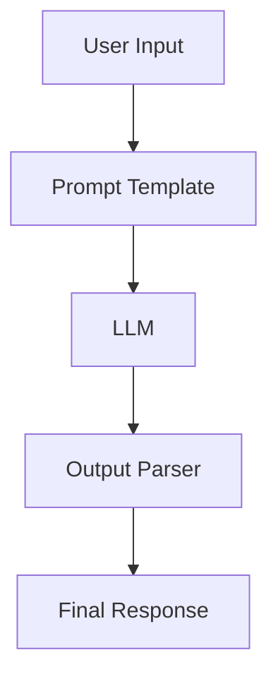
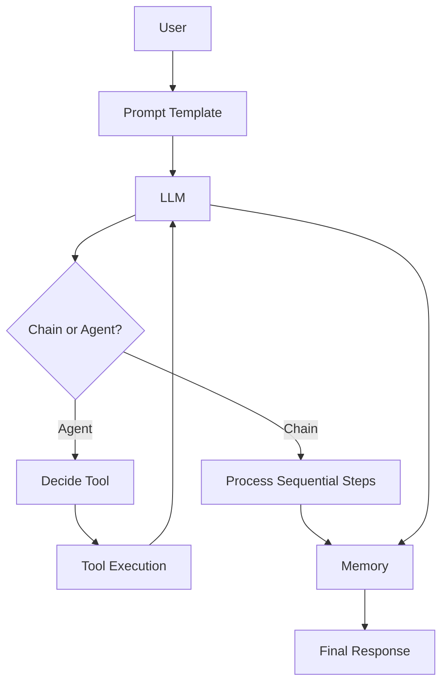
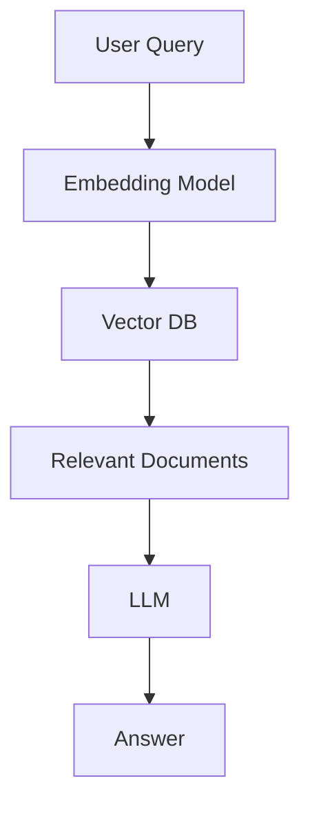

# LangChain Crash Course (Graphical + Practical)

## 1. What is LangChain?

LangChain is a framework for building applications powered by Large Language Models (LLMs). It helps you connect:

- LLMs (OpenAI, Ollama, etc.)
- Data sources (DB, PDFs, APIs)
- Logic (chains, agents)

---

## 2. Core Architecture (High-Level)

```
User Input
   ↓
Prompt Template
   ↓
LLM (OpenAI / Ollama)
   ↓
Output Parser
   ↓
Final Response
```

### Visual Flow (Mermaid)



---

## 3. Key Components

### 3.1 LLMs

Responsible for generating responses.

Example:

```python
from langchain.llms import OpenAI
llm = OpenAI()
```

---

### 3.2 Prompt Templates

Reusable prompts with variables.

```
Input: "Explain {topic} in simple terms"
```

---

### 3.3 Chains

Chains = sequence of steps.

```
Input → Prompt → LLM → Output
```

Example:

```python
from langchain.chains import LLMChain
```

---

### 3.4 Agents

Agents decide what action to take.

```
User Query
   ↓
Agent decides
   ↓
Tool Execution
   ↓
Final Answer
```

---

### 3.5 Tools

External capabilities (APIs, DB, search).

Examples:

- Google Search
- Calculator
- Database queries

---

### 3.6 Memory

Stores conversation history.

```
User → Chat → Memory → Context-aware Response
```

---

## 4. LangChain Flow (End-to-End)

```
[User]
   ↓
[Prompt Template]
   ↓
[LLM]
   ↓
[Chain / Agent]
   ↓
[Tools (Optional)]
   ↓
[Memory]
   ↓
[Response]
```

### End-to-End Flow Diagram



---

## 5. RAG (Retrieval Augmented Generation)

### Architecture

```
User Query
   ↓
Embedding Model
   ↓
Vector DB (FAISS / Pinecone)
   ↓
Relevant Docs
   ↓
LLM
   ↓
Answer
```

### RAG Flow Diagram



---

## 6. Vector Database Concept

```
Text → Embeddings → Stored in Vector DB

Query → Embedding → Similarity Search → Results
```

---

## 7. Simple Example (End-to-End)

```python
from langchain.llms import OpenAI
from langchain.prompts import PromptTemplate
from langchain.chains import LLMChain

prompt = PromptTemplate(
    input_variables=["topic"],
    template="Explain {topic} in simple terms"
)

llm = OpenAI()
chain = LLMChain(llm=llm, prompt=prompt)

print(chain.run("LangChain"))
```

---

## 8. Agent Workflow (Detailed)

```
User Question
   ↓
Agent
   ↓ decides tool
[Search API] OR [Calculator] OR [DB]
   ↓
LLM reasoning
   ↓
Final Answer
```

---

## 9. Real-World Use Cases

- AI Code Generator (like Bolt.new)
- Chatbots
- Document QA system
- Auto Dev Tools
- Workflow Automation

---

## 10. LangChain vs Traditional App

| Feature      | Traditional | LangChain          |
| ------------ | ----------- | ------------------ |
| Logic        | Static      | Dynamic            |
| Data         | Fixed       | External + dynamic |
| Intelligence | Rule-based  | AI-driven          |

---

## 11. Advanced Concepts

### 11.1 Multi-Chain

```
Chain1 → Chain2 → Chain3
```

### 11.2 Router Chains

```
Input → Decide Chain → Execute
```

### 11.3 Tool Calling (Function Calling)

```
LLM → JSON → Tool → Response
```

---

## 12. Production Architecture (Your Use Case)

```
Frontend (React / Next.js)
   ↓
Backend (Python FastAPI)
   ↓
LangChain Layer
   ├── Chains
   ├── Agents
   ├── Memory
   ├── Tools
   ↓
LLM (Ollama / OpenAI)
   ↓
Vector DB (FAISS)
   ↓
Storage (S3 / DB)
```

### Production Architecture Diagram

```mermaid
flowchart TD
    FE[Frontend (React/Next.js)] --> BE[Backend (FastAPI)]
    BE --> LC[LangChain Layer]
    LC --> CH[Chains]
    LC --> AG[Agents]
    LC --> ME[Memory]
    LC --> TO[Tools]
    LC --> LLM[LLM (Ollama/OpenAI)]
    LLM --> VDB[Vector DB]
    VDB --> ST[Storage]
```

---

## 13. Key Libraries

- langchain
- langchain-community
- langchain-core
- FAISS / Pinecone
- OpenAI / Ollama

---

## 14. Learning Roadmap

1. Prompt Engineering
2. Chains
3. Memory
4. Agents
5. RAG
6. Production deployment

---

## 15. Summary

LangChain = Glue Layer between:

- LLM
- Data
- Tools
- Logic

It helps you build intelligent applications quickly.

```
LLM + Data + Tools + Memory = AI Application
```

---

## 16. Next Step (Important)

Build this project:

👉 AI Code Generator (like Bolt.new)

Modules:

- Prompt → Code generator
- File structure generator
- Live preview
- Download zip

---

END
